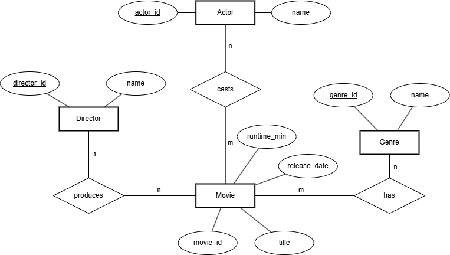
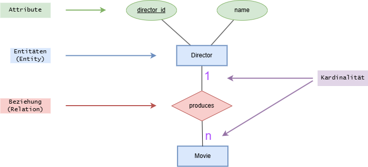

## ER Modell

**ER-Modell:** Die fachliche Beschreibung der Domäne – welche Entitäten es gibt (z. B. Movie, Actor), welche Attribute sie haben (z. B. title, name), wie sie zusammenhängen (Beziehungen, Kardinalitäten/Optionalitäten) und welche Regeln/Schlüssel gelten. Inhaltsebene, was gilt.

**Beispiel: ER-Modell:**

```
Entitäten & Schlüssel
- Movie(movie_id, title, release_date, runtime_min) – movie_id als Surrogat-PK
- Actor(actor_id, name)
- Director(director_id, name)
- Genre(genre_id, name UNIQUE)

Beziehungen & Kardinalitäten
- Movie–Actor: m:n über Casting(movie_id, actor_id, character_name, billing_order)
- Movie–Genre: m:n über MovieGenre(movie_id, genre_id)
- Movie–Director: 1:n als FK in Movie

Regeln (Auszug)
- Ein Casting gehört genau zu einem Movie und einem Actor; Kombination (movie_id, actor_id) ist eindeutig.
- Genre.name ist eindeutig.
- Optionalität: Movie.release_date kann fehlen; Movie kann (vorläufig) auch ohne Director existieren.
- Löschregel: Wird ein Movie gelöscht, verschwinden zugehörige Casting/MovieGenre/MovieDirector-Einträge.
```

## ER Diagram

**ER-Diagramm:** Die grafische Darstellung eines ER-Modells. Es zeigt Entitäten, Attribute und Beziehungen als Bild und dient zur Kommunikation. Es kann mehrere Diagramme zum gleichen Modell geben (z. B. je Teildomäne).

**Beispiel: ER-Diagram (nach Chen-Notation)**



### Aufbau

#### Wichtigste Bausteine

**Entitäten (Entities):**

- Starke Entität: eigenständig identifizierbar
- Symbol: Rechteck
- Beispiel: `MOVIE`

**Attribute:**

- beschreibende Eigenschaften
- beschreiben die relevanten Merkmale von Objekten oder Beziehungen
- Beispiel: `name`

**Beziehungen (Relationships):**

- beschreibt welche Beziehung eine Entität zu einer anderen (oder derselben) hat
- Beispiel: `produces`
- beschreibt außerdem die Kardinalität (1:1, 1:n, m:n)
- kann auch Attribute beinhalten (e.g. bei Kardinalität m:n)
- meist binär (zwischen zwei Entitäten)

---



---

#### Sonderformen

**Schwache Entitäten (Weak Entities):**

- ohne „Eltern“-Entität nicht eindeutig identifizierbar
- Symbol: Doppeltes Rechteck; identifizierende Beziehung als doppelte Raute.
- Beispiel: `REVIEW(review_no, text)` ist nur eindeutig pro Film → identifiziert durch (`movie_id`, `review_no`) via Beziehung `hasReview` zu `MOVIE`.

TODO: Bild

**Zusammengesetztes Attribut (komposit):**

- `name` vs. `person_name` = `{first_name, last_name}` 
- Symbol: Ellipsen haften an der Attribut-Ellipse.

**Mehrwertiges Attribut:**

- kann mehrere Werte halten (z. B. mehrere Alternativtitel).
- Symbol: doppelte Ellipse → `alternate_title` an MOVIE.

TODO: Bild

**Abgeleitetes Attribut:**

- wird aus anderen Werten berechnet (z. B. `age` aus `birth_date`).
- Symbol: gestrichelte Ellipse.

TODO: Bild

**Schlüsselattribut:**
- Primärschlüssel, der eindeutig indentifizert
- Symbol: im Diagramm unterstreicht man den Namen in der Ellipse

TODO: Bild

**Ternäre bzw. N-äre Beziehung:**
- Ternär = 3, N = beliebige Anzahl
- Beziehung zwischen drei+ Entitäten 
- Beispiel: `SIGNED_FOR` zwischen `ACTOR`, `MOVIE`, `AGENCY`

TODO: Bild

**Rekursive Beziehung:**
- Beziehungen innerhalb derselben Entität
- mit Rollenzeichnungen an den Kanten/Linien
- Beispiel `PERSON mentors PERSON` (Rollen: *Mentor, Mentee*)

TODO: Bild

**Beziehungsattribute:**
- Eigenschaften der Beziehung selbst
- Meist bei m:n Beziehungen
- Beispiel: Die Zwischentabelle `ACTS_IN` (zwischen `MOVIE` und `ACTOR`) hat ein Attribut `character_name`

TODO: Bild


**Spezialisierung/Generalisierung von Entitäten:**
- Oberklasse -> Unterklasse
- Beispiel: Oberklasse: `PERSON`, Unterklassen: `ACTOR`, `DIRECTOR`

TODO: Bild
