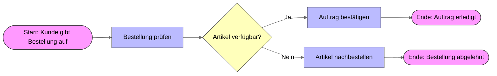

## Einführung 

Warum Geschäftsprozessmodellierung?

- Unternehmen bestehen aus Prozessen → zusammenhängende Tätigkeiten, die ein Ergebnis erzeugen (z. B. Bestellung, Bewerbung, Reparatur).
- Prozesse müssen verständlich dokumentiert werden, damit man sie verbessern, automatisieren oder digitalisieren kann.
- Modellierung = visuelle Darstellung dieser Abläufe.

**Vorteile:**

- Einheitliche Sprache zwischen IT & Business
- Frühzeitiges Erkennen von Fehlern
- Grundlage für Simulation oder Automatisierung

## Überblick Modellierungssprachen

- **UML-Aktivitätsdiagramme**: aus der Softwaretechnik, einfach, aber wenig Details für Geschäftsprozesse.

- **EPC (Ereignisgesteuerte Prozesskette):** aus ARIS, traditionell in der Wirtschaftsinformatik.

- **BPMN 2.0 (Business Process Model and Notation)**: aktueller Standard, von der OMG (Object Management Group).

!!! tip "Info"
    Wir arbeiten mit BPMN, da es internationaler Standard und praxisnah ist.

## Grundlagen BPMN 2.0

### Zentrale Elemente

- **Events (Ereignisse):** runde Symbole, markieren Start, Zwischen-Ereignisse oder Ende.

- **Activities (Aktivitäten):** abgerundete Rechtecke, stehen für Arbeitsschritte.

- **Gateways:** Rauten, Entscheidungspunkte (XOR, AND, OR).

- **Pools & Lanes:** repräsentieren Organisationseinheiten oder Rollen.

- **Flows:** Pfeile verbinden die Symbole.

