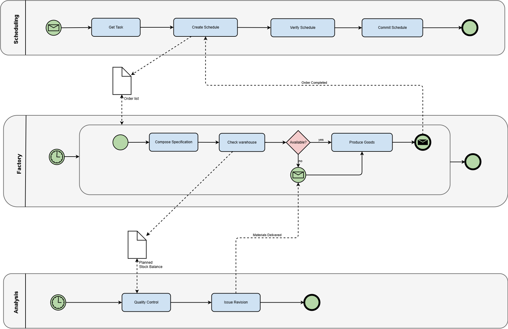

## Was bedeutet BPMN?

**BPMN** steht für **Business Process Model and Notation**.  
Es handelt sich um eine internationale **Standardnotation zur Darstellung von Geschäftsprozessen**.  
Das Ziel von BPMN ist es, eine **einheitliche Sprache** zu schaffen, die sowohl von **Fachabteilungen** (z. B. Wirtschaft, Organisation) als auch von **IT-Abteilungen** verstanden wird.  

## Herkunft und Entwicklung

- Entwickelt durch die **OMG (Object Management Group)** – eine internationale Organisation, die auch UML (Unified Modeling Language) standardisiert hat.  
- Erste Version erschienen **2004**.  
- Seit **2011 ist BPMN 2.0** der aktuelle Standard.  
- Heute ist BPMN **weltweit im Einsatz**, von kleinen Firmen bis zu großen Konzernen.

## Ziel von BPMN

- Prozesse **verständlich dokumentieren**, damit alle Beteiligten sie nachvollziehen können.  
- Prozesse **standardisiert beschreiben**, damit sie in jedem Unternehmen gleich lesbar sind.  
- Prozesse so präzise darstellen, dass sie sogar von **IT-Systemen automatisiert ausgeführt** werden können. 

## Vorteile von BPMN

- **Einheitliche Sprache** für Business und IT.  
- **Klarer, grafischer Standard**, international anerkannt.  
- **Flexibel und erweiterbar**: von einfachen Schulprozessen bis zu komplexen Unternehmensabläufen.  
- Grundlage für **Analyse, Optimierung und Automatisierung** von Prozessen.

## Beispiel eines BPMN-Diagramms:

{ align=center }


## Zentrale Elemente

- **Ereignisse**: Start, Zwischenereignis, Ende (runde Symbole).  
- **Aktivitäten**: Arbeitsschritte, Aufgaben (abgerundete Rechtecke).  
- **Gateways**: Verzweigungen und Entscheidungen (Rauten).  
- **Pools und Lanes**: Organisationen und Rollen.  
- **Flows**:  
  - Sequenzfluss: Pfeil innerhalb einer Lane.  
  - Nachrichtenfluss: gestrichelter Pfeil zwischen Lanes/Pools.  


### Ereignisse
Ereignisse sind **runde Symbole** in BPMN.  
Sie markieren wichtige Punkte im Ablauf.

- **Start-Ereignis**: zeigt, wo der Prozess beginnt.  
- **Zwischen-Ereignis**: tritt während eines Prozesses auf (z. B. Nachricht erhalten).  
- **End-Ereignis**: markiert den Abschluss des Prozesses.


### Aktivitäten

Aktivitäten sind **Arbeitsschritte** in einem Prozess.
  
- Darstellung: abgerundetes Rechteck.  
- Jede Aktivität beschreibt **eine Aufgabe oder Handlung**.  
- Aktivitäten werden nacheinander oder parallel ausgeführt. 


---

**Beispiel: Lehrer gibt Hausübung auf**

```
- Start-Ereignis: Unterrichtsstunde beginnt  
- Aktivität: Lehrer erklärt Hausübung  
- Aktivität: Schüler notiert Hausübung  
- End-Ereignis: Stunde endet
```


---

### Gateways

Gateways werden als **Rauten** in BPMN dargestellt.  
Sie zeigen, wie der Ablauf eines Prozesses an einer Stelle weitergeht.

#### Arten von Gateways

- **Exklusiv (XOR)**  
    - Genau **ein Pfad** wird gewählt.  
    - Beispiel: Prüfung „Pizza verfügbar?“ → Entweder „Ja“ oder „Nein“.  

- **Parallel (AND)**  
    - **Alle Pfade** werden gleichzeitig ausgeführt.  
    - Beispiel: „Lieferung vorbereiten“ und „Rechnung erstellen“ laufen parallel.  

- **Inklusiv (OR)**  
    - **Ein oder mehrere Pfade** können ausgeführt werden.  
    - Beispiel: Schüler bearbeitet Hausübung mit Buch *und/oder* Internet. 


!!! warning "Achtung"
    - Jeder Pfad eines Gateways muss zu einem logischen Ende führen.
    - Prozesse können **mehrere End-Ereignisse** haben (z. B. „Bestellung erfolgreich“ oder „Bestellung abgelehnt“).
    - Es ist wichtig, dass alle möglichen Entscheidungen berücksichtigt werden.

---

**Beispiel: Pizza bestellen (XOR)**

```
- Start-Ereignis: Kunde hat Hunger  
- Aktivität: Pizza bestellen  
- Gateway (XOR): Pizza verfügbar?  
  - Ja: Pizza backen → Pizza liefern → End-Ereignis: Kunde isst Pizza  
  - Nein: Bestellung ablehnen → End-Ereignis: Kunde bestellt woanders
```


---

<!-- ### Pools und Lanes

**Pools:**

- **Pool = eigenständiger Beteiligter** im Prozess.  
- Beispiele: „Kunde“, „Unternehmen“, „Bank“.  

**Lanes:**

- **Lane = Unterteilung innerhalb eines Pools**.  
- Beispiele: in einem Unternehmen → „Verkauf“, „Lager“, „Buchhaltung“.  
- Dient zur Darstellung von **Rollen, Abteilungen oder Verantwortlichkeiten**.

**Verbindungen zwischen Pools und Lanes:**

- **Sequenzfluss (Pfeil)**: Verbindet Aktivitäten **innerhalb einer Lane**.  
- **Nachrichtenfluss (gestrichelter Pfeil)**: Verbindet Aktivitäten **zwischen verschiedenen Lanes oder Pools**.  
- Nachrichtenfluss zeigt die **Kommunikation zwischen Beteiligten**. 

**Beispiel: Urlaubsantrag**

**Pool: Unternehmen**

- **Lane: Mitarbeiter**  
  - Start-Ereignis: Mitarbeiter möchte Urlaub nehmen  
  - Aktivität: Urlaubsantrag ausfüllen  
  - Nachrichtenfluss: Antrag an Vorgesetzten senden  

- **Lane: Vorgesetzter**  
  - Empfang des Antrags (Nachricht)  
  - Aktivität: Antrag prüfen  
  - Gateway (XOR): Urlaub genehmigt?  
    - Ja: Aktivität: Genehmigung erteilen → End-Ereignis: Urlaub genehmigt  
    - Nein: Aktivität: Absage senden → End-Ereignis: Urlaub abgelehnt  

!!! hint "Merke"
    - Pools und Lanes helfen, **Verantwortlichkeiten sichtbar** zu machen.  
    - Nachrichtenflüsse stellen die **Kommunikation** dar, nicht die Reihenfolge der Arbeitsschritte.  
    - Ein Prozess kann aus **einem oder mehreren Pools** bestehen.   -->