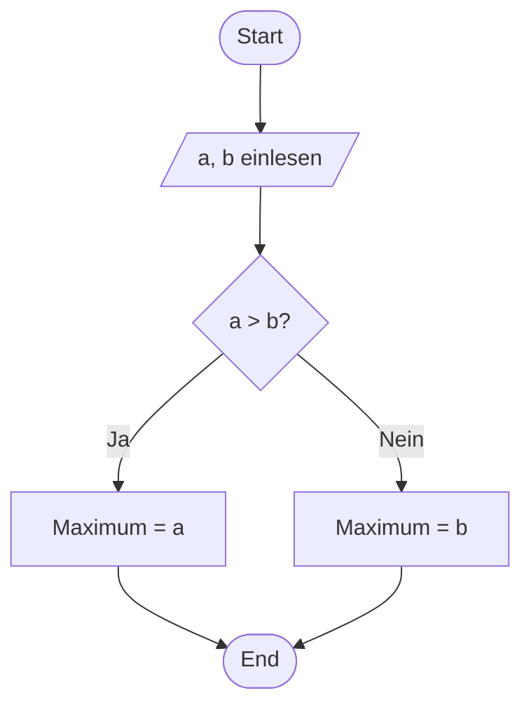
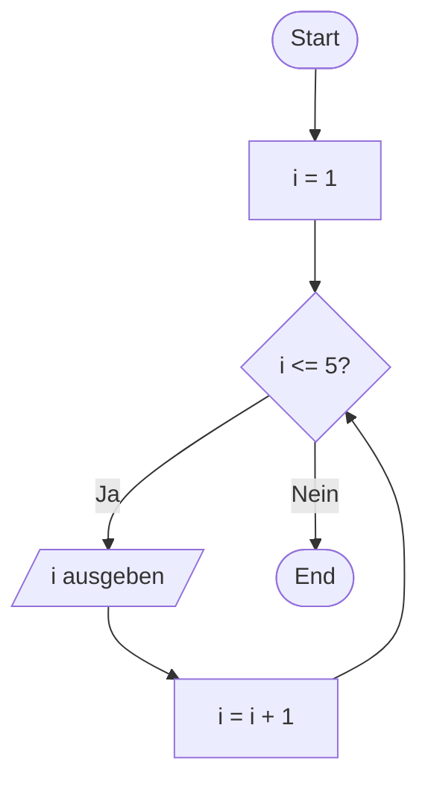
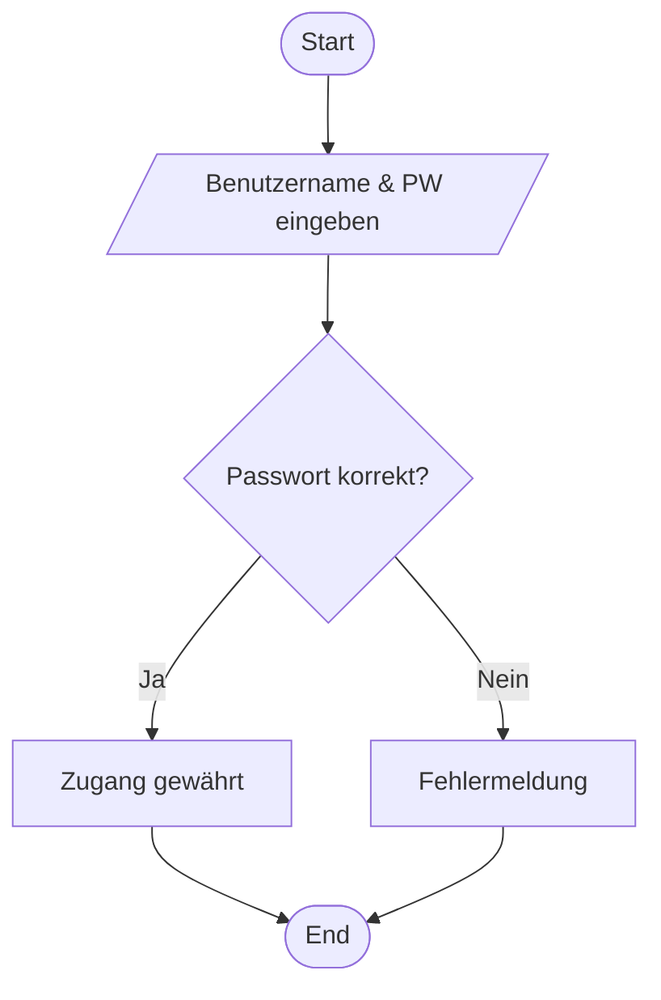

# Flussdiagramme

- Ein **Flowchart (Flussdiagramm)** stellt den **Ablauf eines Algorithmus oder Prozesses** grafisch dar.
- Es verwendet standardisierte Symbole, die **Aktionen, Entscheidungen und Start/Ende** kennzeichnen.
- Hilft, **logisches Denken** zu schulen und Abläufe zu planen, bevor man programmiert.

!!! tip "Merke"
    Flowcharts zeigen, **wie der Ablauf Schritt für Schritt verläuft**, mit klaren Verzweigungen und Wiederholungen.

## Syntax

- Oval: Start / Ende
- Rechteck: Anweisung / Prozessschritt
- Raute: Entscheidung (Ja/Nein, Wahr/Falsch)
- Parallelogramm: Ein- oder Ausgabe

## Beispiele

### Beispiel: Maximum von zwei Zahlen

**Algorithmus in Worten:**

1. Lies zwei Zahlen a und b.
2. Vergleiche sie.
3. Wenn a > b, dann ist a das Maximum.
4. Sonst ist b das Maximum.

### Beispiel: Zahlen von 1 bis 5 ausgeben

### Beispiel: Login-Prozess

**Ablauf:**

1. Benutzer gibt Benutzername & Passwort ein.
1. System prüft die Daten.
1. Falls korrekt → Zugang gewährt.
1. Falls falsch → Fehlermeldung.

