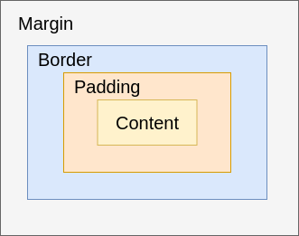

# CSS Box-Modell

## Grundidee
Jedes HTML-Element auf einer Webseite wird im Browser als **Rechteck** dargestellt.  
Dieses Rechteck besteht nicht nur aus dem Inhalt, sondern auch aus Abständen und Rahmen.  
Das Konzept, wie diese Teile zusammenspielen, nennt man **CSS Box-Modell**.

---

## Aufbau einer Box

Von innen nach außen:

1. **Content** – Der eigentliche Inhalt (Text, Bild, etc.)
2. **Padding** – Abstand zwischen Inhalt und Rahmen
3. **Border** – Rahmen um das Element
4. **Margin** – Abstand zu anderen Elementen



---

## Die vier Bereiche im Detail

### Content
- Enthält den eigentlichen Inhalt, z. B. Text oder Bilder.
- Größe wird mit `width` und `height` festgelegt.

```css
div {
  width: 200px;
  height: 100px;
}
```

### Padding

- **Innenabstand** zwischen Inhalt und Rahmen.
- Hintergrundfarbe wird **bis zum Rand des Paddings** gefüllt.

```css
div {
  padding: 20px; /* alle Seiten */
  padding: 10px 20px; /* oben/unten, links/rechts */
  padding: 10px 20px 30px 10px /* oben rechts unten links */
}
```

### Border

- Rahmen um den Inhalt **und** Padding.
- Kann in Farbe, Dicke und Stil angepasst werden.

```css
div {
  border: 2px solid black;
}
```

### Margin

- Außenabstand zwischen diesem Element und anderen.
- Hintergrundfarbe wirkt sich nicht auf den Margin aus.

```css
div {
  margin: 10px; /* alle Seiten */
  margin: 0 auto; /* horizontal zentrieren */
}
```

### Box-Sizing

Standardmäßig berechnet CSS die Gesamtgröße eines Elements so:
```
div {
  Gesamtbreite = width + padding + border
  Gesamthöhe   = height + padding + border
}
```

Das kann unpraktisch sein.
Mit `box-sizing: border-box;` wird die Breite inklusive Padding und Border berechnet.

```css
div {
  box-sizing: border-box;
}
```

**Beispiel:**

```css
.box {
  width: 200px;
  padding: 20px;
  border: 5px solid blue;
  margin: 24px;
  background-color: lightyellow;
  box-sizing: border-box;
}
```

!!! tip "Tipp"
    - Verwenden Sie `box-sizing: border-box;` in allen Projekten, um die Größenberechnung einfacher zu machen.
    - Mit `html { box-sizing: border-box; }` setzt man den Standard für die gesamte Seite.
    - Mit `*` (und den Pseudo-Elementen `::before/::after`) stellt man sicher, dass alle Elemente und deren Pseudo-Elemente die gleiche Berechnungsmethode nutzen.
    - Das verhindert unvorhersehbare Layout-Probleme und erleichtert die Arbeit mit Padding + Border.
        ```css
        html {
          box-sizing: border-box;
        }
        *, *::before, *::after {
          box-sizing: inherit;
        }
        ```

    