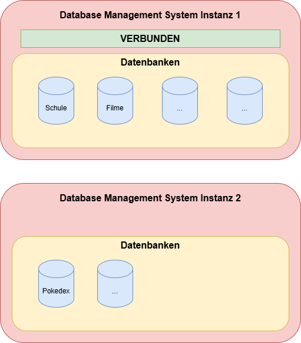

# Einführung Datenbanken

## Warum Datenbanken?

---

# Inhalt

<Toc minDepth="1" maxDepth="1" />

---

# Warum werden Datenbanken benötigt?

- Große Datenmengen **strukturiert & effizient** verwalten
- **Gleichzeitiger Zugriff** vieler Benutzer
- **Beziehungen** zwischen Daten abbilden
- **Komplexe Abfragen** und Auswertungen
- Dateien/Excel stoßen hier **schnell an Grenzen**

---

# Was ist eine Datenbank?

- **Strukturiertes System** zur Speicherung & Verwaltung von Daten
- Unterstützt **Suchen, Einfügen, Ändern, Löschen (CRUD)**
- Gewährleistet **Integrität, Mehrbenutzerbetrieb, Zugriffskontrolle**

---

# Anwendungsbeispiele
| Bereich        | Typische Daten                 |
| -------------- | ------------------------------ |
| Schule         | Schüler, Noten, Stundenpläne   |
| Online-Shop    | Produkte, Bestellungen, Kunden |
| Bank           | Konten, Transaktionen, Kunden  |

---

# Welche Vorteile bieten Datenbanken?
- **Struktur & Regeln** (z. B. eindeutige IDs)
- **Mehrbenutzerfähig** und transaktionssicher
- **Schnelles Finden/Filtern** (Indizes, SQL)
- **Sicherheit & Integrität**
- **Erweiterbar** (z. B. neue Entitäten/Beziehungen)  

 

> Takeaway: Ohne Datenbanken gäbe es kein Google, YouTube, Banking-Apps oder moderne Schul-IT.

---

# Datenbanksysteme: Überblick

Datenbanksysteme unterscheiden sich nach **Datenmodell**, **Einsatzzweck** und **technischer Ausprägung**.

- **Relationale Datenbanksysteme (RDBMS)**
- **Nicht-relationale Datenbanksysteme (NoSQL)**

---

# RDBMS – Definition

Relationale Datenbanken speichern Daten in **Tabellen**, die über Schlüssel verknüpft sind. Abfragen mit **SQL**.

## RDBMS – Merkmale
|  |                                    |
|-----------|-----------------------------------------------|
| Struktur  | Tabellen mit Zeilen & Spalten                 |
| Sprache   | SQL                                           |
| Vorteile  | Standardisiert, bewährt, konsistent (ACID)    |
| Einsatz   | Geschäftsprozesse, Web-Apps, ERP, Schulen     |

---

# RDBMS – Beispiele
| System                   | Kurzbeschreibung                                      |
|--------------------------|-------------------------------------------------------|
| **MySQL**                | Open Source, im Web weit verbreitet (z. B. mit PHP)  |
| **PostgreSQL**           | Sehr leistungsfähig, viele Features                   |
| **Microsoft SQL Server** | In Unternehmen verbreitet, starke .NET-Integration   |
| **Oracle Database**      | Für große Unternehmens-Workloads                      |
| **SQLite**               | Kompakt, serverlos, dateibasiert (Apps, Tests)       |

---

# Nicht-relationale Datenbanksysteme (NoSQL)
NoSQL-Datenbanken für spezielle Einsatzzwecke: **skalierbar**, **flexibel**, oft **schemafrei** & **nicht tabellenbasiert**.

## NoSQL – Typen
- **Dokumentenorientiert** (z. B. JSON-Dokumente)
- **Key-Value-Stores**
- **Graphdatenbanken**
- **Zeitreihendatenbanken**

<!-- ## NoSQL – Beispiele
| System       | Typ                  | Anwendung                           |
|--------------|----------------------|-------------------------------------|
| **MongoDB**  | Dokumentenorientiert | Web-Apps, dynamische Datenmodelle   |
| **Redis**    | Key-Value Store      | Caching, Sessions, Queues           |
| **Neo4j**    | Graphdatenbank       | Netzwerke, Routen, Empfehlungen     |
| **InfluxDB** | Zeitreihen           | Sensorik, IoT, Monitoring           | -->

---

# Vergleich: RDBMS vs. NoSQL
|        | Relationale DB (SQL)         | NoSQL-Datenbanken                 |
|-----------------|-------------------------------|-----------------------------------|
| Struktur        | Tabellenbasiert               | Flexibel (JSON, Key-Value, Graph) |
| Abfragen        | **SQL**                       | Systemspezifisch (z. B. JSON-Query) |
| Einsatzbeispiel | ERP, Shop, Schulverwaltung    | Big Data, Caching (schneller Zugriff)       |

## Praxis-Leitlinie (Kurz)
- **RDBMS**, wenn: klare Struktur, starke Konsistenz, Berichte/Transaktionen.
- **NoSQL**, wenn: flexibel, massiv skalieren, spezielle Datenformen.

---

# Lokales vs. Remote Datenbanksystem
- **Remote (Firma/Cloud):** Server steht im Rechenzentrum oder in der Cloud.
- **Lokal (Schule/PC):**
  - Kleines **Server-Programm** läuft im Hintergrund.
  - Du bist **Admin und Benutzer** zugleich.
  - **Vorteil:** Frei üben—DBs erstellen, löschen, Tabellen anlegen—ohne zentrale Systeme zu gefährden.

---

# Wie wird mit Datenbanken gearbeitet
Kurzer Überblick über den Ablauf

1. **Verbinden:** „Hallo Server, darf ich mit dir reden?“  
2. **DB wählen:** „Ich möchte mit der *Schule*-DB arbeiten.“  
3. **Befehle ausführen:** „Zeig mir alle Schüler.“  
4. **Antwort erhalten:** Der Server liefert die Tabelle zurück.

 

> **Merke:** Ohne **Verbindung** keine **Daten**. Das Datenbanksystem ist ein eigenes Programm—wir sind Gäste und brauchen zuerst die **Tür** (die Verbindung).

---
layout: two-cols
layoutClass: gap-16
---

# Instanzen eines DBMS
- Eine **Instanz** ist ein eigenes **Datenbank-Server-Programm**.
- Nur mit **funktionierender Verbindung** können wir **SQL-Befehle** senden.

::right::

<!---  -->

