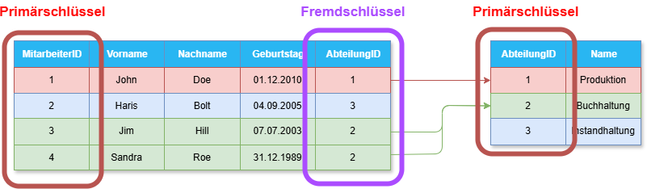
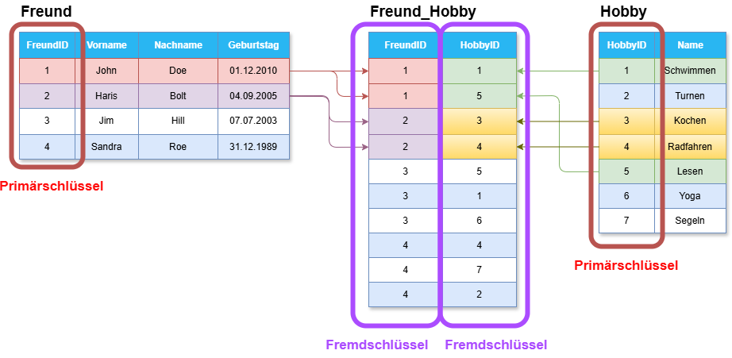
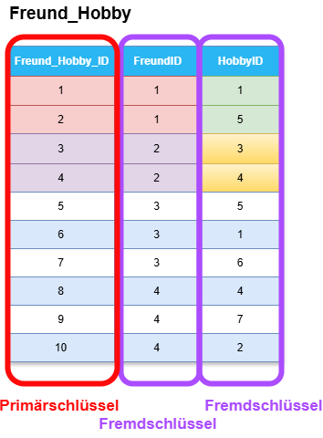

# Schlüsselattribute in Datenbanken

---
hideInToc: true
---

# Inhalt

<Toc minDepth="1" maxDepth="1" />

---

# Was ist ein Schlüsselattribut?

Ein Schlüsselattribut ist ein Attribut (oder eine Kombination von Attributen), das **eindeutig einen Datensatz** in einer Tabelle **identifiziert**.

- Zur Erinnerung: Ein *Attribut* ist eine **Spalte** in relationalen Datenbanken

<br>

> 💡 Man kann sich das wie eine „ID-Karte“ für jede Zeile vorstellen.

---

# Wichtige Schlüsselattribute

<br>

**Primärschlüssel**
- english: *Primary Key*
- Das wichtigste Schüsselattribut
- Darf **nicht leer (NULL)** sein und muss **eindeutig** sein
- Beispiel: In der Tabelle `Mitglied` ist `MitgliedID` der Primärschlüssel

**Fremdschlüssel**
- english: *Foreign Key*
- Verweist auf den Primärschlüssel einer **anderen Tabelle**
- **Stellt** also die **Beziehung** zwischen Tabellen **her** 

---

# Beispiel: Schlüsselattribute `Abteilung` - `Mitarbeiter`

- Der **Primärschlüssel** `AbteilungID` in der `Abteilung` Tabelle ist auch der **Fremdschlüssel** `AbteilungID` in der `Mitarbeiter` Tabelle.




> 💡 Zugehörige Fremd- und Primärschlüssel **müssen nicht gleich heißen**, es erleichtert aber das Verständnis was zu wem gehört, gerade in größeren Datenbanken

---

# Beispiel: Schlüsselattribute `Freund` - `Hobby`
***



---
layout: two-cols
---
# Primärschlüssel in Zwischentabellen

In Zwischentabellen kann man auch einen **Primärschlüssel** vergeben.

::right::



---

# Primärschlüssel in Tabellen

Um einen **Primarschlüssel** zu definieren, benötigen wir zusätzlich das **Schlüsselwort** `PRIMARY KEY` in der Spalte

```sql
CREATE TABLE Schueler (
    SchuelerID INT PRIMARY KEY,
    Nachname NVARCHAR(50) NOT NULL,
    Vorname NVARCHAR(50) NOT NULL
);
```

<br>

💡 Es muss nicht immer eine **künstliche Spalte** für eine ID erzeugt werden, es kann auch eine **natürliche Spalte** (also eine Spalte die eindeutig ist und schon gibt) dafür benutzt werden (e.g. Sozialversicherungsnummer, ISBN bei Büchern)

```sql
CREATE TABLE Buch (
    ISBN  CHAR(13) PRIMARY KEY,
    Titel NVARCHAR(200) NOT NULL,
    Autor NVARCHAR(100) NOT NULL
);
```

---

# Automatische ID Vergabe

- Sofern jemand in die Datenbank mit dem `INSERT` *SQL Befehl* schreiben will, muss man immer die SchuelerID angeben.
- Somit müssen sich Anwender Gedanken machen, die richtigen (e.g. fortlaufenden) IDs zu vergeben.
- MS SQL Server erlaubt aber ein automatisches Inkrementieren. Bedeutet also, die Datenbank kümmert sich um die ID Vergabe mit dem Schlüsselwort `IDENTITY`

```sql
    CREATE TABLE Schueler (
    SchuelerID INT IDENTITY(1,1) PRIMARY KEY, -- (1,1) bedeutet: startet bei 1, Schrittweite 1
    Nachname NVARCHAR(50) NOT NULL,
    Vorname NVARCHAR(50) NOT NULL
    );
```


