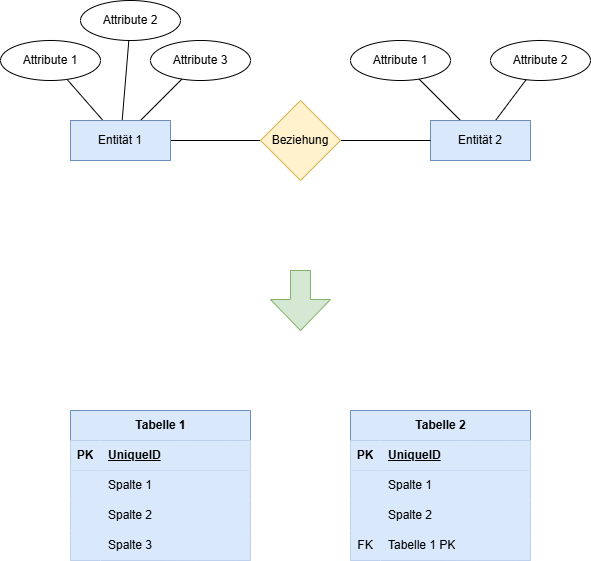
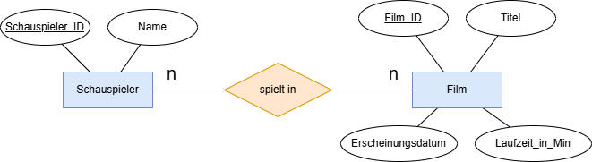
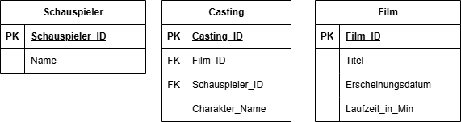
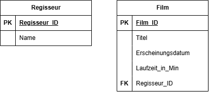

# Relationsschema

## Vom ER Diagramm zum Relationsschema

---
hideInToc: true
---

# Inhalt

<Toc minDepth="1" maxDepth="1" />

---

# Erinnerung: ER-Modell

- Entitäten (z. B. `FILM`, `SCHAUSPIELER`)  
- Attribute (z. B. `Titel`, `Name`)  
- Beziehungen (z. B. „spielt in“)  
- Kardinalitäten (1:1, 1:n, m:n)

👉 ER-Modell = **konzeptuelle Sicht** (fachliche Welt)

---
layout: two-cols
layoutClass: gap-16
---

# Ziel: Relationsschema

- Relationsschema = **Sammlung von Tabellen**  
- Jede Tabelle enthält: 
   - Name
   - Attribute
   - Primärschlüssel
   - Fremdschlüssel (falls vorhanden)
- Später Grundlage für SQL `CREATE TABLE`

 

👉 Relationsschema = **logische Sicht**

::right::

---

# Regeln zur Umwandlung

1. **Entität → Tabelle**  
   - Attribute der Entität → Spalten  
   - Primärschlüssel markieren  

2. **1:n Beziehung → Fremdschlüssel**  
   - Der Schlüssel der „1“-Seite wird in der „n“-Tabelle als Fremdschlüssel gespeichert  

3. **m:n Beziehung → Zwischentabelle**  
   - Neue Relation mit beiden Primärschlüsseln als Fremdschlüssel 
   - ggf. zusätzliche Beziehungsattribute  

---

# Beispiel - m:n Beziehung

**ER-Modell + Diagramm:**  

- `FILM(Film_ID, Titel, ...)`  
- `SCHAUSPIELER(Schauspieler_ID, Name)`  
- Beziehung: *m:n* `spielt in` mit Attribut `Charakter_Name`

 

---
hideInToc: true
---

# Beispiel - m:n Beziehung

**Relationsschema:**

- `FILM(Film_ID PK, Titel, ...)`  
- `SCHAUSPIELER(Schauspieler_ID PK, Name)`  
- `CASTING(Casting_ID PK, Film_ID FK, Schauspieler_ID FK, Charakter_Name)`

👉 `CASTING` ist die Zwischentabelle für die m:n-Beziehung `spielt in`

---

# Beispiel - 1:n Beziehung

**ER-Modell + Diagramm:**  

- `REGISSEUR(Regisseur_ID, Name)`  
- `FILM(Film_ID, Titel, ...)`  
- Beziehung: *1:n* – ein Regisseur kann viele Filme führen, aber ein Film kann nur von einem Regisseur geführt werden

---

# Beispiel - 1:n Beziehung

**Relationsschema:**

- `REGISSEUR(Regisseur_ID PK, Name)`  
- `FILM(Film_ID PK, Titel, ..., Regisseur_ID FK)`

👉 Fremdschlüssel `Regisseur_ID` in Tabelle `FILM` zeigt auf Tabelle `REGISSEUR`

---

# Warum diese Schritte?

 

✅ Das Relationsschema ist **klar definiert**

✅ Direkte Grundlage für **SQL** Befehle (`CREATE TABLE`)  

✅ Vermeidet Fehler und Inkonsistenzen  
