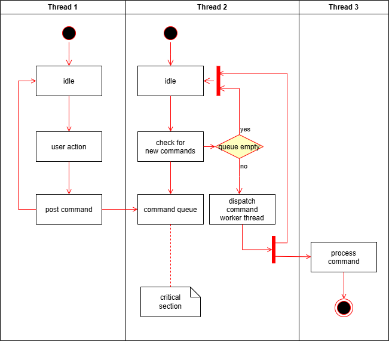
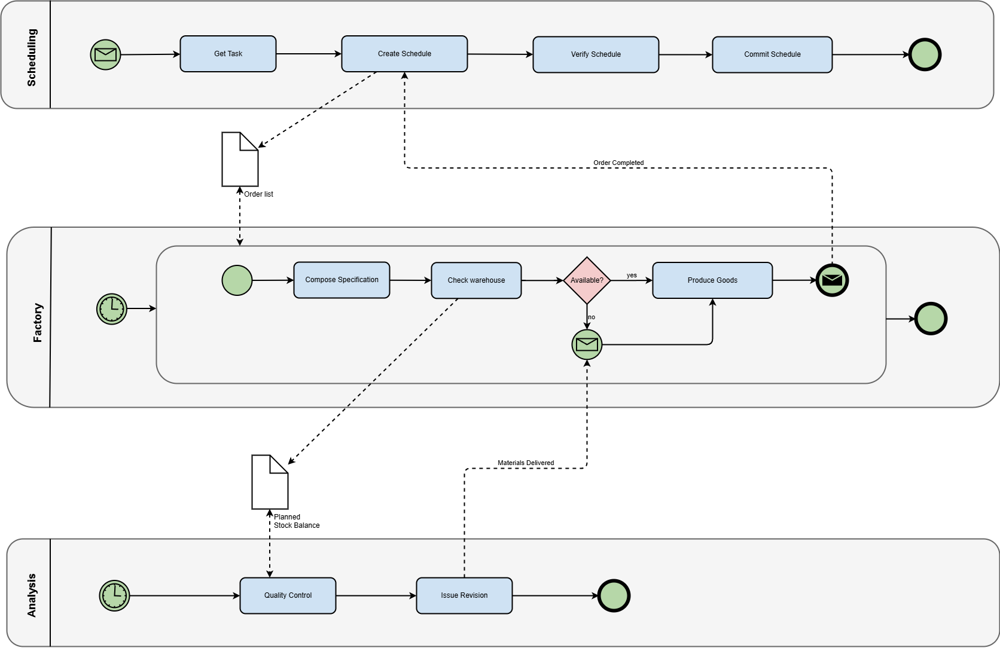

# Geschäftsprozesse und Modellierung

---
hideInToc: true
---

# Inhalt

<Toc minDepth="1" maxDepth="1" />

---

# Was ist ein Geschäftsprozess?

Ein **Geschäftsprozess** ist eine logisch verknüpfte Abfolge von Aktivitäten,  
die ein bestimmtes Ziel erreicht und einen **Mehrwert für einen Kunden oder eine Organisation** erzeugt.  

<br/>

*Ein Prozess beschreibt, **wer was in welcher Reihenfolge** tut, um ein Ergebnis zu erreichen.*

---

# Merkmale von Geschäftsprozessen

- **Ablauf von Aktivitäten** (z. B. Bestellung annehmen, prüfen, liefern)  
- **Start- und Endpunkt** (z. B. Bestellung eingegangen → Produkt beim Kunden)  
- **Beteiligte Rollen oder Organisationen** (z. B. Kunde, Verkäufer, Lager)  
- **Ergebnis mit Mehrwert** (z. B. Kunde erhält die Ware)  

---

# Beispiele für Geschäftsprozesse

<br>

**Alltag**  
- Frühstück machen: aufstehen → Kaffee kochen → essen → Tisch abräumen  
- Pizza bestellen: Hunger → Pizzeria anrufen → Pizza liefern lassen → bezahlen → essen  

**Schule**  
- Hausübung: Lehrer gibt auf → Schüler erledigt → Schüler gibt ab → Lehrer kontrolliert  
- Schularbeit: Termin festlegen → lernen → schreiben → korrigieren → Note vergeben  

**Wirtschaft**  
- Online-Bestellung: Produkt auswählen → bezahlen → Lieferung  
- Bewerbungsprozess: Bewerbung einreichen → prüfen → Gespräch → Entscheidung  

---

# Übung

Schreiben Sie den Geschäftsprozess zu "Diplomarbeiten" auf.

Format:
- Eine geordnete Liste welche die einzelnen Schritte chronologisch abbildet
- Fügen Sie beteiligte Rollen oder Organisationen dabei an
- Beschreiben sie auch das Ergebnis mit Mehrwert
- In Datei: `business-process-diplomarbeit.txt`


```txt [business-process-diplomarbeit.txt]
Mehrwert: XY
- <Rolle>: Schritt 1,
- <Rolle>: Schritt 2,
- <Rolle>: Schritt 3,
- ...
```

---

# Warum sind Geschäftsprozesse wichtig?

- **Verständlichkeit**: Jeder sieht, wie der Ablauf funktioniert  
- **Transparenz**: Verantwortlichkeiten werden klar  
- **Optimierung**: Engpässe und unnötige Schritte erkennen  
- **Automatisierung**: IT-Systeme können Abläufe übernehmen  

---

# Warum Geschäftsprozesse modellieren?

- Prozesse laufen oft unbewusst ab → Modellierung macht sie **sichtbar**  
- Dokumentation = Grundlage für **Verbesserung und Digitalisierung**  
- Modellierung = **Standardisierung** + visuelle Darstellung  

<br>

**Vorteile:**

- **Verständlichkeit**: Abläufe klar und nachvollziehbar  
- **Transparenz**: Rollen und Verantwortlichkeiten sichtbar  
- **Standardisierung**: Einheitliche Abläufe, keine Willkür  
- **Optimierung**: Schwachstellen und Engpässe erkennen  
- **Automatisierung**: IT-Systeme können Prozesse ausführen  

---

# Der Weg zum Modell

- Prozesse lassen sich in **Reihenfolge von Schritten** darstellen  
- Erster Schritt = **Start**, letzter Schritt = **Ende**  

**Beispiel Frühstück**  
- Start: Aufstehen  
- Kaffee kochen  
- Frühstück essen  
- Tisch abräumen  
- Ende: satt für die Schule  

---

# Arten von Modellierungssprachen

- Verschiedene Ansätze, je nach Herkunft und Zielgruppe  
- Drei wichtige Vertreter: 
    - UML,
    - EPC, 
    - **BPMN**  

---
layout: two-cols
layoutClass: gap-8
---

# UML-Aktivitätsdiagramme

- **UML = Unified Modeling Language**  
- Aus der **Softwareentwicklung**  
- Zeigt Abläufe als Aktivitäten und Entscheidungen  
- Vorteil: einfach und verständlich  
- Nachteil: zu allgemein für Geschäftsprozesse  

::right::



---
layout: two-cols
layoutClass: gap-8
---

# EPC – Ereignisgesteuerte Prozesskette

- Entstanden in den 1990ern im **ARIS-Modell**  
- Nutzt Ereignisse (Zustände) und Funktionen (Tätigkeiten)  
- Vorteil: gut für den Einstieg  
- Nachteil: weniger Standard, kaum Automatisierung  

<br>

> **💡 Notiz**  
>  **ARIS = Architecture of Integrated Information Systems**  
>  Entwickelt in den 1990er Jahren von Prof. Scheer.


::right::


*Quelle: [ARIS](https://aris.com/resources/process-management/ds/aris-epc-cheat-sheet/)*

---
layout: two-cols
layoutClass: gap-8
---

# BPMN 2.0 – Business Process Model and Notation

- Seit 2011 internationaler Standard (**OMG**)  
- Entwickelt speziell für **Geschäftsprozesse**  
- Weltweit verbreitet und von Tools unterstützt  

<br>

> **💡 Notiz**  
>**OMG = Object Management Group**  
>- Internationale Organisation (seit 1989)  
>- Entwickelt Standards für Modellierung: UML, BPMN, SysML    
>- Standards sind **weltweit anerkannt**  

::right::



---

# Vergleich der Modellierungssprachen

| **Aspekt**       | **UML**          | **EPC**            | **BPMN 2.0**         |
|------------------|------------------|--------------------|----------------------|
| Ursprung         | Softwaretechnik  | Wirtschaft (ARIS)  | International (OMG)  |
| Zielgruppe       | Entwickler       | Betriebswirt:innen | Business & IT        |
| Hauptfokus       | Ablauflogik      | Ereignisse+Funktionen | Geschäftsprozesse |
| Standardisierung | Ja (OMG)         | Teil von ARIS      | Ja (OMG, weltweit)   |
| Automatisierung  | kaum             | kaum               | sehr gut möglich     |

---

# Fazit

- Wir arbeiten mit **BPMN 2.0**,  
- weil es internationaler Standard ist,  
- praxisnah eingesetzt wird  
- und eine Brücke zwischen **Business und IT** bildet.