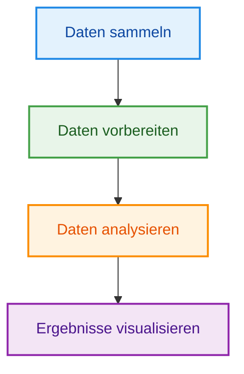
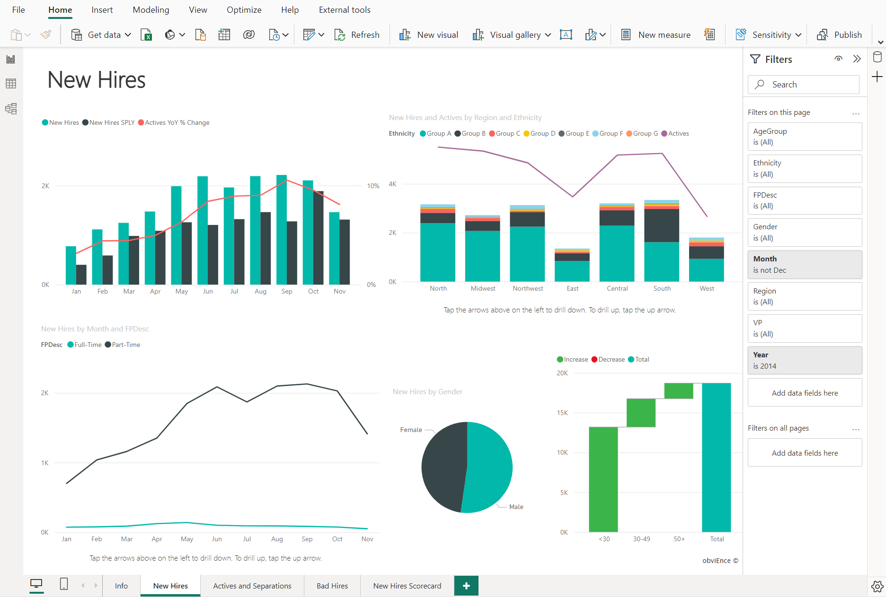

# Einführung Business Intelligence (BI)

---
hideInToc: true
---

# Inhalt

<Toc minDepth="1" maxDepth="1" />

---
layout: two-cols-header
layoutClass: gap-8
---

# Daten sind überall

Unternehmen sammeln ständig Daten aus verschiedenen Systemen.

::left::

**Beispiele:**

- Excel Dateien
- Datenbanken
- ERP Systeme (z. B. SAP)
- Web APIs
- ...

 

::right::

**Fragen aus Daten beantworten:**

* Welches Produkt verkauft sich am besten?
* In welchem Land machen wir den meisten Umsatz?
* Wie entwickelt sich der Umsatz über die Zeit?

**Daten sind vorhanden, aber schwer auszuwerten**

---
layout: two-cols-header
layoutClass: gap-4
---

# Business Intelligence (BI)

Business Intelligence beschreibt **Methoden und Werkzeuge zur Analyse großer Datenmengen, um daraus verständliche Informationen zu gewinnen**.

::left::

**Business-Intelligence-Tools helfen dabei:**

- Daten aus verschiedenen Quellen zu sammeln
- Daten aufzubereiten und zu analysieren
- Zusammenhänge zu erkennen
- Ergebnisse verständlich darzustellen (Diagramme, Dashboards)

**Typische Einsatzbereiche:**
- Verkaufsanalysen
- Unternehmenskennzahlen
- Entscheidungsunterstützung

::right::

---
layout: two-cols
---

# BI Tools

Es gibt viele Programme, die für Business Intelligence verwendet werden.

 

**Beispiele:**

- Microsoft Power BI
- Tableau
- Qlik Sense
- SAP Analytics Cloud
- Looker (Google)

 

> 💡 Wir verwenden Microsoft Power BI im Unterricht

::right::

---
layout: two-cols
---

# Einführung in Power BI 

Power BI ist ein Tool von Microsoft für:

- Datenanalyse
- Visualisierung
- Dashboards

**Versionen:**

- Power BI Desktop (Analyse & Reports)
- Power BI Service (Cloud)
- Power BI Mobile

::right::

---

# Workflow in Power BI

Power BI folgt einem klaren Ablauf, um aus Rohdaten verständliche Analysen zu erstellen.

**Schritte:**

- **Daten laden**: Daten aus Quellen importieren (z. B. Excel, Datenbanken)

- **Daten vorbereiten (Power Query)**: Daten bereinigen, filtern und transformieren

- **Datenmodell**: Tabellen verbinden und Beziehungen definieren

- **Visualisierung**: Diagramme, Reports und Dashboards erstellen

---
layout: center
---

# Übung: Bericht erstellen aus Excel Arbeitmappe

[Link zum Tutorial](https://learn.microsoft.com/de-de/power-bi/create-reports/desktop-excel-stunning-report)

