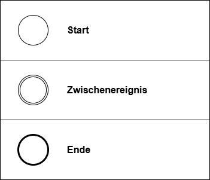

# BPMN Basics

---
hideInToc: true
---

# Inhalt

<Toc minDepth="1" maxDepth="1" />

---

# Was bedeutet BPMN?

- **BPMN** steht für **Business Process Model and Notation**
- ist eine internationale **Standardnotation zur Darstellung von Geschäftsprozessen**
- ist eine einheitliche Sprache zwischen **Fachabteilungen** als auch von **IT-Abteilungen**

---

# Zentrale Elemente

- **Ereignisse:** Start-, Zwischen-, Endergebnis
- **Aktivitäten:** Arbeitsschritte, Aufgaben
- **Gateways:** Verzweigungen und Entscheidungen

---

# Ereignisse

Ereignisse sind **runde Symbole** in BPMN. Sie markieren wichtige Punkte im Ablauf.

- **Start-Ereignis:** zeigt, wo der Prozess beginnt.
- **Zwischen-Ereignis:** tritt während eines Prozesses auf (z. B. Nachricht erhalten).
- **End-Ereignis:** markiert den Abschluss des Prozesses.



---

# Aktivitäten

Aktivitäten sind Arbeitsschritte in einem Prozess.

- Darstellung: **abgerundetes Rechteck**.
- Jede Aktivität **beschreibt eine Aufgabe oder Handlung**.
- Aktivitäten werden **nacheinander oder parallel** ausgeführt.


---

# Beispiel: Ereignisse + Aktivitäten

Aufgabe: Lehrer gibt Hausübung auf

```
- Start-Ereignis: Unterrichtsstunde beginnt  
- Aktivität: Lehrer erklärt Hausübung  
- Aktivität: Schüler notiert Hausübung  
- End-Ereignis: Stunde endet
```
<br>


---

# Gateways

Gateways werden als **Rauten** in BPMN dargestellt. Sie zeigen, wie der Ablauf eines Prozesses an einer Stelle weitergeht. Es gibt unterschiedliche Arten von Gateways:

<div class="flex">
<div>

1. **Exklusiv (XOR)**  
    - Genau **ein Pfad** wird gewählt.  
    - Beispiel: Prüfung „Pizza verfügbar?“ → Entweder „Ja“ oder „Nein“.  

2. **Parallel (AND)**  
    - **Alle Pfade** werden gleichzeitig ausgeführt.  
    - Beispiel: „Lieferung vorbereiten“ und „Rechnung erstellen“ laufen parallel.  

3. **Inklusiv (OR)**  
    - **Ein oder mehrere Pfade** können ausgeführt werden.  
    - Beispiel: Schüler bearbeitet Hausübung mit Buch *und/oder* Internet. 
</div>
<div class="w-64">


</div>
</div>

---

# Gateway Regeln

- **Jeder Pfad** eines Gateways **muss zu einem logischen Ende führen.**
- Prozesse können **mehrere End-Ereignisse** haben (z. B. „Bestellung erfolgreich“ oder „Bestellung abgelehnt“).
- Es ist wichtig, dass **alle möglichen Entscheidungen berücksichtigt werden**.

---

# Beispiel: Ereignisse + Aktivitäten + Gateway

Aufgabe: Pizza bestellen

```
- Start-Ereignis: Kunde hat Hunger  
- Aktivität: Pizza bestellen  
- Gateway (XOR): Pizza verfügbar?  
  - Ja: Pizza backen → Pizza liefern → End-Ereignis: Kunde isst Pizza  
  - Nein: Bestellung ablehnen → End-Ereignis: Kunde bestellt woanders
```


