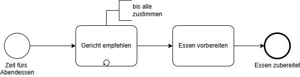
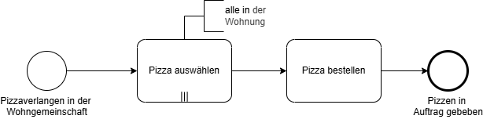
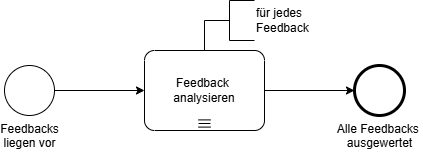
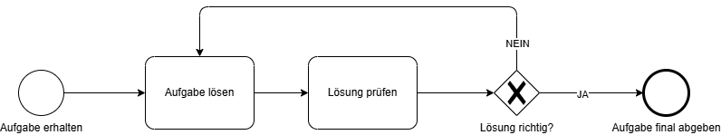

# BPMN Schleifen

---
hideInToc: true
---

# Inhalt

<Toc minDepth="1" maxDepth="1" />

---

# Was sind Schleifen?

Eine **Schleife** in BPMN beschreibt, dass **ein bestimmter Teil eines Prozesses mehrfach ausgeführt** wird – solange eine **Bedingung erfüllt** ist.

**Beispiel:** Schüler wiederholt Übungsaufgaben, bis sie richtig sind.

 

> Das ist eine **Prozess-Schleife**, da ein Schritt mehrfach durchlaufen wird.

---

# Arten von Schleifen

BPMN kennt **mehrere Möglichkeiten**, Schleifen zu modellieren:

| **Art** | **Beschreibung** | **Typische Darstellung** |
|------|----------------|----------------------|
| **Standard-Schleife** | Eine Aktivität wird **wiederholt**, solange eine Bedingung gilt | Symbol: **kleiner Pfeil im Kreis** unten an der Aktivität |
| **Mehrfachinstanz (Parallel/Sequenziell)** | Dieselbe Aktivität wird **mehrmals ausgeführt**, z. B. für jede Eingabe oder jeden Teilnehmer | Symbol: **drei parallele Striche** unter der Aktivität |
| **Gateway-Schleife** | Der Ablauf selbst springt über ein **Gateway** zu einem früheren Punkt zurück | Kombination von XOR-Gateway + Sequenzfluss zurück |

---

# Standard-Schleife

**Darstellung in BPMN:**

- Eine **Aktivität mit Loop-Symbol (Pfeil im Kreis)**  
- Bis Bedingung erfüllt ist
- **Annotation hinzufügen** um Bedingung zu erläutern

 

---

# Mehrfachinstanz - Parallel

**Darstellung in BPMN:**

- Aktivität mit **drei vertikalen Strichen** am unteren Rand  
- Bedeutet: „Führe diese Aktivität mehrfach aus“ (parallel)

 

---

# Mehrfachinstanz - Sequentiell

**Darstellung in BPMN:**

- Aktivität mit **drei horizontale Strichen** am unteren Rand  
- Bedeutet: „Führe diese Aktivität mehrfach aus“ (sequentiell)

 

---

# Gateway-Schleife

- Diese Form der Schleife ist **am häufigsten in Geschäftsprozessen**,  
weil sie **grafisch sichtbar** zeigt, wann der Ablauf zurückspringt.
- aka *"Going back"*

