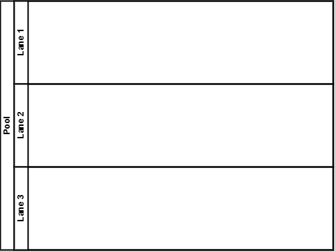
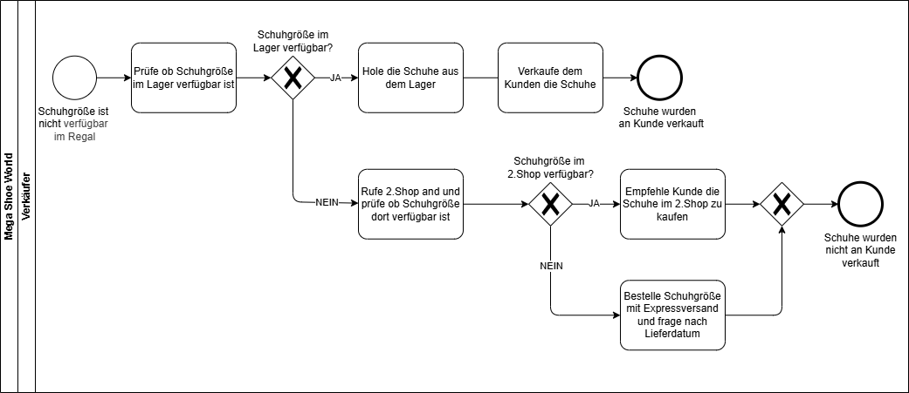
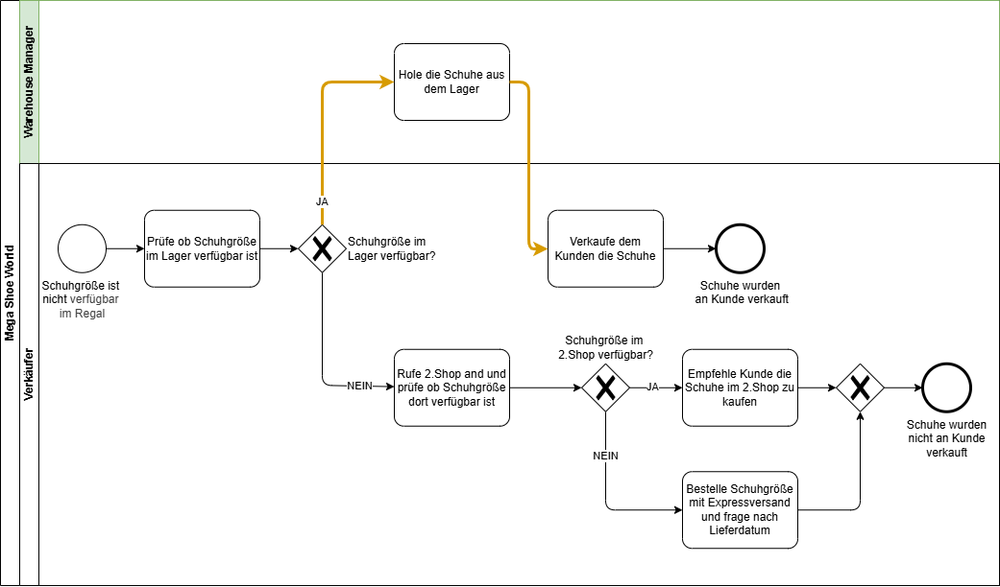
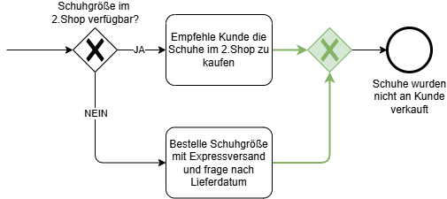
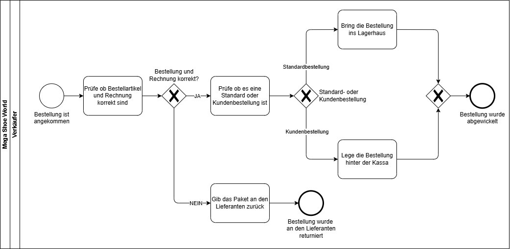
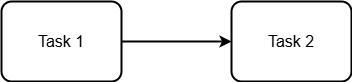
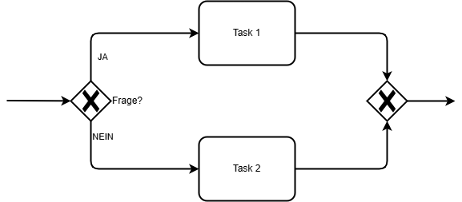
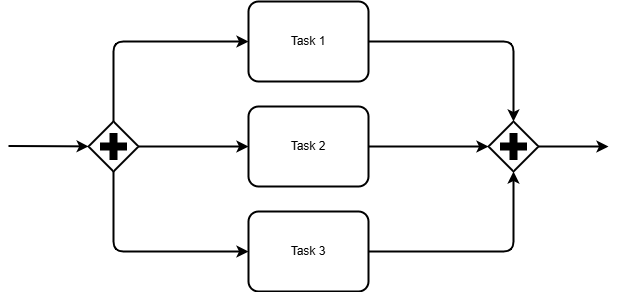

# BPMN - Fortgeschritten

---
hideInToc: true
---

# Inhalt

<Toc minDepth="1" maxDepth="1" />

---

# Pools & Lanes

- Der **Pool** definiert in der Regel die **Organisation oder Einheit**, in der der Prozess stattfindet.
- Die **Lane** (Bahn) definiert die **Rolle oder Abteilung**, die für die Ausführung der einzelnen Aufgaben verantwortlich ist.

{width=50%}

---

# Beispiel: Fehlender Schuhgrößen Prozess

*** 

---

# Beispiel: Fehlender Schuhgrößen Prozess 2.0

***

{width=80%}

---

# Closing Gateways

Um Aktivitäten (Tasks) wieder zusammenzuführen, benutzt man *Closing Gateways*.

 

---

# Übung: Lieferung Großhändler

Der Verkäufer steht vor einer neuen Herausforderung. Er erhält eine Lieferung vom Großhändler und weiß nicht, was er als Nächstes tun soll. Sein Chef sagt zu ihm:

„Keine Sorge. Zuerst überprüfst du, ob die Bestellung und die Rechnung korrekt sind. Wenn nicht, gibst du das Paket an den Versandmitarbeiter zurück. Wenn alles stimmt, prüfst du, ob es sich um eine Standardbestellung oder um eine Kundenbestellung handelt. Wenn es eine Standardbestellung ist, bringst du die Schuhe einfach ins Lager. Wenn es eine Kundenbestellung ist, stellst du die Schuhe hinter die Kasse – und das war’s!“

Deine Aufgabe ist es nun, dem Verkäufer zu helfen, indem du einen einfachen Prozess erstellst. Ignoriere dabei die Aufgaben des Versandmitarbeiters. Modelle nur, was der Verkäufer tun muss.

---

# Lösung: Lieferung Großhändler

*** 

---

# Token Konzept

Einen *Token* kann man sich als *Ball* oder *Murmel* vorstellen.

{width=40%}

- Der *Token* rollt durch den Prozess, vom Start- bis zum Endevent!
- Der *Token* durchläuft alle Arten von Aktivitäten und Gateways, die ihn beeinflussen.
- Sobald die Aktivität fertig ist, rollt der Token weiter

---
hideInToc: true
layout: default
clicks: 2
---

# Token Konzept

    <BpmnToken />

  

---
hideInToc: true
clicks: 4
---

# Token Konzept

Die eigentliche Stärke des Token-Konzepts besteht darin, zu veranschaulichen, wie verschiedene Gateways funktionieren.

**Beispiel: XOR**

    <BpmnToken />

  

---
hideInToc: true
clicks: 8
---

# Token Konzept

Die eigentliche Stärke des Token-Konzepts besteht darin, zu veranschaulichen, wie verschiedene Gateways funktionieren.

**Beispiel "Parallel": Tokens werden geklont und beim Closing Gateway muss man auf alle warten.**

    <BpmnToken />

    <BpmnToken />

    <BpmnToken />

  

