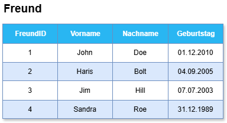
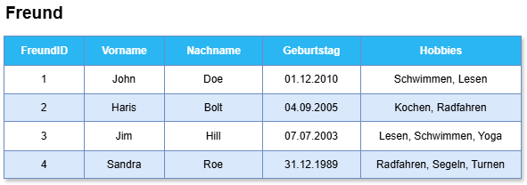
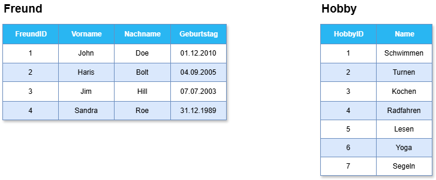
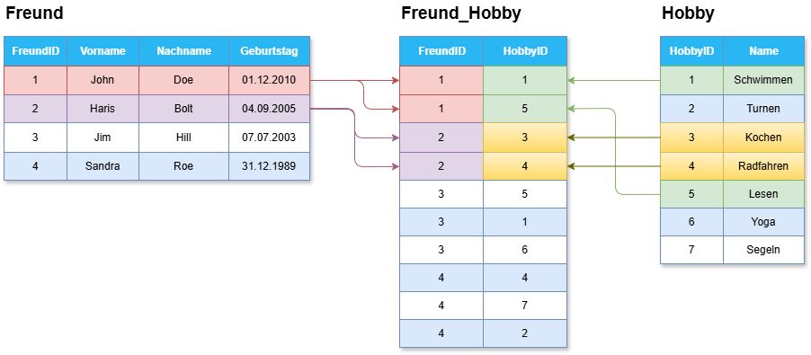
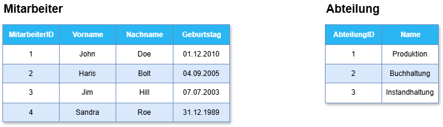
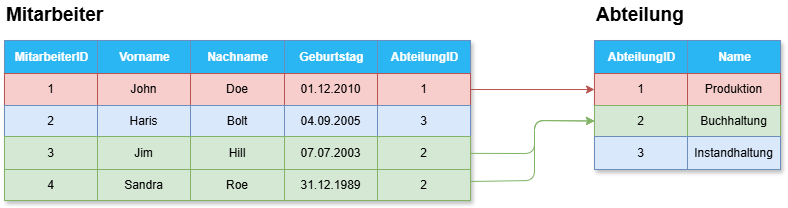

# Relationen in Datenbanken

---
hideInToc: true
---

# Inhalt

<Toc minDepth="1" maxDepth="1" />

---

# Was ist eine Relation?

In der Datenbanktheorie ist eine **Relation** eine **Tabelle**, bestehend aus:

- **Zeilen (Tupel)** → einzelne Datensätze
- **Spalten (Attribute)** → Felder mit bestimmten Datentypen

 

> 💡 Eine **Relation** beschreibt also eine **Menge gleich strukturierter Daten** – zum Beispiel alle Filme, alle Kunden oder alle Rechnungen.

**Beispiel einer Relation `Filme`:**

| movie_id | title        | genre    | jahr |
|----------|--------------|----------|------|
| 1        | Inception    | Sci-Fi   | 2010 |
| 2        | Parasite     | Drama    | 2019 |
| 3        | Matrix       | Action   | 1999 | 

---

# Wie stehen Relationen (Tabellen) zueinander?

Einzelne Relationen können miteinander in **Beziehung** stehen – z. B.:

- Ein Kunde hat mehrere Bestellungen
- Ein Film kann in mehreren Kinos gezeigt werden
- Ein Lehrer unterrichtet mehrere Klassen

---

# Warum braucht man Beziehungen zwischen Relationen?

Beispiel: Freunde und Hobbies

- Stellen Sie sich vor, sie verwalten in einer Datenbank-Tabelle alle ihre Freunde
- Damit sie den Geburtstag nicht vergessen, gibt es eine Spalte dafür.

---

- Sie wollen nun auch noch deren Hobbies speichern → Also fügen Sie eine Spalte namens "Hobbies" hinzu

- Auf den ersten Blick wirkt das praktisch. **Aber:**
    - **Suche schwierig**: *„Finde alle Mitglieder, die Schwimmen als Hobby haben“* → man muss Text durchsuchen, sehr unpraktisch.
    - **Redundanz (Doppelungen):** Hobbies wie *Schwimmen* kommen öfters vor. Schreibfehler („schwimen“) führen zu Chaos beim Suchen.
    - **Erweiterung unflexibel:** Eventuell wollen sie zum Hobby noch weitere Infos speichern. e.g. ein Level wie gut jemand ist, in welchem Verein er/sie spielt, oder seit wann er/sie das Hobby ausübt 

---

# Die Lösung: Beziehungen zwischen Tabellen

**Schritt 1:** Anstelle von nur einer Tabelle, werden die Daten in **mehreren Tabellen aufgeteilt**

---

# Die Lösung: Beziehungen zwischen Tabellen

**Schritt 2:** Verbinden der Tabellen miteinander durch ein eindeutiges Attribut (e.g. HobbyID und FreundID) und einer neuen Tabelle

---

# Braucht man also immer eine neue Tabelle?

- Antwort: **Nein**, es kommt darauf an, wie die Tabellen in Beziehung stehen.

**Beispiel: Mitarbeiter arbeitet in einer Abteilung:**
- Ein Mitarbeiter kann in nur einer Abteilung arbeiten, aber in einer Abteilung können viele Mitarbeiter arbeiten

<v-switch>
<template #0>

</template>
<template #1>

</template>
</v-switch>

---

# Zusammenfassung: Beziehungen

Ob eine neue Tabelle benötigt wird, hängt von der **Art der Beziehung** ab.

**Neue (Zwischen-)Tabelle wenn:**

- **ein** Eintrag in einer Tabelle auf **viele andere** Einträge auf der anderen Tabelle verweist **und umgekehrt**
- Beispiel: **Ein Freund** kann **viele Hobbies** haben, und **ein Hobby** kann von **vielen Freunden** ausgeübt werden.
- Anders ausgedrückt: **(1) Freund** kann **(n) Hobbies** haben, jedoch kann **(1) Hobby** von **(m) Freunden** ausgeübt werden

 

---
hideInToc: true
---

# Zusammenfassung: Beziehungen

Ob eine neue Tabelle benötigt wird, hängt von der **Art der Beziehung** ab.

**Keine neue Tabelle wenn:**

- **ein** Eintrag in einer Tabelle auf **viele andere** Einträge auf der anderen Tabelle verweist, aber **nicht umgekehrt**
- Beispiel: In **einer Abteilung** können **viele** Mitarbeiter arbeiten, jedoch nur **ein Mitarbeiter** kann in einer **Abteilung** arbeiten.
- Anders ausgedrückt: In **(1) Abteilung** können **(n)** Mitarbeiter arbeiten, jedoch nur **(1) Mitarbeiter** kann in **(1) Abteilung** arbeiten.

 

