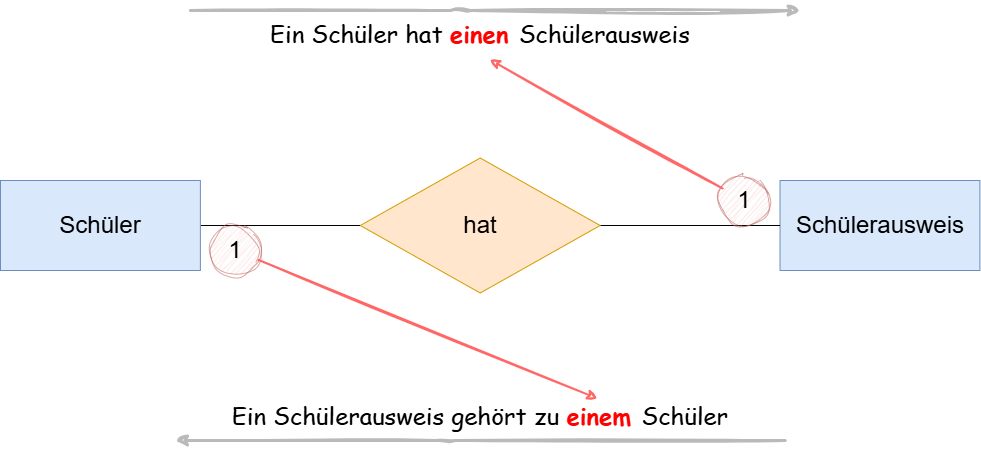
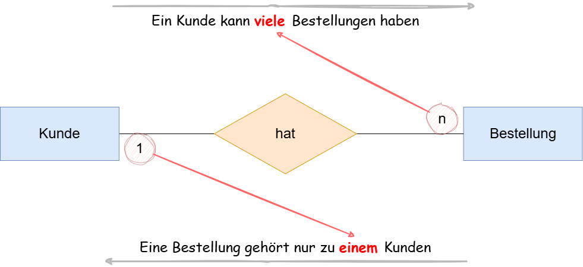
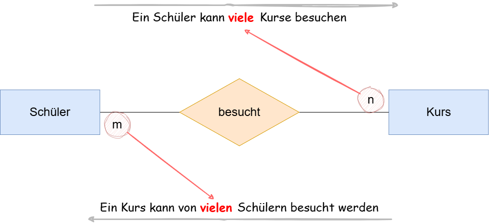
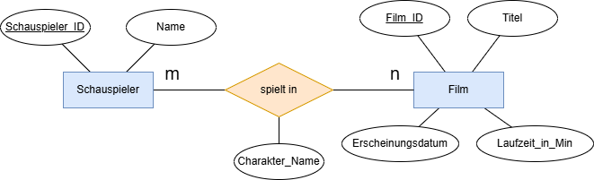
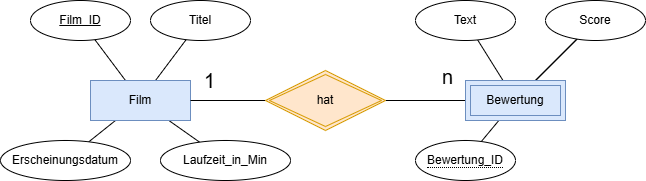
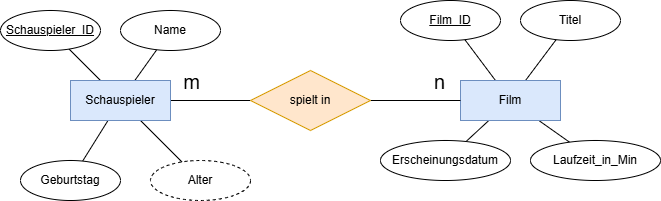

# Datenbankmodellierung

---
hideInToc: true
---

# Inhalt

<Toc minDepth="1" maxDepth="1" />

---

# Warum modellieren?

Analogie: Man stelle sich vor, wir würden ein Haus **ohne Bauplan** bauen

- Wände passen nicht zusammen  
- Türen gehen ins Leere  
- Stromleitungen fehlen oder sind doppelt  
- Änderungen sind sehr teuer  

**Vergleich zur Datenbank:**

- **Haus** = Datenbank  
- **Bauplan** = Datenbankmodell

 

> 💡 Niemand baut ein Haus ohne Plan – warum also eine Datenbank ohne Modell? 

---

# Vorteile der Datenbankmodellierung

 

✅ **Struktur & Übersicht**: Komplexe Daten werden klar organisiert  

✅ **Vermeidung von Redundanz**: Keine mehrfach gespeicherten Infos  

✅ **Konsistenz & Regeln sichtbar**: Klare Vorgaben: was ist erlaubt, was nicht  

✅ **Einfache Abfragen & Nutzung**: Daten sind leichter zu durchsuchen  

✅ **Bessere Wartbarkeit & Erweiterbarkeit**: Neue Anforderungen lassen sich leichter einbauen  

---

# Definition: Datenbankmodellierung

**Datenbankmodellierung** übersetzt die Fachdomäne in eine klare, widerspruchsfreie Datenstruktur.  

- Statt sofort Tabellen in SQL zu schreiben,  
  → **zuerst ein Modell erstellen**  
- Zeigt: welche Dinge (Entitäten) und welche Verknüpfungen (Beziehungen) es gibt  
- Ergebnis: ein **Relationenschema**, das später in SQL umgesetzt wird  

 

> 💡Erst **modellieren (konzeptuell)** → dann **Tabellen bauen (logisch)** → zuletzt **im DBMS speichern (physisch)**

 

--> Wir benutzen das **ER-Modell** als Modellierungssprache

---

# Was ist ein ER-Modell?

- **E**ntity (**Entität**) = Ding/Objekt, das wir speichern wollen 
- **R**elationship (**Beziehung**) = Verknüpfung zwischen Entitäten 

 

**Beispiel:**

*Entitäten (Tabellen):*
- Movie(movie_id, title, release_date, runtime_min)
- Actor(actor_id, name)

*Beziehungen:*
- Ein Movie kann viele Actors haben  
- Ein Actor kann in vielen Movies spielen 

---

# ER-Diagramm

Das ER-Diagramm ist die **grafische Darstellung** des ER-Modells.

- **Rechteck** = Entität (Tabelle)  
- **Ellipse** = Attribut (Spalte)  
- **Raute** = Beziehung (Verknüpfung)  

👉 mit **Kardinalität**: 1:1, 1:n, m:n

**Beispiel:**

---

# Kardinalität – Was heißt das?

Beschreibt **wie viele Objekte** einer Entität  
mit Objekten einer anderen Entität verknüpft sein können.

- **1:1**
    - genau eins zu eins
    - *Beispiel:* **Ein (1)** Schüler hat **genau einen (1)** Schülerausweis
- **1:n**
    - eins zu vielen
    - *Beispiel:* **Ein (1)** Kunde hat **viele (n)** Bestellungen, aber **eine (1)** Bestellung gehört nur zu **einem (1)** Kunden
- **m:n** 
    - viele zu vielen
    - *Beispiel:*  **Ein (1)** Schüler besucht **viele (n)** Kurse, und **ein (1)** Kurs hat **viele (m)** Schüler

---

# Beispiel - 1:1 Kardinalität

**Ein (1)** Schüler hat **genau einen (1)** Schülerausweis

{width=100%}

---

# Beispiel - 1:n Kardinalität

**Ein (1)** Kunde hat **viele (n)** Bestellungen, aber **eine (1)** Bestellung gehört nur zu **einem (1)** Kunden

{width=100%}

---

# Beispiel - m:n Kardinalität

**Ein (1)** Schüler besucht **viele (n)** Kurse, und **ein (1)** Kurs hat **viele (m)** Schüler

{width=100%}

> 💡 in `m:n` Beziehungen können auch *Beziehungen* Attribute haben.

---

# Beziehungen mit Attributen

In `m:n` Beziehungen können auch *Beziehungen* Attribute haben.

{width=100%}

---

# Weitere Elemente im ER Diagramm

 

**Schwache Entität**

- kann nicht alleine existieren
- Beispiel: `Bewertung` gehört immer zu genau einem `Film`
- Symbol: *Doppeltes Rechteck*

 

---
hideInToc: true
---

# Weitere Elemente im ER Diagramm

 

**Abgeleitetes Attribut**

- wird aus einem anderen Attribut berechnet
- Beispiel: `Alter` wird aus `Geburtstag` berechnet
- Symbol: *Gestrichelte Ellipse*

 

