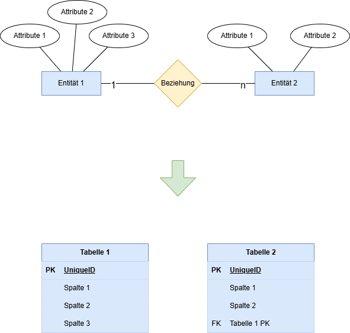
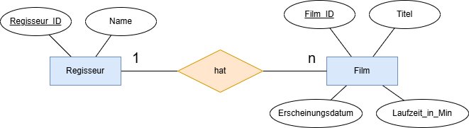
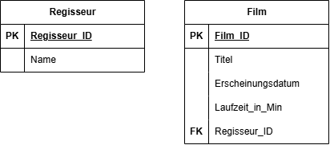
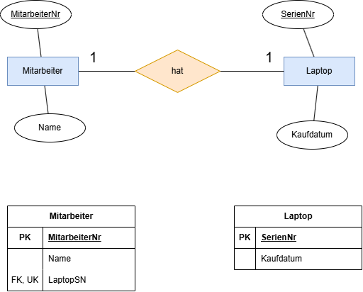
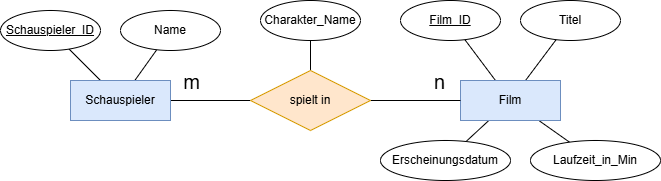
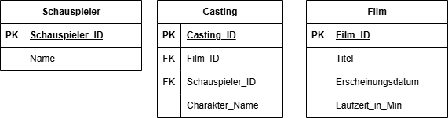
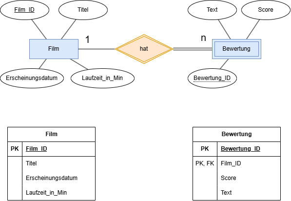
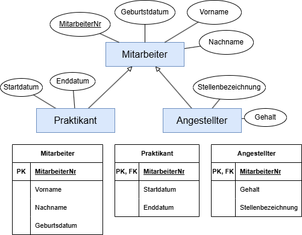
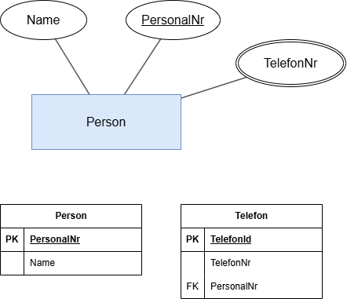

# Relationsschema

## Vom ER Diagramm zum Relationsschema

---
hideInToc: true
---

# Inhalt

<Toc minDepth="1" maxDepth="1" />

---

# Erinnerung: ER-Modell/Diagramm

- Entitäten (z. B. `FILM`, `SCHAUSPIELER`)  
- Attribute (z. B. `Titel`, `Name`)  
- Beziehungen (z. B. „spielt in“)  
- Kardinalitäten (1:1, 1:n, m:n)

👉 ER-Modell = **konzeptuelle Sicht** (fachliche Welt)

---
layout: two-cols
layoutClass: gap-16
---

# Ziel: Relationsschema

- Relationsschema = **Sammlung von Tabellen**  
- Jede Tabelle enthält: 
   - Name
   - Spalten
   - Primärschlüssel
   - Fremdschlüssel (falls vorhanden)
   - Constraints (falls vorhanden)
- Später Grundlage für SQL `CREATE TABLE`

 

👉 Relationsschema = **logische Sicht**

::right::

---
layout: two-cols-header
layoutClass: gap-y-14
---

# Umwandlung - 1:n Beziehung

::left::

**1:n Beziehung → Fremdschlüssel**  
   - Der Schlüssel der „1“-Seite wird in der „n“-Tabelle als Fremdschlüssel gespeichert  

::right::

 

---
layout: two-cols-header
layoutClass: gap-y-14 gap-x-4
---

# Umwandlung - 1:1 Beziehung

::left::

**1:1 Beziehung → Fremdschlüssel + Unique key**
   - Die eine Tabelle beinhaltet den Primärschlüssel der anderen Tabelle als Fremdschlüssel. 
   - Zusätzlich kommt noch eine `UNIQUE` Constraint dazu, welches sicherstellt das der Wert nur einmal in der Spalte vorkommt

::right::

---
layout: two-cols-header
layoutClass: gap-y-14
---

# Umwandlung - m:n Beziehung

::left::

**m:n Beziehung → Zwischentabelle**  
   - Neue Relation mit beiden Primärschlüsseln als Fremdschlüssel 
   - ggf. zusätzliche Beziehungsattribute in Zwischentabelle als Spalten einfügen

::right::

 

---
layout: two-cols-header
layoutClass: gap-y-14
---

# Umwandlung - Weak Entity

::left::

**Weak Entity → Fremdschlüssel + PK**
   - Die Tabelle aus der Weak Entity bekommt den Primärschüssel der anderen Tabelle als Primär- und Fremdschlüssel

::right::

---
layout: two-cols-header
layoutClass: gap-y-14
---

# Umwandlung - Generalisierung 

::left::

**Generalisierung → FK = PK**
   - Die Spezialisierung  teilt sich den Primärschlüssel mit der Generalisierung
   - Zusätzlich dient dieser Primärschlüssel als Fremdschlüssel um eine Verbindung zur Generalisierung herzustellen.

::right::

---
layout: two-cols-header
layoutClass: gap-y-14
---

# Umwandlung - Mehrwertiges Attribut 

::left::

**Mehrwertiges Attribut → Neue Tabelle + FK**
   - Neue Relation mit dem Primärschlüssel der ursprünglichen Entität als Fremdschlüssel

::right::

---

# Warum diese Schritte?

 

✅ Das Relationsschema ist **klar definiert**

✅ Direkte Grundlage für **SQL** Befehle (`CREATE TABLE`)  

✅ Vermeidet Fehler und Inkonsistenzen  
