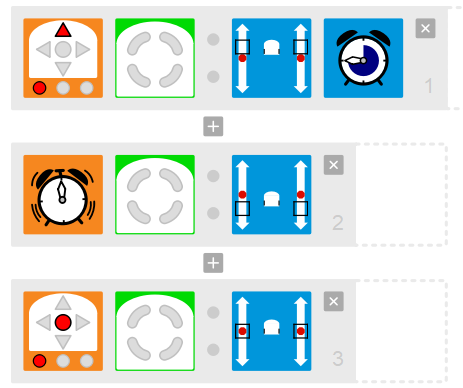
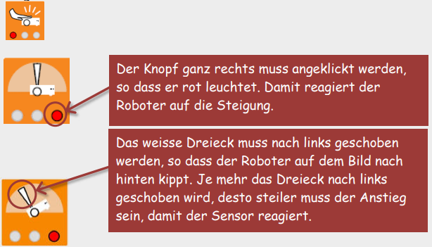
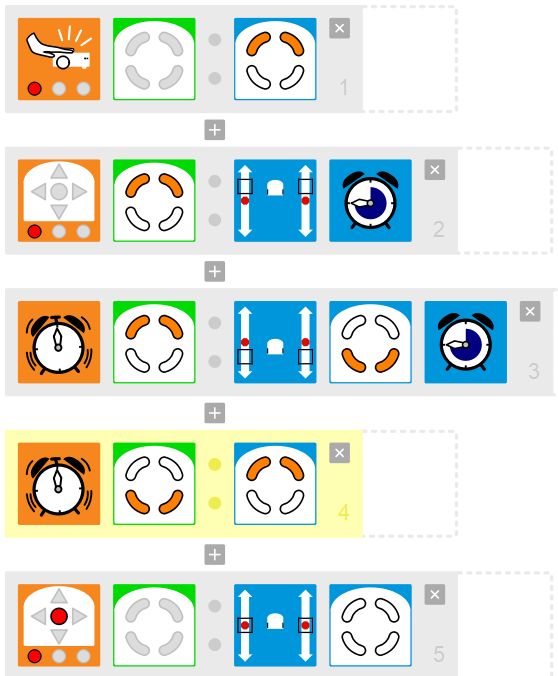

# Thymio

---
hideInToc: true
---

# Inhalt

<Toc minDepth="1" maxDepth="1" />

---

# Aufgabe: Need for Speed

- Steuere den Thymio über die Tasten. Teste verschiedene Geschwindigkeiten. 
- Kurven fahren bis hin zum Drehen auf der Stelle ist ebenfalls möglich.
- Auch Rückwärtsfahren ist erlaubt!

---

# Aufgabe: Lichtspiele

- Lass den Thymio farbig leuchten, wenn du klatschst.
- Probiere verschiedene Farben aus. 
- Man kann Farben auch selber "mischen".

---

# Aufgabe: Notbremse

- Der Thymio fährt auf die Tischkante zu und droht abzustürzen.
- Programmiere den Roboter so, dass er nicht in die Tiefe stürzt.

 

**Tipp zur Umsetzung:**
Du brauchst die *Bodendistanz-Sensoren*. Lasse den Roboter auf eine Tischkante zufahren, oder benutze einen weissen Untergrund mit dicker schwarzer Linie als Tischkante.

---

# Aufgabe: Rotlicht

- Vor einem Hindernis stoppt der Thymio und leuchtet rot. 
- Wenn der Stoppbutton gedrückt wird, soll der Thymio wieder weiss werden.

**Tipp zur Umsetzung:**
Bei diesen Ereignissen braucht es mehrere Aktionen.
Du kannst den Thymio oben und unten rot leuchten lassen!

---

# Aufgabe: Linien zeichnen

- Du steuerst den Thymio mit den Pfeiltasten.
- Lass den Roboter ein Bild aus geraden Linien zeichnen.
- Für Richtungswechsel soll der Thymio auf der Stelle drehen.

**Tipp zur Umsetzung:**
Je langsamer der Thymio fährt, desto besser fährt er geradeaus. Beim Drehen auf der Stelle drückst du im richtigen Moment wieder die Vorwärts-Taste zum Weiterzeichnen.

---

# Aufgabe: Ausweichen

- Wenn der Roboter auf ein Hindernis trifft, soll er rückwärts mit einer Kurve ausweichen. 
- Wenn er beim Rückwärtsfahren ein Hindernis trifft, dann soll er wieder geradeaus vorwärts fahren.

**Tipp zur Umsetzung:**
Weiche mit einer Rechts- oder Linkskurve rückwärts aus. Programmiere also die Sensoren vorne rechts und vorne links unterschiedlich.

---

# Aufgabe: Einer Linie folgen

- Der Thymio soll auf Knopfdruck vorwärts losfahren und selbständig einer schwarzen Linie (mindestens 3cm breit!) folgen. 
- Dabei leuchtet er unten, wenn er nach rechts fährt und er leuchtet oben, wenn er nach links fährt.

**Tipps zur Umsetzung:**
Du brauchst die Bodensensoren, die erkennen, wenn du die Linie links oder rechts verlässt. Der Thymio soll dann zurück auf die Linie fahren.
Linie: Schwarzes Klebband (mindestens 3cm breit!)
auf einer hellen Unterlage.

---

# Aufgabe: Verfolgungsjagd

Der Thymio verfolgt deine Hand. Programmiere ihn so, dass er der Hand geradeaus, links und rechts folgen kann.

**Tipps zur Umsetzung:**

Je langsamer der Thymio fährt, desto besser folgt er der Hand.
Programmiere mindestens drei vordere Sensoren. Vergiss den Stoppknopf nicht!

---

# Aufgabe: Blaulicht

Der Thymio fährt auf Knopfdruck los. Unterwegs schaltet er bei leichtem Klopfen auf das Gehäuse das Blaulicht ein. 
Immer, wenn ein Hindernis vor ihm erscheint, erklingt eine "Sirene" (Melodie) und der Thymio stoppt. 

**Tipps zur Umsetzung:**

Programmiere den Startknopf so, dass er das Blaulicht ausschaltet. So ist der Roboter bei einem erneuten Start wieder weiss. 

---
layout: center
---

# Expertenmodus einschalten

  

---

# Timer: Rückwartsgang nach 3 Sekunden

Der Thymio fährt auf Knopfdruck nach vorne. Nach 3 Sekunden legt er den Rückwärtsgang ein.

{width=40%}

---

# Aufgabe: Bergfahrt

Die Strecke für den Thymio verläuft zuerst flach, dann folgt eine leichte Steigung. Der Thymio bemerkt die Steigung und wird rot, ansonsten ist er grün.

- Den Sensor für die Vorwärts- / Rückwärtsneigung findest du bei den
Ereignissen links unten. Er sieht zuerst so aus:

{width=60%}

# Kreisel mit Farbwechsel

Der Thymio dreht sich auf Knopfdruck um sich selber. 
Wenn du deine Hand vor den Thymio hältst, wird er rot, beim zweiten Mal blau und beim dritten Mal grün, dann wieder rot usw. 
Nutze immer den gleichen Sensor (vorne in der Mitte)! 

---

# Aufgabe: Endlos Vorwärts / Rückwärts

Der Thymio fährt bei Klopfereignis nach vorne. Nach 3 Sekunden legt er den Rückwärtsgang ein. Danach fährt er wieder vorwärts für 3 Sekunden, danach wieder Rückwärts, usw. usw

**Tipps zur Umsetzung:**

- Du musst mit den States arbeiten
- Du musst mit dem Timer arbeiten

---

# Lösung: Endlos Vorwärts / Rückwärts
***
{width=40%}

---

# Links

[Alle Lösungen](./assets/Dossier-Thymio-mit-VPL.pdf)
