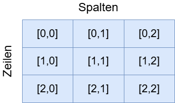

# Einführung in Mehrdimensionale Arrays

---
hideInToc: true
---

# Inhalt

<Toc minDepth="1" maxDepth="1" />

---

# Was sind mehrdimensionale Arrays?

- Arrays können nicht nur **eine Reihe** von Werten speichern  
- Sondern auch mehrere Dimensionen → „Tabellen“ oder „Matrizen“  
- Beispiel: **2D-Array** = Zeilen × Spalten

👉 Praktisch für Tabellen, Spielfelder, Matrizen

---

# Beispiel: 2D-Array

```csharp
// 2D-Array mit 2 Zeilen und 3 Spalten
double[,] matrix = new double[2, 3];

matrix[0, 1] = 1.5;

int zeilen = matrix.GetLength(0); // 2
int spalten = matrix.GetLength(1); // 3
```



> `matrix[0,1]` = Zugriff auf Zeile 0, Spalte 1

---
layout: two-cols-header
layoutClass: gap-1
---

# Beispiel: 3D-Array

::left::

```csharp
// 3D-Array: [2,3,4]
int[,,] cube = new int[2, 3, 4];

// Zugriff auf ein Element
cube[1, 2, 3] = 42;

// Dimensionen abfragen
int dim0 = cube.GetLength(0); // 2
int dim1 = cube.GetLength(1); // 3
int dim2 = cube.GetLength(2); // 4
```

<br>

> 💡 Zugriff erfolgt mit drei Indizes `[i, j, k]`

::right::


---

# Jagged Arrays (gezackte Arrays)

- Unterschied: Jede „Zeile“ kann unterschiedlich viele Elemente haben
- Also kein Rechteck, sondern „gezackt“


```csharp
int[][] dreieck = new int[3][];     // 3 Zeilen

dreieck[0] = new[] { 1, 9, 8, 7 };  // 4 Element
dreieck[1] = new[] { 2, 3 };        // 2 Elemente
dreieck[2] = new[] { 4, 5, 6 };     // 3 Elemente

int x = dreieck[2][1];              // Zugriff: 5
```

---

# Vergleich Mehrdimensionale vs Jagged Arrays

|             | **Mehrdimensionales Array** | **Jagged Array**                       |
| ----------- | ----------------------- | ---------------------------------- |
| **Struktur**    | Rechteck, Quader  | unterschiedlich lange Zeilen       |
| **Deklaration** | `int[,] matrix`, `int[,,] cube`        | `int[][] jagged`                   |
| **Zugriff**     | `matrix[i,j]`, `cube[i,j,k]`           | `jagged[i][j]`                     |
| **Anwendung**   | Matrizen, Spielfelder   | Dreiecke, unregelmäßige Strukturen |

