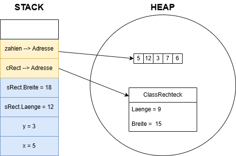

# Klassen

## Einstieg in die objektorientierte Programmierung 

---
hideInToc: true
---

# Inhalt

<Toc minDepth="1" maxDepth="1" />

---

# Klasse = der Bauplan 📝

Eine Klasse ist wie ein **Bauplan** für ein **Haus**.

- Der Bauplan beschreibt, welche Räume, Fenster und Türen das Haus hat.
- Aber solange der Plan nur auf Papier existiert, steht noch kein Haus.

```csharp {1-2,14}{lines:true}
class Player
{
    public int Lebenspunkte; // Daten in Form von Feldern

    public Player(int lebenspunkte)
    {
        this.Lebenspunkte = lebenspunkte;
    }

    public void Angreifen() // Methoden
    {
        Console.WriteLine($"Spieler greift an.");
    }
}
```
<br>

> 👉 Eine Klasse ist nur die Anleitung, kein echtes Objekt im Speicher.

---

# Warum brauchen wir Klassen ❓

Um **Daten und Verhalten logisch zusammenzufassen**, sodass wir **komplexe Dinge** aus der realen Welt als **strukturierte, wiederverwendbare Objekte** im Programm abbilden können.

- Klassen sind das Herz der **objektorientierten Programmierung (OOP**).
- Sie beschreiben wie etwas aussieht (**Daten**) und was es tun kann (**Methoden**).

```csharp {1-3,10-14}{lines:true}
class Player
{
    public int Lebenspunkte; // Felder = Daten

    public Player(int lebenspunkte)
    {
        this.Lebenspunkte = lebenspunkte;
    }

    public void Angreifen() // Methoden
    {
        Console.WriteLine($"Spieler greift an.");
    }
}
```


---

# Der Konstruktor = der Baumeister 👷‍♂️

Damit aus einem Bauplan ein echtes Haus wird, braucht man jemanden, der es baut – den **Baumeister**.

In C# übernimmt das der **Konstruktor**.

```csharp {5-8}{lines:true}
class Player
{
    public int Lebenspunkte;

    public Player(int lebenspunkte) // Konstruktor mit einem Parameter
    {
        this.Lebenspunkte = lebenspunkte;
    }

    public void Angreifen()
    {
        Console.WriteLine($"Spieler greift an.");
    }
}
```

---

# Standardkonstruktor

Eine Klasse hat **immer** einen Standardkonstruktor, also einen Konstruktor ohne Parameter, der keine Felder setzt.

```csharp {lines:true}
class Player
{
    public int Lebenspunkte;

    public void Angreifen()
    {
        Console.WriteLine($"Spieler greift an.");
    }
}
```

---

# Standardkonstruktor überschreiben

Man kann den Standarkonstuktor überschreiben, um Felder mit "Standardwerten" zu befüllen.

```csharp {5-8}{lines:true}
class Player
{
    public int Lebenspunkte;

    public Player()
    {
        this.Lebenspunkte = 80;
    }

    public void Angreifen()
    {
        Console.WriteLine($"Spieler greift an.");
    }
}
```

---

# Mehrere Konstruktoren

Es ist auch möglich mehrere Konstruktoren zu definieren

```csharp {5-13}{lines:true}
class Player
{
    public int Lebenspunkte;

    public Player()
    {
        this.Lebenspunkte = 80;
    }

    public Player(int lebenspunkte)
    {
        this.Lebenspunkte = lebenspunkte;
    }

    public void Angreifen()
    {
        Console.WriteLine($"Spieler greift an.");
    }
}
```

---

# Das Objekt = das gebaute Haus 🏠

Wenn der Bauplan (Klasse) umgesetzt wird, entsteht ein konkretes **Objekt** – das „echte Haus“.

```csharp
Player player = new Player(100); // neues Objekt ensteht

Player enemy = new Player(50); // ein weiteres Objekt entsteht

Player boss = new Player(); // ein weiteres Objekt, welches den Standardkonstruktor benutzt hat
```

<br>

> 💡 Objekt = **Instanz der Klasse**.

---

# Objekte referenzieren 👉

Ein Objekt ist ein **Referenztyp**. Mit Variablen *referenzieren* (zeigen 👉) wir auf diese Objekte im Speicher.

**Stell dir ein Schulspind-System vor:**
- Der Spind (Objekt) steht irgendwo im Schulhaus → das ist der Speicher im Heap.
- Die Spindnummer (Referenz) steht auf deinem Schlüsselanhänger → das ist die Variable im Code.

```csharp
Player player = new Player(100); // `player` speichert die "Spindnummer"
Player samePlayer = player; // `samePlayer` bekommt die selbe "Spindnummer"

samePlayer.Lebenspunkte = 150;
Console.WriteLine(player.Lebenspunkte); // Ausgabe: 150
```

➡️ **Beide** Variablen (`player` und `samePlayer`) **zeigen auf dasselbe Objekt** (im Speicher).

➡️ **Variablen von Klassen speichern** nicht das Objekt selbst,
sondern **nur eine Referenz (Adresse)**, um es zu erreichen.

---
layout: two-cols-header
layoutClass: gap-8
---

# Referenz- VS. Wertetypen

- Primitive Datentypen (e.g. `int`, `bool`, `char`) und *Structs* sind **Wertetypen** und befinden sich am **Stack**.
- *Klassen* und *Arrays* sind **Referenztypen**. Sie referenzieren zum eigentlichen Objekt hin und befinden sich am **Heap**.

::left::

```csharp
int x = 5;
int y = 3;

StructRechteck sRect = new StructRechteck(12,18);
ClassRechteck cRect = new ClassRechteck(9,15);

int[] zahlen = new int[]{5, 12, 3, 7, 6};
```


::right::


---

# Lebenszyklus von Variablen

```csharp {none|1-5,21|7-9,20|9-11,20|13-17|5,19}{lines:true}
class Player
{
    // 🔹 Feld der Klasse – gehört jedem Objekt "Spieler"
    // Lebt so lange, wie das Objekt im Speicher (Heap) existiert
    public int Lebenspunkte = 100;

    // 🔹 Parameter `betrag`, lebt so lange bis die Methode endet
    public void Heile(int betrag)
    {
        // 🔹 Lokale Variable – lebt bis zum Methodenende
        int geheilt = 0;

        // 🔹 Schleifenvariable `i` – lebt nur in der Schleife
        for (int i = 0; i < betrag; i++)
        {
            geheilt++;           // i und geheilt leben auf dem Stack
        }

        Lebenspunkte += geheilt; // Schreiben auf das Feld (Heap), da `geheilt` Variable bei Methodenende stirbt
    }
}
```
---

# Zusammenfassung

| Begriff         | Analogie     | Bedeutung                                |
| --------------- | ------------ | ---------------------------------------- |
| **Klasse**      | Bauplan      | Vorlage, beschreibt Aufbau und Verhalten |
| **Konstruktor** | Baumeister   | Erzeugt das Objekt und befüllt es        |
| **Objekt**      | Haus / Spind | Konkrete Instanz im Speicher             |
| **Referenz**    | Spindnummer  | Zeiger auf das Objekt im Heap            |

