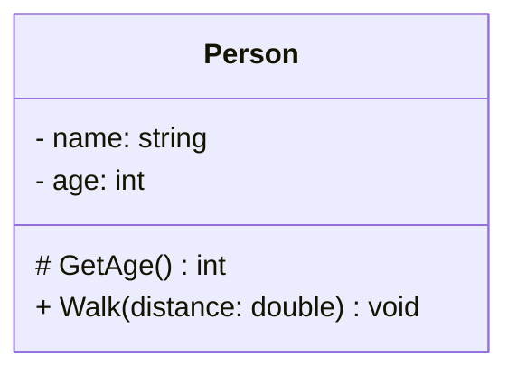
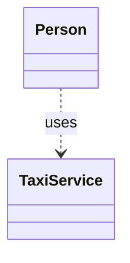
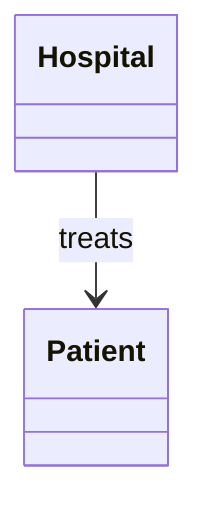
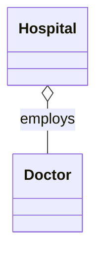
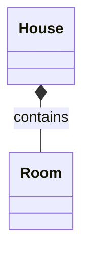
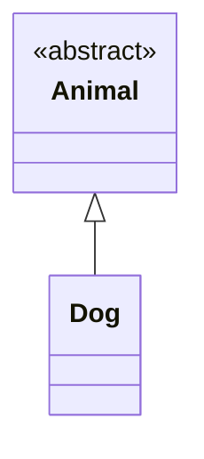
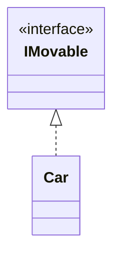

# UML Klassendiagramme

## *Unified Modelling Language*

---
hideInToc: true
---

# Inhalt

<Toc minDepth="1" maxDepth="1" />

---

# Was sind Klassendiagramme? 

Klassendiagramme sind ein Teil der UML (Unified Modeling Language).

- Sie zeigen Aufbau, **Eigenschaften, Methoden und Beziehungen** zwischen Klassen.
- Sie helfen dabei, Struktur und Logik des **Systems zu planen**.
- Sie bilden die **Grundlage der objektorientierten Programmierung** (OOP).

--- 

# Warum verwenden wir Klassendiagramme?

- Architekturen planen
- Komplexität zu reduzieren
- Klassenverantwortungen sichtbar zu machen
- Beziehungen zu klären
- Teams ein gemeinsames Verständnis zu geben

---
layout: two-cols
layoutClass: gap-16
---

# Aufbau einer Klasse

 

### Eine Klasse besteht in UML aus drei Bereichen:

 

1. Name der Klasse
2. Attribute (Eigenschaften, Felder)
3. Methoden (Funktionen der Klasse)

 

### ...und zeigt Sichtbarkeiten:

 

- `+`  → `public` 
- `-` → `private`
- `#` → `protected`

::right::

 
 
 

---

# Beziehungen zwischen Klassen abbilden

Auch Beziehungen zwischen Klassen bzw. Objekten können in UML abgebildet werden:

 

<h4>Abhängigkeit</h4>

<h4>Assoziation</h4>

<h4>Aggregation</h4>

<h4>Komposition</h4>

<h4>Vererbung</h4>

<h4>Interface</h4>

