# UML Klassendiagramme

## *Unified Modelling Language*

---
hideInToc: true
---

# Inhalt

<Toc minDepth="1" maxDepth="1" />

---

# Was sind Klassendiagramme?

Klassendiagramme sind ein Teil der UML (Unified Modeling Language).

<v-clicks>

- Sie zeigen Aufbau, **Eigenschaften, Methoden und Beziehungen** zwischen Klassen.
- Sie helfen dabei, Struktur und Logik des **Systems zu planen**.
- Sie bilden die **Grundlage der objektorientierten Programmierung** (OOP).
- Sie eignen sich auch als **Datenmodell** für Datenbanken – als Alternative zum Chen-ER-Diagramm.

</v-clicks>

---
hideInToc: true
---

# Warum verwenden wir Klassendiagramme?

<v-clicks>

- Architekturen planen
- Komplexität reduzieren
- Klassenverantwortungen sichtbar machen
- Beziehungen klären
- Teams ein gemeinsames Verständnis geben

</v-clicks>

---
layout: two-cols
layoutClass: gap-16
---

# Aufbau einer Klasse

Eine Klasse besteht in UML aus **drei Bereichen**:

<v-clicks>

1. **Name** der Klasse (Singular, groß geschrieben)
2. **Attribute** (Eigenschaften, Felder)
3. **Operationen** (Methoden der Klasse)

</v-clicks>

<div v-click class="mt-8">

Schreibweise:

```text
sichtbarkeit name : Typ
sichtbarkeit name(param : Typ) : Rückgabetyp
```

</div>

::right::

<div class="mt-20">

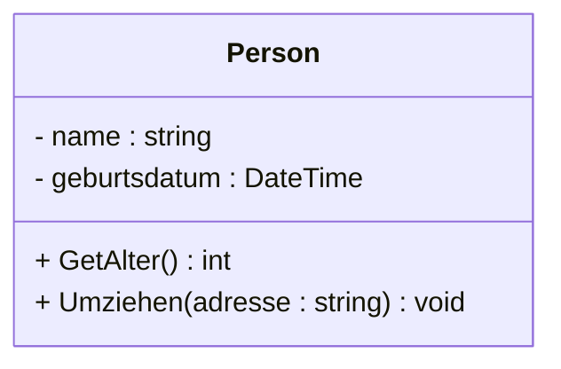
```mermaid {scale: 1.2}
classDiagram
  class Person {
    - name : string
    - geburtsdatum : DateTime
    + GetAlter() int
    + Umziehen(adresse : string) void
  }
```

</div>

---
hideInToc: true
---

# Sichtbarkeiten

Wer darf auf ein Attribut oder eine Operation zugreifen?

<br>

| UML | Name | C#-Schlüsselwort | Zugriff von … |
|:---:|------|------------------|---------------|
| `+` | public | `public` | überall |
| `-` | private | `private` | nur innerhalb der Klasse |
| `#` | protected | `protected` | Klasse und abgeleitete Klassen |
| `~` | package | `internal` | innerhalb desselben Pakets / Assemblys |

<br>

<div v-click>

> 💡 Faustregel: **Attribute `-` private**, Operationen, die andere aufrufen sollen, **`+` public**.

</div>

---
hideInToc: true
---

# Datentypen und statische Elemente

<div class="grid grid-cols-2 gap-12">
<div>

### Datentypen

Der Typ steht **nach** dem Namen:

```text
preis : decimal              Attribut
GetSumme() : decimal         Rückgabetyp
anzahl : int = 0             Startwert
telefon : string [1..*]      mehrere Werte
```

<div v-click class="mt-6">

### Statische Elemente

- gehören zur **Klasse**, nicht zum Objekt
- werden **unterstrichen** dargestellt
- in C#: `static`

</div>

</div>
<div v-click>

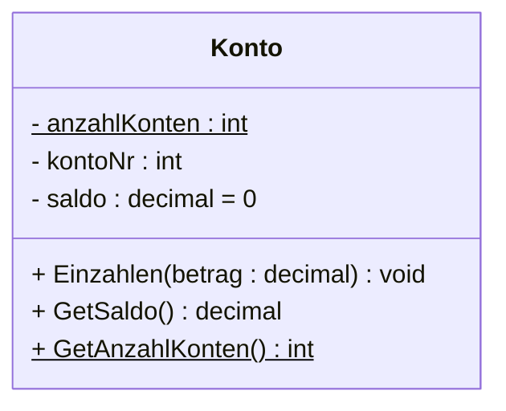
```mermaid {scale: 1.1}
classDiagram
  class Konto {
    - anzahlKonten : int$
    - kontoNr : int
    - saldo : decimal = 0
    + Einzahlen(betrag : decimal) void
    + GetSaldo() decimal
    + GetAnzahlKonten() int$
  }
```

</div>
</div>

---

# Beziehungen zwischen Klassen

Auch Beziehungen zwischen Klassen bzw. Objekten werden in UML abgebildet:

<br>

<div class="grid grid-cols-5 gap-6 text-center">
<div>

<h4>Abhängigkeit</h4>

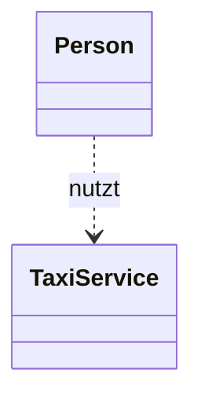
```mermaid
classDiagram
    class Person
    class TaxiService
    Person ..> TaxiService : nutzt
```

</div>
<div>

<h4>Assoziation</h4>

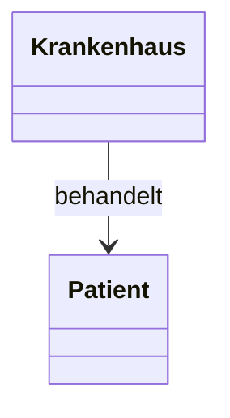
```mermaid
classDiagram
    class Krankenhaus
    class Patient
    Krankenhaus --> Patient : behandelt
```

</div>
<div>

<h4>Aggregation</h4>

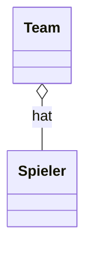
```mermaid
classDiagram
    class Team
    class Spieler
    Team o-- Spieler : hat
```

</div>
<div>

<h4>Komposition</h4>

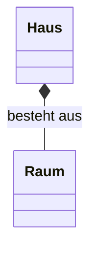
```mermaid
classDiagram
    class Haus
    class Raum
    Haus *-- Raum : besteht aus
```

</div>
<div>

<h4>Generalisierung</h4>

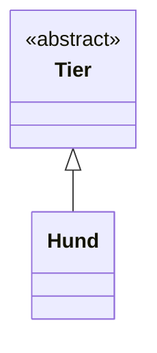
```mermaid
classDiagram
    class Tier {
          <<abstract>>
    }
    class Hund
    Tier <|-- Hund
```

</div>
</div>

<div v-click class="mt-6 text-center">

Von **schwach** (Abhängigkeit) nach **stark** (Komposition, Generalisierung) – die Details folgen auf den nächsten Folien.

</div>

---
hideInToc: true
---

# Assoziation: Multiplizitäten und Rollennamen

Eine **Assoziation** ist eine dauerhafte Beziehung zwischen Objekten zweier Klassen.

<svg viewBox="0 0 660 95" class="w-165 mx-auto my-4" style="font-family: ui-sans-serif, Arial, sans-serif; font-size: 16px" fill="none" stroke="currentColor" stroke-width="1.5">
  <rect x="40" y="25" width="170" height="50"/>
  <text x="125" y="56" text-anchor="middle" fill="currentColor" stroke="none" font-weight="bold">Lehrer</text>
  <rect x="450" y="25" width="170" height="50"/>
  <text x="535" y="56" text-anchor="middle" fill="currentColor" stroke="none" font-weight="bold">Klasse</text>
  <line x1="210" y1="50" x2="450" y2="50"/>
  <text x="330" y="42" text-anchor="middle" fill="currentColor" stroke="none" font-style="italic">leitet</text>
  <text x="218" y="42" fill="currentColor" stroke="none" font-weight="bold">1</text>
  <text x="218" y="70" fill="currentColor" stroke="none" style="font-size: 14px">klassenvorstand</text>
  <text x="442" y="42" text-anchor="end" fill="currentColor" stroke="none" font-weight="bold">0..1</text>
  <text x="442" y="70" text-anchor="end" fill="currentColor" stroke="none" style="font-size: 14px">klasse</text>
</svg>

<div class="grid grid-cols-2 gap-8 text-sm">
<div v-click>

**Multiplizität** = wie viele Objekte am anderen Ende beteiligt sind

| Notation | Bedeutung |
|----------|-----------|
| `1` | genau eins |
| `0..1` | keins oder eins |
| `0..*` bzw. `*` | beliebig viele |
| `1..*` | mindestens eins |

</div>
<div v-click>

**Rollenname** = welche Rolle das Objekt in der Beziehung spielt

- steht am Ende der Linie, neben der Klasse
- wird im Code oft zum **Attributnamen**

**Name + Leserichtung**: „Lehrer *leitet* ▶ Klasse“

</div>
</div>

---
hideInToc: true
---

# Navigierbarkeit

Ein **Pfeil** zeigt, in welche Richtung ein Objekt das andere „kennt“.

<div class="grid grid-cols-2 gap-12 mt-8">
<div>

<svg viewBox="0 0 470 80" class="w-full" style="font-family: ui-sans-serif, Arial, sans-serif; font-size: 16px" fill="none" stroke="currentColor" stroke-width="1.5">
  <rect x="10" y="15" width="140" height="50"/>
  <text x="80" y="46" text-anchor="middle" fill="currentColor" stroke="none" font-weight="bold">Kunde</text>
  <rect x="300" y="15" width="160" height="50"/>
  <text x="380" y="46" text-anchor="middle" fill="currentColor" stroke="none" font-weight="bold">Bestellung</text>
  <line x1="150" y1="40" x2="300" y2="40"/>
  <polyline points="286,32 300,40 286,48"/>
  <text x="158" y="32" fill="currentColor" stroke="none">1</text>
  <text x="292" y="62" text-anchor="end" fill="currentColor" stroke="none">0..*</text>
</svg>

<v-clicks>

- `Kunde` kennt seine Bestellungen
- `Bestellung` kennt den Kunden **nicht**
- in C#: `Kunde` hat eine `List<Bestellung>`

</v-clicks>

</div>
<div v-click>

<svg viewBox="0 0 470 80" class="w-full" style="font-family: ui-sans-serif, Arial, sans-serif; font-size: 16px" fill="none" stroke="currentColor" stroke-width="1.5">
  <rect x="10" y="15" width="140" height="50"/>
  <text x="80" y="46" text-anchor="middle" fill="currentColor" stroke="none" font-weight="bold">Kunde</text>
  <rect x="300" y="15" width="160" height="50"/>
  <text x="380" y="46" text-anchor="middle" fill="currentColor" stroke="none" font-weight="bold">Bestellung</text>
  <line x1="150" y1="40" x2="300" y2="40"/>
  <text x="158" y="32" fill="currentColor" stroke="none">1</text>
  <text x="292" y="32" text-anchor="end" fill="currentColor" stroke="none">0..*</text>
</svg>

- ohne Pfeil: Richtung **nicht festgelegt**
- typisch im **Datenmodell**

</div>
</div>

---
hideInToc: true
---

# Aggregation vs. Komposition

Beide beschreiben eine **Teil-Ganzes-Beziehung**. Die Raute sitzt beim **Ganzen**.

<div class="grid grid-cols-2 gap-12 mt-6">
<div>

### Aggregation ◇

<svg viewBox="0 0 470 80" class="w-full my-2" style="font-family: ui-sans-serif, Arial, sans-serif; font-size: 16px" fill="none" stroke="currentColor" stroke-width="1.5">
  <rect x="10" y="15" width="140" height="50"/>
  <text x="80" y="46" text-anchor="middle" fill="currentColor" stroke="none" font-weight="bold">Team</text>
  <rect x="300" y="15" width="160" height="50"/>
  <text x="380" y="46" text-anchor="middle" fill="currentColor" stroke="none" font-weight="bold">Spieler</text>
  <polygon points="150,40 166,32 182,40 166,48"/>
  <line x1="182" y1="40" x2="300" y2="40"/>
  <text x="156" y="68" fill="currentColor" stroke="none">0..*</text>
  <text x="292" y="32" text-anchor="end" fill="currentColor" stroke="none">0..*</text>
</svg>

<v-clicks>

- Teile können **ohne das Ganze** existieren
- ein Spieler kann in mehreren Teams sein
- Team aufgelöst → Spieler bleiben

</v-clicks>

</div>
<div v-click>

### Komposition ◆

<svg viewBox="0 0 470 80" class="w-full my-2" style="font-family: ui-sans-serif, Arial, sans-serif; font-size: 16px" fill="none" stroke="currentColor" stroke-width="1.5">
  <rect x="10" y="15" width="140" height="50"/>
  <text x="80" y="46" text-anchor="middle" fill="currentColor" stroke="none" font-weight="bold">Haus</text>
  <rect x="300" y="15" width="160" height="50"/>
  <text x="380" y="46" text-anchor="middle" fill="currentColor" stroke="none" font-weight="bold">Raum</text>
  <polygon points="150,40 166,32 182,40 166,48" fill="currentColor"/>
  <line x1="182" y1="40" x2="300" y2="40"/>
  <text x="156" y="68" fill="currentColor" stroke="none">1</text>
  <text x="292" y="32" text-anchor="end" fill="currentColor" stroke="none">1..*</text>
</svg>

- Teil ist **existenzabhängig** vom Ganzen
- ein Teil gehört zu **genau einem** Ganzen
- Haus abgerissen → Räume weg

</div>
</div>

---
hideInToc: true
---

# Generalisierung (Vererbung)

<div class="grid grid-cols-2 gap-12">
<div>

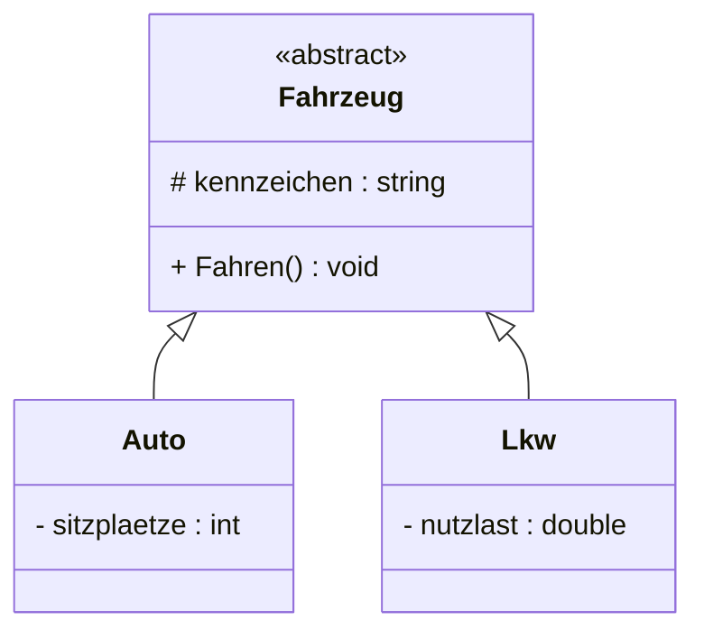
```mermaid {scale: 0.85}
classDiagram
  class Fahrzeug {
    <<abstract>>
    # kennzeichen : string
    + Fahren() void
  }
  class Auto {
    - sitzplaetze : int
  }
  class Lkw {
    - nutzlast : double
  }
  Fahrzeug <|-- Auto
  Fahrzeug <|-- Lkw
```

</div>
<div class="mt-8">

<v-clicks>

- „**ist ein**“: Ein Auto *ist ein* Fahrzeug
- Pfeil mit **leerem Dreieck** zeigt zur **Oberklasse**
- Unterklasse erbt Attribute und Operationen
- `#` protected: in Unterklassen sichtbar
- C#: `class Auto : Fahrzeug`

</v-clicks>

</div>
</div>

---
hideInToc: true
---

# Abhängigkeit

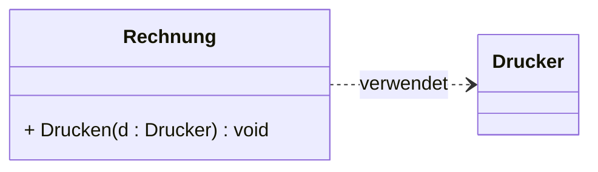
```mermaid {scale: 1.1}
classDiagram
  direction LR
  class Rechnung {
    + Drucken(d : Drucker) void
  }
  class Drucker
  Rechnung ..> Drucker : verwendet
```

<v-clicks>

- **schwächste** Beziehung: „benutzt kurzzeitig“
- gestrichelter Pfeil
- z. B. als **Parameter** oder **lokale Variable**
- kein dauerhaftes Attribut – sonst wäre es eine Assoziation

</v-clicks>

---

# Vom Diagramm zum Code

<div class="grid grid-cols-2 gap-8">
<div>

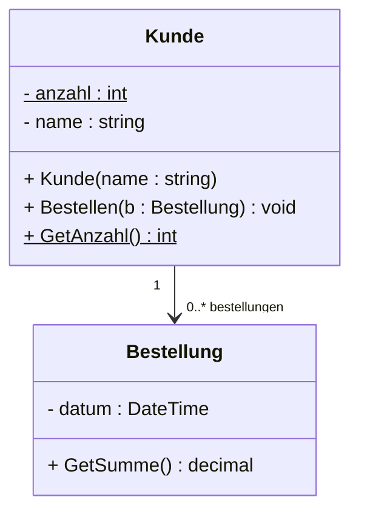
```mermaid {scale: 0.85}
classDiagram
  class Kunde {
    - anzahl : int$
    - name : string
    + Kunde(name : string)
    + Bestellen(b : Bestellung) void
    + GetAnzahl() int$
  }
  class Bestellung {
    - datum : DateTime
    + GetSumme() decimal
  }
  Kunde "1" --> "0..* bestellungen" Bestellung
```

</div>
<div>

```csharp {*|3|4|5|7-11|12-13|*}{lines:false}
public class Kunde
{
    private static int anzahl = 0;
    private string name;
    private List<Bestellung> bestellungen = new();

    public Kunde(string name)
    {
        this.name = name;
        anzahl++;
    }
    public void Bestellen(Bestellung b)
        => bestellungen.Add(b);
    public static int GetAnzahl() => anzahl;
}

public class Bestellung
{
    private DateTime datum;
    public decimal GetSumme() { /* ... */ }
}
```

</div>
</div>

<div v-click class="text-sm mt-2">

Rollenname `bestellungen` + Multiplizität `0..*` + Pfeil → Attribut `List<Bestellung> bestellungen` in `Kunde`.

</div>

---

# Vom Klassendiagramm zum Datenmodell

Für Datenbanken wird das Klassendiagramm **reduziert** – es geht nur um die Daten.

<div class="grid grid-cols-2 gap-12 mt-4">
<div>

### OOP-Klasse

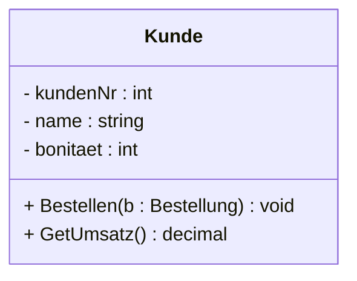
```mermaid
classDiagram
  class Kunde {
    - kundenNr : int
    - name : string
    - bonitaet : int
    + Bestellen(b : Bestellung) void
    + GetUmsatz() decimal
  }
```

</div>
<div v-click>

### Datenmodell-Klasse

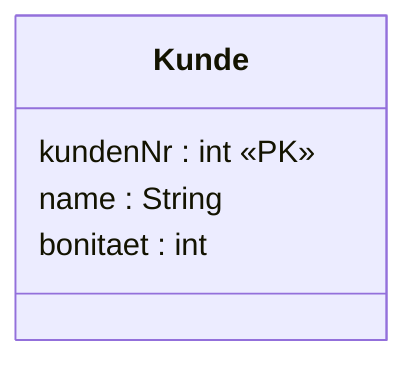
```mermaid
classDiagram
  class Kunde {
    kundenNr : int «PK»
    name : String
    bonitaet : int
  }
```

</div>
</div>

<v-clicks>

- **keine Operationen** und **keine Sichtbarkeiten**
- meist **keine Navigationspfeile** – Beziehungen gelten in beide Richtungen
- Primärschlüssel werden mit `«PK»` markiert

</v-clicks>

---

# Übersetzung Chen → UML (1/2)

| Chen-ER | UML-Klassendiagramm | Beispiel |
|---------|---------------------|----------|
| Entität (Rechteck) | Klasse | `Kunde` |
| Attribut (Ellipse) | Zeile in der Klasse | `name : String` |
| Schlüssel (unterstrichen) | `«PK»` | `kundenNr : int «PK»` |
| Beziehung (Raute) | Assoziationslinie mit Namen | `gibt auf` |
| Kardinalität 1 : N | Multiplizitäten | `1`, `0..1`, `0..*`, `1..*` |
| Beziehungsattribut | Assoziationsklasse | `Teilnahme` mit `note` |

---
hideInToc: true
---

# Übersetzung Chen → UML (2/2)

<div class="text-sm">

| Chen-ER | UML-Klassendiagramm | Beispiel |
|---------|---------------------|----------|
| ternäre Beziehung | Raute mit drei Linien – **einziger Fall mit Raute** | `unterrichtet` |
| schwache Entität (Doppelrechteck) | Komposition ◆ | `Bestellung ◆— Bestellposition` |
| IS-A (Dreieck) | Generalisierung ▷ | `Kunde —▷ Person` |
| mehrwertiges Attribut (Doppelellipse) | Multiplizität am Attribut oder eigene Klasse | `telefon : String [1..*]` |
| abgeleitetes Attribut (gestrichelt) | Schrägstrich vor dem Namen | `/alter : int` |
| zusammengesetztes Attribut | eigener Datentyp oder eigene Klasse | `adresse : Adresse` |

</div>

---

# Durchgehendes Beispiel: Bestellsystem

<svg viewBox="0 0 960 330" class="w-full mt-4" style="font-family: ui-sans-serif, Arial, sans-serif; font-size: 16px" fill="none" stroke="currentColor" stroke-width="1.5">
  <!-- Person -->
  <rect x="40" y="10" width="200" height="112"/>
  <text x="140" y="32" text-anchor="middle" fill="currentColor" stroke="none" font-weight="bold">Person</text>
  <line x1="40" y1="42" x2="240" y2="42"/>
  <text x="52" y="64" fill="currentColor" stroke="none">name : String</text>
  <text x="52" y="86" fill="currentColor" stroke="none">geburtsdatum : Date</text>
  <text x="52" y="108" fill="currentColor" stroke="none">/alter : int</text>
  <!-- Artikel -->
  <rect x="720" y="10" width="200" height="112"/>
  <text x="820" y="32" text-anchor="middle" fill="currentColor" stroke="none" font-weight="bold">Artikel</text>
  <line x1="720" y1="42" x2="920" y2="42"/>
  <text x="732" y="64" fill="currentColor" stroke="none">artikelNr : int «PK»</text>
  <text x="732" y="86" fill="currentColor" stroke="none">bezeichnung : String</text>
  <text x="732" y="108" fill="currentColor" stroke="none">preis : decimal</text>
  <!-- Kunde -->
  <rect x="40" y="200" width="200" height="90"/>
  <text x="140" y="222" text-anchor="middle" fill="currentColor" stroke="none" font-weight="bold">Kunde</text>
  <line x1="40" y1="232" x2="240" y2="232"/>
  <text x="52" y="254" fill="currentColor" stroke="none">kundenNr : int «PK»</text>
  <text x="52" y="276" fill="currentColor" stroke="none">bonitaet : int</text>
  <!-- Bestellung -->
  <rect x="380" y="200" width="200" height="90"/>
  <text x="480" y="222" text-anchor="middle" fill="currentColor" stroke="none" font-weight="bold">Bestellung</text>
  <line x1="380" y1="232" x2="580" y2="232"/>
  <text x="392" y="254" fill="currentColor" stroke="none">bestellNr : int «PK»</text>
  <text x="392" y="276" fill="currentColor" stroke="none">datum : Date</text>
  <!-- Bestellposition -->
  <rect x="720" y="200" width="200" height="90"/>
  <text x="820" y="222" text-anchor="middle" fill="currentColor" stroke="none" font-weight="bold">Bestellposition</text>
  <line x1="720" y1="232" x2="920" y2="232"/>
  <text x="732" y="254" fill="currentColor" stroke="none">posNr : int</text>
  <text x="732" y="276" fill="currentColor" stroke="none">menge : int</text>
  <!-- Kunde ist eine Person -->
  <polygon points="140,122 130,140 150,140"/>
  <line x1="140" y1="140" x2="140" y2="200"/>
  <!-- Kunde gibt auf Bestellung -->
  <line x1="240" y1="245" x2="380" y2="245"/>
  <text x="248" y="237" fill="currentColor" stroke="none" font-weight="bold">1</text>
  <text x="372" y="237" text-anchor="end" fill="currentColor" stroke="none" font-weight="bold">0..*</text>
  <text x="310" y="267" text-anchor="middle" fill="currentColor" stroke="none" font-style="italic" style="font-size: 14px">gibt auf</text>
  <!-- Bestellung enthält Bestellposition (Komposition) -->
  <polygon points="580,245 596,237 612,245 596,253" fill="currentColor"/>
  <line x1="612" y1="245" x2="720" y2="245"/>
  <text x="586" y="272" fill="currentColor" stroke="none" font-weight="bold">1</text>
  <text x="712" y="237" text-anchor="end" fill="currentColor" stroke="none" font-weight="bold">1..*</text>
  <text x="666" y="272" text-anchor="middle" fill="currentColor" stroke="none" font-style="italic" style="font-size: 14px">enthält</text>
  <!-- Bestellposition betrifft Artikel -->
  <line x1="820" y1="200" x2="820" y2="122"/>
  <text x="828" y="192" fill="currentColor" stroke="none" font-weight="bold">0..*</text>
  <text x="828" y="142" fill="currentColor" stroke="none" font-weight="bold">1</text>
  <text x="812" y="166" text-anchor="end" fill="currentColor" stroke="none" font-style="italic" style="font-size: 14px">betrifft</text>
</svg>

---
hideInToc: true
---

# Bestellsystem lesen

<v-clicks>

- Ein **Kunde** *ist eine* **Person** → erbt `name`, `geburtsdatum`, `/alter`
- `/alter` ist **abgeleitet** – wird aus `geburtsdatum` berechnet, nicht gespeichert
- Ein Kunde gibt `0..*` Bestellungen auf – eine Bestellung gehört zu genau `1` Kunden
- Eine Bestellung enthält `1..*` Positionen – Positionen existieren nicht ohne Bestellung (Komposition)
- Eine Position betrifft genau `1` Artikel – ein Artikel kommt in `0..*` Positionen vor

</v-clicks>

<div v-click class="mt-8">

> ⚠️ **Bestellung hat KEIN Attribut `kundenNr`!**
> Die Verbindung zum Kunden steckt in der **Assoziationslinie**. Der Fremdschlüssel entsteht erst bei der Umsetzung ins Relationenschema.

</div>

---

# Kardinalitäten lesen

UML liest „**look across**“ – genau wie Chen mit 1 : N. Die Zahl steht **beim anderen Ende**.

<svg viewBox="0 0 700 215" class="w-170 mx-auto mt-4" style="font-family: ui-sans-serif, Arial, sans-serif; font-size: 16px" fill="none" stroke="currentColor" stroke-width="1.5">
  <text x="0" y="14" fill="currentColor" stroke="none" font-weight="bold" style="font-size: 13px">Chen</text>
  <rect x="20" y="25" width="140" height="50"/>
  <text x="90" y="56" text-anchor="middle" fill="currentColor" stroke="none">Kunde</text>
  <line x1="160" y1="50" x2="280" y2="50"/>
  <polygon points="350,22 420,50 350,78 280,50"/>
  <text x="350" y="55" text-anchor="middle" fill="currentColor" stroke="none" style="font-size: 14px">gibt auf</text>
  <line x1="420" y1="50" x2="540" y2="50"/>
  <rect x="540" y="25" width="140" height="50"/>
  <text x="610" y="56" text-anchor="middle" fill="currentColor" stroke="none">Bestellung</text>
  <text x="175" y="42" fill="currentColor" stroke="none" font-weight="bold">1</text>
  <text x="522" y="42" fill="currentColor" stroke="none" font-weight="bold" text-anchor="end">N</text>
  <text x="0" y="124" fill="currentColor" stroke="none" font-weight="bold" style="font-size: 13px">UML</text>
  <rect x="20" y="135" width="140" height="50"/>
  <text x="90" y="166" text-anchor="middle" fill="currentColor" stroke="none">Kunde</text>
  <line x1="160" y1="160" x2="540" y2="160"/>
  <rect x="540" y="135" width="140" height="50"/>
  <text x="610" y="166" text-anchor="middle" fill="currentColor" stroke="none">Bestellung</text>
  <text x="175" y="152" fill="currentColor" stroke="none" font-weight="bold">1</text>
  <text x="522" y="152" fill="currentColor" stroke="none" font-weight="bold" text-anchor="end">0..*</text>
  <text x="350" y="152" text-anchor="middle" fill="currentColor" stroke="none" style="font-size: 14px">gibt auf</text>
  <text x="350" y="208" text-anchor="middle" fill="currentColor" stroke="none" font-style="italic" style="font-size: 13px">Die Werte bleiben beim Umzeichnen auf derselben Seite.</text>
</svg>

<v-clicks>

- „Ein Kunde gibt `0..*` Bestellungen auf.“ → Zahl bei *Bestellung* lesen
- „Eine Bestellung wird von `1` Kunden aufgegeben.“ → Zahl bei *Kunde* lesen

</v-clicks>

---
hideInToc: true
---

# Untergrenze: immer entscheiden!

Chen sagt nur **1** oder **N**. UML verlangt **immer eine Untergrenze**.

<br>

| Chen | UML – Variante A | UML – Variante B |
|:----:|:----------------:|:----------------:|
| 1 | `1` – genau eins (Pflicht) | `0..1` – höchstens eins (optional) |
| N | `0..*` – beliebig viele | `1..*` – mindestens eins |

<br>

<v-clicks>

- Frage dich: *Darf es das Objekt geben, ohne dass ein Partner existiert?*
- Bestellung ohne Kunde? **Nein** → `1`. Kunde ohne Bestellung? **Ja** → `0..*`
- `*` allein bedeutet `0..*`

</v-clicks>

---

# Was zu beachten ist

<v-clicks>

- **Keine Fremdschlüssel** im konzeptuellen Modell – Beziehungen sind Linien, keine Attribute
- **Aggregation vermeiden** – ihre Bedeutung ist unscharf und bringt fürs Datenmodell nichts
- **Komposition = Existenzabhängigkeit** → wird später zu `ON DELETE CASCADE`
- **Klassennamen im Singular**: `Kunde`, nicht `Kunden`
- **Constraints** in geschweiften Klammern:
  - `email : String {unique}` – Wert darf nur einmal vorkommen
  - `{ordered}` am Assoziationsende – Reihenfolge ist relevant
  - `preis : decimal {preis > 0}` – Bedingung an den Wert

</v-clicks>

---
hideInToc: true
---

# Assoziationsklassen für M : N mit Attributen

Hat eine M : N-Beziehung **eigene Attribute**, wird daraus eine **Assoziationsklasse**.

<svg viewBox="0 0 600 240" class="w-140 mx-auto mt-6" style="font-family: ui-sans-serif, Arial, sans-serif; font-size: 16px" fill="none" stroke="currentColor" stroke-width="1.5">
  <rect x="20" y="30" width="150" height="50"/>
  <text x="95" y="61" text-anchor="middle" fill="currentColor" stroke="none" font-weight="bold">Schueler</text>
  <rect x="430" y="30" width="150" height="50"/>
  <text x="505" y="61" text-anchor="middle" fill="currentColor" stroke="none" font-weight="bold">Kurs</text>
  <line x1="170" y1="55" x2="430" y2="55"/>
  <text x="178" y="47" fill="currentColor" stroke="none" font-weight="bold">0..*</text>
  <text x="422" y="47" fill="currentColor" stroke="none" font-weight="bold" text-anchor="end">0..*</text>
  <text x="300" y="47" fill="currentColor" stroke="none" text-anchor="middle" font-style="italic" style="font-size: 14px">besucht</text>
  <line x1="300" y1="55" x2="300" y2="140" stroke-dasharray="6 4"/>
  <rect x="200" y="140" width="200" height="90"/>
  <text x="300" y="163" text-anchor="middle" fill="currentColor" stroke="none" font-weight="bold">Teilnahme</text>
  <line x1="200" y1="173" x2="400" y2="173"/>
  <text x="212" y="196" fill="currentColor" stroke="none">note : int</text>
  <text x="212" y="219" fill="currentColor" stroke="none">anmeldedatum : Date</text>
</svg>

<v-clicks>

- Die Klasse hängt mit einer **gestrichelten Linie** an der Assoziation
- `note` gehört weder zum Schüler noch zum Kurs, sondern zur **Kombination**

</v-clicks>

---
hideInToc: true
---

# Rekursive Beziehungen brauchen Rollennamen

<div class="grid grid-cols-2 gap-10">
<div>

<svg viewBox="0 0 440 230" class="w-full mt-4" style="font-family: ui-sans-serif, Arial, sans-serif; font-size: 16px" fill="none" stroke="currentColor" stroke-width="1.5">
  <rect x="20" y="20" width="230" height="90"/>
  <text x="135" y="42" text-anchor="middle" fill="currentColor" stroke="none" font-weight="bold">Mitarbeiter</text>
  <line x1="20" y1="52" x2="250" y2="52"/>
  <text x="32" y="74" fill="currentColor" stroke="none">mitarbeiterNr : int «PK»</text>
  <text x="32" y="96" fill="currentColor" stroke="none">name : String</text>
  <polyline points="250,65 400,65 400,190 135,190 135,110"/>
  <text x="258" y="57" fill="currentColor" stroke="none" font-weight="bold">0..1</text>
  <text x="258" y="85" fill="currentColor" stroke="none" style="font-size: 14px">vorgesetzter</text>
  <text x="143" y="132" fill="currentColor" stroke="none" font-weight="bold">0..*</text>
  <text x="127" y="132" text-anchor="end" fill="currentColor" stroke="none" style="font-size: 14px">untergebener</text>
  <text x="268" y="212" text-anchor="middle" fill="currentColor" stroke="none" font-style="italic" style="font-size: 14px">◀ leitet</text>
</svg>

</div>
<div>

<v-clicks>

- Beide Enden zeigen auf **dieselbe Klasse**
- Ohne Rollennamen ist unklar, welches Ende was bedeutet
- „Ein **Vorgesetzter** leitet `0..*` Untergebene.“
- „Ein **Untergebener** hat `0..1` Vorgesetzten.“ (die Chefin hat keinen)

</v-clicks>

</div>
</div>

---

# Ternäre Beziehungen

Wenn **drei** Klassen gleichzeitig beteiligt sind, zeichnet UML eine **Raute**.

<svg viewBox="0 0 600 330" class="w-130 mx-auto mt-2" style="font-family: ui-sans-serif, Arial, sans-serif; font-size: 16px" fill="none" stroke="currentColor" stroke-width="1.5">
  <rect x="30" y="30" width="150" height="70"/>
  <text x="105" y="55" text-anchor="middle" fill="currentColor" stroke="none" font-weight="bold">Lehrer</text>
  <line x1="30" y1="66" x2="180" y2="66"/>
  <text x="40" y="88" fill="currentColor" stroke="none" style="font-size: 14px">lehrerId «PK»</text>
  <rect x="420" y="30" width="150" height="70"/>
  <text x="495" y="55" text-anchor="middle" fill="currentColor" stroke="none" font-weight="bold">Klasse</text>
  <line x1="420" y1="66" x2="570" y2="66"/>
  <text x="430" y="88" fill="currentColor" stroke="none" style="font-size: 14px">klasseId «PK»</text>
  <rect x="225" y="245" width="150" height="70"/>
  <text x="300" y="270" text-anchor="middle" fill="currentColor" stroke="none" font-weight="bold">Fach</text>
  <line x1="225" y1="281" x2="375" y2="281"/>
  <text x="235" y="303" fill="currentColor" stroke="none" style="font-size: 14px">fachId «PK»</text>
  <polygon points="300,120 340,150 300,180 260,150"/>
  <text x="300" y="108" text-anchor="middle" fill="currentColor" stroke="none" font-style="italic" style="font-size: 15px">unterrichtet</text>
  <line x1="180" y1="65" x2="260" y2="150"/>
  <line x1="420" y1="65" x2="340" y2="150"/>
  <line x1="300" y1="180" x2="300" y2="245"/>
  <text x="200" y="66" fill="currentColor" stroke="none" font-weight="bold">0..1</text>
  <text x="400" y="66" fill="currentColor" stroke="none" font-weight="bold" text-anchor="end">0..*</text>
  <text x="310" y="236" fill="currentColor" stroke="none" font-weight="bold">0..*</text>
</svg>

<div v-click class="text-center">

Das ist der **einzige Fall**, in dem im UML-Klassendiagramm eine Raute vorkommt.

</div>

---
hideInToc: true
---

# Ternäre Beziehungen lesen

**Leseregel:** Zwei Seiten festhalten, nach der dritten fragen – **ein Satz pro Ende**.

<v-clicks>

- **Lehrer-Ende `0..1`**: Die *4B* hat in *Mathematik* höchstens **einen** Lehrer → Frau Huber.
- **Fach-Ende `0..*`**: *Frau Huber* unterrichtet in der *4B* **beliebig viele** Fächer → Mathematik, Physik.
- **Klasse-Ende `0..*`**: *Frau Huber* unterrichtet *Mathematik* in **beliebig vielen** Klassen → 4B, 4C, …

</v-clicks>

<div v-click class="mt-8">

> 💡 Chen mit **1 : N : M** (1 beim Lehrer) liest sich genauso.

</div>

---
hideInToc: true
---

# Warum ist die Untergrenze fast immer 0?

<v-clicks>

- Eine Untergrenze von `1` am Lehrer-Ende hieße: **jede** Kombination aus Klasse und Fach **muss** einen Lehrer haben.
- Dann bräuchte die 1A auch Latein, Chemie, Informatik, … – egal ob es das Fach in dieser Klasse gibt.
- Bei ternären Beziehungen ist die Untergrenze darum fast immer `0`.

</v-clicks>

---
hideInToc: true
---

# Ternär → Tabelle

```sql
Unterricht(lehrerId, klasseId, fachId)
-- Primärschlüssel: (klasseId, fachId)
```

<br>

| lehrerId | <u>klasseId</u> | <u>fachId</u> |
|----------|-----------------|---------------|
| Huber | 4B | Mathematik |
| Huber | 4B | Physik |
| Huber | 4C | Mathematik |
| Mayer | 4C | Physik |

<v-clicks>

- Wegen `0..1` am Lehrer-Ende bestimmen **Klasse + Fach** eindeutig den Lehrer
- Daher reicht `(klasseId, fachId)` als Primärschlüssel

</v-clicks>

---
hideInToc: true
---

# Warum nicht drei binäre Beziehungen?

<div class="grid grid-cols-3 gap-6 text-sm">
<div>

**Lehrer – Klasse**

| Lehrer | Klasse |
|--------|--------|
| Huber | 4B |
| Mayer | 4B |

</div>
<div>

**Lehrer – Fach**

| Lehrer | Fach |
|--------|------|
| Huber | Mathematik |
| Huber | Physik |
| Mayer | Physik |

</div>
<div>

**Klasse – Fach**

| Klasse | Fach |
|--------|------|
| 4B | Mathematik |
| 4B | Physik |

</div>
</div>

<v-clicks>

- Frage: **Wer unterrichtet Physik in der 4B?**
- Huber passt zu allen drei Tabellen – Mayer aber auch. 🤷
- Die Information „*diese drei gehören zusammen*“ geht verloren → nur die **ternäre** Beziehung speichert sie.

</v-clicks>

---
layout: center
class: text-center
---

# Zusammenfassung

<v-clicks>

**OOP-Klassendiagramm**: Name, Attribute, Operationen, Sichtbarkeiten, Beziehungen

**Datenmodell**: keine Operationen, keine Sichtbarkeiten, keine Fremdschlüssel, `«PK»`

**Multiplizitäten**: look across, Untergrenze immer angeben

**Raute** nur bei ternären Beziehungen

</v-clicks>
