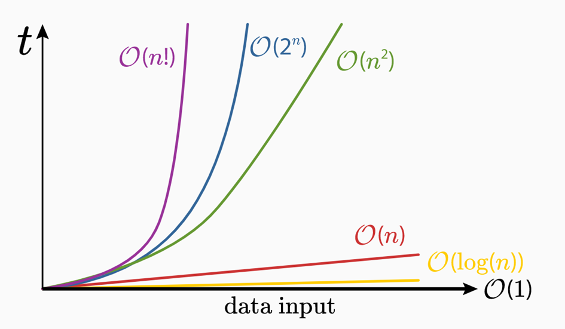
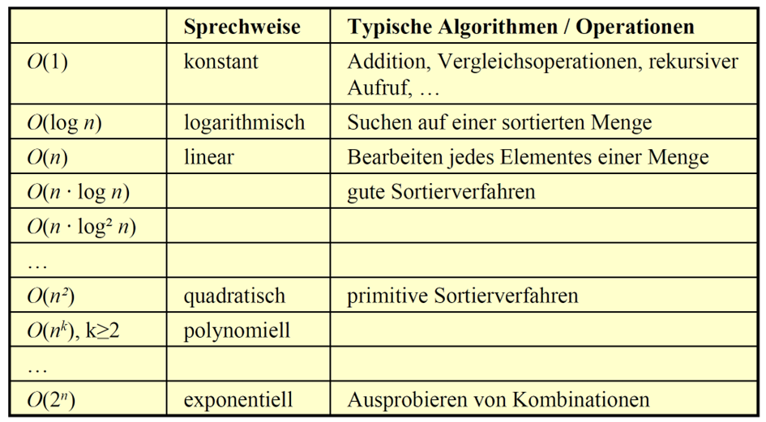

# Sortieralgorithmen

## Warum brauchen wir sie?

---
hideInToc: true
---

# Inhalt

<Toc minDepth="1" maxDepth="1" />

---

# Warum müssen wir sortieren?

- **Daten müssen oft geordnet werden:**
    - Namen alphabetisch
    - Produkte nach Preis
    - Ergebnisse nach Zeit
    - Dateien nach Datum

- **Sortieren ist ein Grundproblem der Informatik**
    - Grundlage für Datenbanken
    - Grundlage für effiziente Programme

---

# Kriterien der Sortieralgorithmen

- Korrektheit
- Laufzeit (Wie schnell?)
- Speicherverbrauch (Wie viel extra Speicher?)
- Stabilität (bleiben gleiche Elemente in Reihenfolge?)

---

# *Big O-Notation*

Die **(Big) O-Notation** beschreibt, wie **schnell oder langsam ein Algorithmus wächst**, wenn die Datenmenge größer wird. Es geht also nicht um „wie viele Millisekunden auf meinem PC“, sondern um die **grundsätzliche Skalierung**.

{width=70%}

---

# Komplexitätsklassen

Algorithmen werden in sogenannte Komplexitätsklassen eingeteilt. Eine Komplexitätsklasse wird mit dem Landau-Symbol O ("Groß O") gekennzeichnet. 

{width=70%}


---


# Warum verschiedene Sortieralgorithmen?

Es gibt nicht den einen perfekten Algorithmus

Manche sind:
- leichter zu verstehen
- schneller bei vielen Daten
- gut, wenn die Daten fast sortiert sind
- gut, wenn wenig Speicher verfügbar ist

<br>

> 💡 Deshalb lernt man mehrere Ansätze und deren Einsatzgebiete

---

# 4 wichtige Sortierverfahren

<br>

- **Selection Sort:** Sortieren durch Auswahl 

- **Insertion Sort:** Sortieren durch Einfügen

- **Bubble Sort:** Sortieren durch Vertauschen

- **QuickSort**: Teile-und-Herrsche

---
layout: two-cols-header
layoutClass: gap-16
---

# Bubble Sort

::left::

- Vergleiche benachbarte Elemente
- Tausche, wenn sie falsch herum stehen
- Das größte Element „blubbert“ nach oben

<br>

**Eigenschaften:**

- Sehr leicht verständlich
- Extrem ineffizient (O(n²))
- Hauptsächlich ein **Lehrbeispiel**

::right::

```ps
für i von 0 bis n-2:
    für j von 0 bis n-2-i:
        wenn array[j] > array[j+1]:
            tausche array[j] mit array[j+1]
```


---
layout: two-cols-header
layoutClass: gap-16
---

# Selection Sort

::left::

- Finde immer das kleinste Element im unsortierten Teil
- Setze es an die richtige Position
- Wiederhole

<br>

**Eigenschaften:**

- Einfach zu verstehen
- Immer gleiche Anzahl Vergleiche → O(n²)
- Gut zum Lernen, schlecht für große Datenmengen

::right::

```ps
für i von 0 bis n-2:
    minIndex = i
    
    für j von i+1 bis n-1:
        wenn array[j] < array[minIndex]:
            minIndex = j

    tausche array[i] mit array[minIndex]

```


---
layout: two-cols-header
layoutClass: gap-16
---

# Insertion Sort

::left::

- Linker Bereich ist immer sortiert
- Nimm das nächste Element und füge es richtig ein
- Elemente werden nach rechts geschoben

**Eigenschaften:**

- Sehr schnell, wenn Daten fast sortiert sind
- Im Worst-Case O(n²)
- Im Best-Case O(n)
- Wird in der Praxis häufig eingesetzt

::right::

```ps
für i von 1 bis n-1:
    key = array[i]
    j = i - 1
    
    solange j >= 0 und array[j] > key:
        array[j+1] = array[j]
        j = j - 1

    array[j+1] = key
```


---
layout: two-cols-header
layoutClass: gap-16
---

# QuickSort

::left::

- Wähle ein Pivot-Element
- Teile das Array:
    - links: kleiner als Pivot
    - rechts: größer als Pivot
- Sortiere beide Seiten rekursiv

**Eigenschaften:**

- Durchschnittlich O(n log n)
- Sehr schnell in der Praxis
- Gehört zu den wichtigsten Sortierverfahren
- Wird in vielen Programmiersprachen standardmäßig verwendet

::right::

```ps
funktion QuickSort(array, links, rechts):
    wenn links < rechts:
        p = Partition(array, links, rechts)

        QuickSort(array, links, p-1)
        QuickSort(array, p+1, rechts)

funktion Partition(array, links, rechts):
    pivot = array[rechts]
    i = links - 1

    für j von links bis rechts-1:
        wenn array[j] < pivot:
            i = i + 1
            tausche array[i] mit array[j]

    tausche array[i+1] mit array[rechts]
    gib i+1 zurück
```


---

# Vergleich der Algorithmen

| Algorithmus        | Best Case        | Average Case | Worst Case | Vorteil                                | Nachteil                       |
| ------------------ | ---------------- | ------------ | ---------- | -------------------------------------- | ------------------------------ |
| **Bubble Sort**    | O(n)             | O(n²)        | O(n²)      | Extrem leicht verständlich             | Sehr ineffizient               |
| **Selection Sort** | O(n²)            | O(n²)        | O(n²)      | Sehr einfach                           | Immer gleich langsam           |
| **Insertion Sort** | O(n)             | O(n²)        | O(n²)      | Sehr schnell bei fast sortierten Daten | Langsam bei unsortierten Daten |
| **QuickSort**      | O(n log n)       | O(n log n)   | O(n²)      | Sehr schnell in der Praxis             | Schlechtes Pivot → langsam     |

