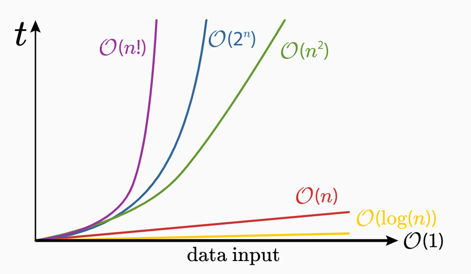
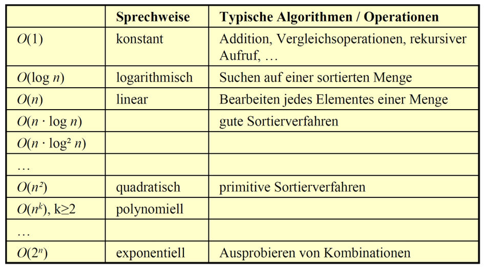

# O-Notation

## Komplexität von Algorithmen

---
hideInToc: true
---

# Inhalt

<Toc minDepth="1" maxDepth="1" />

---
layout: iframe
url: https://www.youtube.com/embed/XMUe3zFhM5c?si=EgBFFj-rjxluQRGO
---

# Erklärvideo

---

# *Big O-Notation*

Die **(Big) O-Notation** beschreibt, wie **schnell oder langsam ein Algorithmus wächst**, wenn die Datenmenge größer wird. Es geht also nicht um „wie viele Millisekunden auf meinem PC“, sondern um die **grundsätzliche Skalierung**.

{width=70%}

---

# Komplexitätsklassen

Algorithmen werden in sogenannte Komplexitätsklassen eingeteilt. Eine Komplexitätsklasse wird mit dem Landau-Symbol O ("Groß O") gekennzeichnet. 

{width=70%}

---

# Übung: Vergleich Komplexitätsklassen 

Erstelle mithilfe von Excel eine Tabelle mit folgenden Komplexitätsklassen und Anzahl von Elementen. Berechne im Anschluss die einzelnen Werte.

|                 | 5 | 10 | 25  | 100   | 5000   | 50000 | 1  Mio | 10  Mio |
|-----------------|---|----|-----|-------|--------|-------|--------|---------|
| O(1)            |   |    |     |       |        |       |        |         |
| O(log n)        |   |    |     |       |        |       |        |         |
| O(n)            |   |    |     |       |        |       |        |         |
| O(n log n)      |   |    |     |       |        |       |        |         |
| O(n²)           |   |    |     |       |        |       |        |         |
| O(2ⁿ)           |   |    |     |       |        |       |        |         |
| O(n!)           |   |    |     |       |        |       |        |         |

---

# Vergleich der Algorithmen

| Algorithmus        | Best Case        | Average Case | Worst Case | Vorteil                                | Nachteil                       |
| ------------------ | ---------------- | ------------ | ---------- | -------------------------------------- | ------------------------------ |
| **Bubble Sort**    | O(n)             | O(n²)        | O(n²)      | Extrem leicht verständlich             | Sehr ineffizient               |
| **Selection Sort** | O(n²)            | O(n²)        | O(n²)      | Sehr einfach                           | Immer gleich langsam           |
| **Insertion Sort** | O(n)             | O(n²)        | O(n²)      | Sehr schnell bei fast sortierten Daten | Langsam bei unsortierten Daten |
| **QuickSort**      | O(n log n)       | O(n log n)   | O(n²)      | Sehr schnell in der Praxis             | Schlechtes Pivot → langsam     |
| **Linear Search**      | O(1)       | O(n)           | O(n)       | Keine Sortierung notwendig             | Sehr langsam bei großen Datenmengen     |
| **Binary Search**      | O(1)       | O(log n)       | O(log n)      |  Sehr schnell bei großen Datenmengen           | Daten müssen sortiert sein     |

---
layout: two-cols-header
layoutClass: gap-16
---

# Traveling Salesman Problem (TSP)

::left::

- Ein Reisender startet in einer Stadt
- Er muss jede Stadt genau einmal besuchen
- Am Ende kehrt er zur Startstadt zurück

- **Ziel: kürzeste mögliche Gesamtroute**

::right::

---
layout: center
---
# Übung: Traveling Salesman Problem

👉 [1. TSP Spiel (wähle Szene 3)](https://prolog.univie.ac.at/tspGame/game.html) 

👉 [2. TSP Algorithmen Vergleich](https://tspvis.com/) 

---

# Warum ist das TSP schwierig zu lösen?

- Anzahl möglicher Routen wächst extrem schnell
- Bei n Städten gibt es n! (fakultät) mögliche Rundreisen
- Schon bei **10 Städten → 3.628.800 Möglichkeiten**
- „Alles ausprobieren“ ist praktisch unmöglich

 

> 💡 In der Praxis nutzt man **Näherungen (Heuristiken)**

---

# Wo kommt TSP vor?

    

        
        <b>Routenplanung (Lieferdienste)</b>
    

    

        
        <b>Leiterplatten-Design</b>
    

    

        
        <b>Roboter- & Maschinenwege</b>
    

    

        
        <b>Logistik & Tourenplanung</b>
    

---

# Worauf man bei Algorithmen achten sollte

- **Wie wächst die Laufzeit**, wenn die Datenmenge größer wird?
- **Verschachtelte Schleifen** → Warnsignal 🚨
- **Alles mit allem vergleichen** → meist schlecht skalierbar
- **Problem halbieren** → meist sehr effizient
- **Sortiert oder unsortiert?** (entscheidet über den Algorithmus)
- **Einfach ≠ gut** bei großen Datenmengen
- **Worst Case im Blick behalten**, nicht nur den Best Case