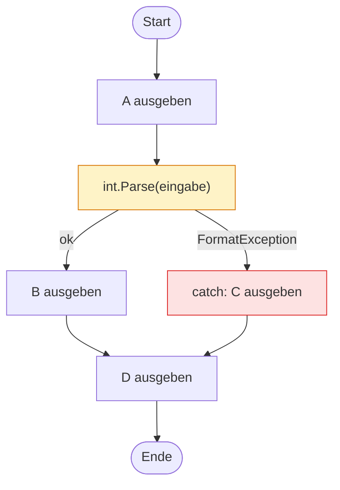

# Exception Handling

## *Fehler behandeln in C#*

---
hideInToc: true
---

# Inhalt

<Toc minDepth="1" maxDepth="1" />

---
layout: section
---

# Einstieg: Live-Absturz

---
hideInToc: true
---

# Ein harmloses Programm …

```csharp {all|1|2|3|4}
Console.Write("Wie alt bist du? ");
string eingabe = Console.ReadLine();
int alter = int.Parse(eingabe);
Console.WriteLine($"Nächstes Jahr bist du {alter + 1}.");
```

<v-click>

Eingabe: `20` → ✅

```text
Wie alt bist du? 20
Nächstes Jahr bist du 21.
```

</v-click>

<v-click>

Eingabe: `zwanzig` → 💥

```text
Wie alt bist du? zwanzig
Unhandled exception. System.FormatException: The input string 'zwanzig' was not in a correct format.
   at System.Number.ThrowFormatException[TChar](ReadOnlySpan`1 value)
   at System.Int32.Parse(String s)
   at Program.<Main>$(String[] args) in C:\Projekte\AlterApp\Program.cs:line 3
```

</v-click>

---
layout: center
class: text-center
hideInToc: true
---

# Was ist passiert?

## Wer ist schuld?

<v-clicks>

Der Benutzer? 🧑 &nbsp;&nbsp; Das Programm? 💻 &nbsp;&nbsp; `int.Parse`? 🔧

**Das Programm** – es hat nicht damit gerechnet, dass Benutzer:innen *beliebigen* Text eingeben können.

</v-clicks>

---
layout: section
---

# Was ist eine Exception?

---
hideInToc: true
---

# Drei Arten von Fehlern

| Fehlerart | Wann bemerkt? | Beispiel | Folge |
|-----------|---------------|----------|-------|
| **Compilerfehler** | beim Kompilieren | `int x = "Hallo";` · fehlender `;` | Programm startet gar nicht |
| **Laufzeitfehler** (Exception) | während das Programm läuft | `int.Parse("zwanzig")` · `10 / 0` | Programm stürzt ab |
| **Logikfehler** | evtl. nie 😬 | `durchschnitt = summe / anzahl - 1;` | Falsches Ergebnis, kein Absturz |

<v-click>

<div class="mt-8 p-4 rounded bg-blue-50 border-l-4 border-blue-500">

Eine **Exception** (Ausnahme) ist ein **Objekt**, das einen Fehler zur **Laufzeit** beschreibt.
Wird sie nicht behandelt, **beendet sich das Programm**.

</div>

</v-click>

---
hideInToc: true
---

# Anatomie einer Fehlermeldung

<div class="font-mono text-sm leading-7 p-4 rounded bg-gray-900 text-gray-100 mt-6">
<div>Unhandled exception. <span class="px-1 rounded bg-red-600">System.FormatException</span>: <span class="px-1 rounded bg-blue-600">The input string 'zwanzig' was not in a correct format.</span></div>
<div class="text-gray-400">&nbsp;&nbsp;&nbsp;at System.Number.ThrowFormatException[TChar](ReadOnlySpan`1 value)</div>
<div class="text-gray-400">&nbsp;&nbsp;&nbsp;at System.Int32.Parse(String s)</div>
<div>&nbsp;&nbsp;&nbsp;at <span class="px-1 rounded bg-purple-600">Program.&lt;Main&gt;$(String[] args)</span> in C:\Projekte\AlterApp\<span class="px-1 rounded bg-green-600">Program.cs:line 3</span></div>
</div>

<div class="grid grid-cols-4 gap-4 mt-8 text-sm">
  <div v-click class="p-3 rounded border-t-4 border-red-600"><b>Exception-Typ</b><br>Welche Art von Fehler?</div>
  <div v-click class="p-3 rounded border-t-4 border-blue-600"><b>Message</b><br>Beschreibung in Textform</div>
  <div v-click class="p-3 rounded border-t-4 border-purple-600"><b>Methode</b><br>Wo im eigenen Code?</div>
  <div v-click class="p-3 rounded border-t-4 border-green-600"><b>Datei &amp; Zeile</b><br>Hier nachschauen!</div>
</div>

---
hideInToc: true
---

# Stack Trace lesen

Der **Stack Trace** zeigt die Aufrufkette – von **innen** (wo der Fehler entstand) nach **außen** (`Main`).

```text {all|2-3|4|5}
Unhandled exception. System.FormatException: The input string 'zwanzig' was not in a correct format.
   at System.Number.ThrowFormatException[TChar](ReadOnlySpan`1 value)
   at System.Int32.Parse(String s)
   at Program.LeseAlter() in C:\Projekte\AlterApp\Program.cs:line 12
   at Program.<Main>$(String[] args) in C:\Projekte\AlterApp\Program.cs:line 3
```

<v-clicks>

- Zeilen aus `System.…` sind **.NET-intern** → meist überspringen
- Die **erste Zeile mit eigenem Code** ist der interessanteste Punkt: `LeseAlter()`, Zeile 12
- Darunter: **wer** hat diese Methode aufgerufen? → `Main`, Zeile 3

</v-clicks>

---
hideInToc: true
---

<PraxisSlide block="1" title="Fehlermeldungen entschlüsseln" time="10 min">

Bestimme für jede Meldung: **Exception-Typ**, **Datei & Zeile** und **vermutliche Ursache**.

<div class="grid grid-cols-2 gap-3 font-mono text-[0.62rem] leading-4">
<div class="p-2 rounded bg-white/70"><b>A</b><br>System.IndexOutOfRangeException: Index was outside the bounds of the array.<br>&nbsp;&nbsp;at Program.&lt;Main&gt;$(String[] args) in C:\Projekte\Noten\Program.cs:line 14</div>
<div class="p-2 rounded bg-white/70"><b>B</b><br>System.NullReferenceException: Object reference not set to an instance of an object.<br>&nbsp;&nbsp;at Schueler.GetInitialen() in C:\Projekte\Klasse\Schueler.cs:line 9<br>&nbsp;&nbsp;at Program.&lt;Main&gt;$(String[] args) in C:\Projekte\Klasse\Program.cs:line 22</div>
<div class="p-2 rounded bg-white/70"><b>C</b><br>System.DivideByZeroException: Attempted to divide by zero.<br>&nbsp;&nbsp;at Statistik.Durchschnitt(Int32[] werte) in C:\Projekte\Noten\Statistik.cs:line 7<br>&nbsp;&nbsp;at Program.&lt;Main&gt;$(String[] args) in C:\Projekte\Noten\Program.cs:line 31</div>
<div class="p-2 rounded bg-white/70"><b>D</b><br>System.IO.FileNotFoundException: Could not find file 'C:\Projekte\Noten\bin\Debug\net8.0\noten.csv'.<br>&nbsp;&nbsp;at System.IO.File.ReadAllLines(String path)<br>&nbsp;&nbsp;at Program.&lt;Main&gt;$(String[] args) in C:\Projekte\Noten\Program.cs:line 5</div>
</div>

Erwartetes Ergebnis (Beispiel für A):

```text
A | IndexOutOfRangeException | Program.cs, Zeile 14 | Zugriff auf ein Array-Element, das es nicht gibt (z. B. noten[5] bei Länge 5)
```

</PraxisSlide>

---
hideInToc: true
---

# Lösung: Fehlermeldungen

| | Typ | Ort | Ursache |
|---|-----|-----|---------|
| **A** | `IndexOutOfRangeException` | Program.cs, Zeile 14 | Index `< 0` oder `>= Length` – oft `<=` statt `<` in der Schleife |
| **B** | `NullReferenceException` | Schueler.cs, Zeile 9 (aufgerufen aus Program.cs, 22) | Eine Variable ist `null`, z. B. `Vorname` wurde nie gesetzt |
| **C** | `DivideByZeroException` | Statistik.cs, Zeile 7 (aufgerufen aus Program.cs, 31) | Ganzzahl-Division durch 0 – das Array `werte` ist leer |
| **D** | `FileNotFoundException` | Program.cs, Zeile 5 | `noten.csv` liegt nicht im Ausführungsordner `bin\Debug\net8.0\` |

<v-click>

<div class="mt-6 p-3 rounded bg-blue-50 border-l-4 border-blue-500">

Bei **B** und **C** liegt der Fehler in einer *anderen* Datei als `Main` → im Stack Trace die **oberste eigene Zeile** suchen!

</div>

</v-click>

---
layout: section
---

# try / catch: die Grundform

---
hideInToc: true
---

# Syntax

```csharp {all|1-6|7-11|all}
try
{
    // Code, bei dem eine Exception auftreten KANN
    int alter = int.Parse(eingabe);
    Console.WriteLine($"Nächstes Jahr bist du {alter + 1}.");
}
catch (FormatException)
{
    // wird NUR ausgeführt, wenn im try-Block eine FormatException auftritt
    Console.WriteLine("Bitte eine Zahl eingeben!");
}
Console.WriteLine("Weiter geht's …");
```

<v-clicks>

- **try**: „Versuche das – es könnte schiefgehen.“
- **catch**: „Falls *dieser* Fehler passiert, mach stattdessen das.“
- Danach läuft das Programm **normal weiter** – kein Absturz.

</v-clicks>

---
hideInToc: true
layout: two-cols
layoutClass: gap-8
---

# Programmablauf

```csharp {1-4,9|1-3,5-7,9}
try {
    Console.WriteLine("A");
    int x = int.Parse(eingabe);
    Console.WriteLine("B");
} catch (FormatException) {
    Console.WriteLine("C");
}
// ...
Console.WriteLine("D");
```

| Eingabe | Ausgabe |
|---------|---------|
| `"42"` | A B D |
| `"abc"` | A C D |

<div v-click class="mt-4 text-sm p-2 rounded bg-red-50 border-l-4 border-red-500">

Nach der Exception wird der **Rest des try-Blocks übersprungen** – `B` wird nie ausgegeben!

</div>

::right::



---
hideInToc: true
---

# Das Exception-Objekt

Im `catch` kann man die Exception **in einer Variable** entgegennehmen:

```csharp {all|5|7-8}
try
{
    int alter = int.Parse("zwanzig");
}
catch (FormatException ex)
{
    Console.WriteLine($"Fehler: {ex.Message}");
    Console.WriteLine($"Typ:    {ex.GetType().Name}");
}
```

```text
Fehler: The input string 'zwanzig' was not in a correct format.
Typ:    FormatException
```

<v-clicks>

- `ex.Message` – Beschreibung des Fehlers (für Entwickler:innen, oft Englisch)
- `ex.GetType().Name` – Name des Exception-Typs
- `ex.StackTrace` – der komplette Stack Trace (zum Loggen)

</v-clicks>

<div v-click class="mt-3 text-sm opacity-80">

⚠️ `ex.Message` ist **nicht** für Endbenutzer:innen gedacht – lieber eine eigene, verständliche Meldung ausgeben.

</div>

---
hideInToc: true
---

<PraxisSlide block="2" title="Die Alterseingabe absichern" time="10 min">

Nimm das Programm aus dem Einstieg und sichere es mit `try` / `catch` ab:

1. Lies das Alter mit `int.Parse` ein.
2. Bei ungültiger Eingabe soll das Programm **nicht abstürzen**, sondern eine freundliche Meldung ausgeben.
3. Gib zusätzlich den Exception-Typ in Klammern aus (`ex.GetType().Name`).
4. Am Ende soll **immer** `Auf Wiedersehen!` erscheinen.

<div class="grid grid-cols-2 gap-4">

```text
Wie alt bist du? 17
Nächstes Jahr bist du 18.
Auf Wiedersehen!
```

```text
Wie alt bist du? siebzehn
Das war keine gültige Zahl. (FormatException)
Auf Wiedersehen!
```

</div>

<template #hinweis>

Teste auch die Eingabe `99999999999` – welcher Fehler tritt jetzt auf? Wird er abgefangen?

</template>

</PraxisSlide>

---
layout: section
---

# Mehrere catch-Blöcke und die Exception-Hierarchie

---
hideInToc: true
---

# Mehrere catch-Blöcke

Ein `try` kann **mehrere** `catch`-Blöcke haben – jeder für einen anderen Fehlertyp:

```csharp {all|5-8|9-12|13-16}
try
{
    int zahl = int.Parse(Console.ReadLine());
    Console.WriteLine(100 / zahl);
}
catch (FormatException)
{
    Console.WriteLine("Das ist keine Zahl.");
}
catch (OverflowException)
{
    Console.WriteLine("Die Zahl ist zu groß.");
}
catch (DivideByZeroException)
{
    Console.WriteLine("Durch 0 kann man nicht teilen.");
}
```

<v-click>

Es wird **genau ein** `catch` ausgeführt – der **erste passende** von oben nach unten.

</v-click>

---
hideInToc: true
---

# Die Exception-Hierarchie

Exceptions sind **Klassen** und erben voneinander:

<div class="eh">
<ul class="side left">
  <li><span class="n">FormatException</span></li>
  <li><span class="n">ArithmeticException</span>
    <ul>
      <li><span class="n leaf">DivideByZeroException</span></li>
      <li><span class="n leaf">OverflowException</span></li>
    </ul>
  </li>
  <li><span class="n">IndexOutOfRangeException</span></li>
  <li><span class="n">NullReferenceException</span></li>
</ul>
<div class="link"></div>
<div class="center">
  <span class="n root">Exception</span>
  <div class="arrow"></div>
  <span class="n sys">SystemException</span>
</div>
<div class="link"></div>
<ul class="side right">
  <li><span class="n">IOException</span>
    <ul>
      <li><span class="n leaf">FileNotFoundException</span></li>
      <li><span class="n leaf">DirectoryNotFoundException</span></li>
    </ul>
  </li>
  <li><span class="n">ArgumentException</span>
    <ul>
      <li><span class="n leaf">ArgumentNullException</span></li>
      <li><span class="n leaf">ArgumentOutOfRangeException</span></li>
    </ul>
  </li>
  <li><span class="n">InvalidOperationException</span></li>
</ul>
</div>

<style>
.eh {
  --h: 1.5rem;     /* Höhe eines Knotens */
  --pad: 0.15rem;  /* Abstand zwischen Knoten */
  --line: #9ca3af;
  display: grid;
  grid-template-columns: 1fr 1.5rem auto 1.5rem 1fr;
  align-items: center;
  margin: 0.8rem 0;
  font-size: 0.8rem;
}
.eh ul { list-style: none; margin: 0 !important; padding: 0 !important; }
.eh li { position: relative; margin: 0 !important; line-height: normal; }
.eh .link { height: 2px; background: var(--line); }

.eh .n {
  position: relative;
  display: inline-block;
  height: var(--h);
  line-height: var(--h);
  padding: 0 0.6rem;
  border: 1.5px solid #6b7280;
  border-radius: 6px;
  background: #fff;
  white-space: nowrap;
  font-family: ui-monospace, Consolas, monospace;
}
.eh .n.leaf { border-color: #60a5fa; background: #eff6ff; }
.eh .n.root { border-color: #dc2626; background: #fde2e2; font-weight: 700; }
.eh .n.sys  { border-color: #d97706; background: #fef3c7; font-weight: 700; }

.eh .center { display: flex; flex-direction: column; align-items: center; padding-bottom: calc(var(--h) + 1rem); }
.eh .arrow { width: 2px; height: 1rem; background: var(--line); }

/* vertikale Stammlinien + waagrechte Verbinder */
.eh li::before { content: ''; position: absolute; top: 0; bottom: 0; width: 2px; background: var(--line); }
.eh .n::after  { content: ''; position: absolute; top: 50%; width: 1rem; height: 2px; background: var(--line); }
.eh .side > li:first-child::before { top: calc(var(--pad) + var(--h) / 2); }
.eh li:last-child::before { bottom: auto; height: calc(var(--pad) + var(--h) / 2); }

/* linke Seite: gespiegelt */
.eh .left { justify-self: end; text-align: right; }
.eh .left li { padding: var(--pad) 1rem var(--pad) 0; }
.eh .left li::before { right: 0; }
.eh .left .n::after { left: 100%; }
.eh .left li ul { padding-right: 1.4rem !important; }

/* rechte Seite */
.eh .right { justify-self: start; text-align: left; }
.eh .right li { padding: var(--pad) 0 var(--pad) 1rem; }
.eh .right li::before { left: 0; }
.eh .right .n::after { right: 100%; }
.eh .right li ul { padding-left: 1.4rem !important; }

.eh .center .n::after { display: none; }
</style>

<div v-click class="text-sm">

`catch (ArithmeticException)` fängt **sowohl** `DivideByZeroException` **als auch** `OverflowException` – `catch (Exception)` fängt **alles**.

</div>

---
hideInToc: true
---

# Die wichtigsten Exceptions im Überblick

| Exception | Typischer Auslöser | Codebeispiel |
|-----------|--------------------|--------------|
| `FormatException` | Text lässt sich nicht umwandeln | `int.Parse("abc")` |
| `OverflowException` | Zahl passt nicht in den Datentyp | `int.Parse("99999999999")` |
| `DivideByZeroException` | Ganzzahl-Division durch 0 | `int x = 10 / 0;` |
| `IndexOutOfRangeException` | Ungültiger Array-Index | `arr[arr.Length]` |
| `ArgumentOutOfRangeException` | Ungültiger Index bei Listen/Strings | `liste[5]` bei 3 Elementen |
| `NullReferenceException` | Zugriff auf `null` | `string s = null; s.Length` |
| `FileNotFoundException` | Datei existiert nicht | `File.ReadAllLines("x.txt")` |

---
hideInToc: true
---

# Reihenfolge: zuerst spezifisch, dann allgemein

<div class="grid grid-cols-2 gap-6">
<div>

❌ **Falsch**

```csharp
try { /* ... */ }
catch (Exception)
{
    Console.WriteLine("Irgendein Fehler");
}
catch (FormatException)   // nie erreichbar!
{
    Console.WriteLine("Keine Zahl");
}
```

<div v-click class="text-xs font-mono p-2 rounded bg-red-50 border-l-4 border-red-500">

error **CS0160**: A previous catch clause already catches all exceptions of this or of a super type ('Exception')

</div>

</div>
<div>

✅ **Richtig**

```csharp
try { /* ... */ }
catch (FormatException)
{
    Console.WriteLine("Keine Zahl");
}
catch (Exception)
{
    Console.WriteLine("Irgendein Fehler");
}
```

<div v-click class="text-sm">

Der Compiler **verhindert** den Fehler – ein allgemeiner `catch` vor einem spezielleren ist ein **Compilerfehler**.

</div>

</div>
</div>

<div v-click class="mt-4 p-3 rounded bg-blue-50 border-l-4 border-blue-500">

**Merke:** Von oben nach unten – vom **Kind** zur **Elternklasse**. `Exception` immer **zuletzt**.

</div>

---
hideInToc: true
---

# ⚠️ Falle: Division durch 0

<div class="grid grid-cols-2 gap-6">
<div>

```csharp
int a = 10;
int b = 0;
Console.WriteLine(a / b);
```

<div v-click>

```text
Unhandled exception.
System.DivideByZeroException:
Attempted to divide by zero.
```

</div>

</div>
<div>

```csharp
double a = 10.0;
double b = 0;
Console.WriteLine(a / b);
```

<div v-click>

```text
∞
```

Kein Fehler! Ergebnis: `double.PositiveInfinity`
(und `0.0 / 0` ergibt `NaN` – *Not a Number*)

</div>

</div>
</div>

<div v-click class="mt-6 p-3 rounded bg-red-50 border-l-4 border-red-500">

`DivideByZeroException` gibt es **nur bei Ganzzahlen** (`int`, `long`, `decimal`).
Bei `double` muss man **selbst prüfen**: `if (b == 0) …` oder `double.IsInfinity(ergebnis)`

</div>

---
hideInToc: true
---

<PraxisSlide block="3" title="Robuster Taschenrechner" time="20 min">

Schreibe einen Taschenrechner, der **zwei Ganzzahlen** und einen **Operator** (`+ - * /`) einliest und das Ergebnis ausgibt.
Jeder Fehlertyp bekommt eine **eigene, benutzerfreundliche** Meldung:

| Situation | Exception | Meldung |
|-----------|-----------|---------|
| Text statt Zahl | `FormatException` | „Bitte nur ganze Zahlen eingeben.“ |
| Zahl zu groß | `OverflowException` | „Die Zahl ist zu groß.“ |
| Division durch 0 | `DivideByZeroException` | „Division durch 0 ist nicht erlaubt.“ |
| alles andere | `Exception` | „Unerwarteter Fehler.“ |

<div class="grid grid-cols-3 gap-3">

```text
Zahl 1: 12
Operator: /
Zahl 2: 4
Ergebnis: 3
```

```text
Zahl 1: 12
Operator: /
Zahl 2: 0
Division durch 0 ist nicht erlaubt.
```

```text
Zahl 1: zwölf
Bitte nur ganze Zahlen eingeben.
```

</div>

<template #hinweis>

Ungültiger Operator (z. B. `%`)? Löse dafür noch **keine** Exception aus, sondern gib per `switch` / `default` eine Meldung aus – in Block 6 lernen wir, wie man selbst Exceptions wirft.

</template>

</PraxisSlide>

---
layout: section
---

# finally

---
hideInToc: true
---

# finally – wird immer ausgeführt

```csharp {all|7-10|11-16}
StreamReader reader = null;
try
{
    reader = new StreamReader("daten.txt");
    Console.WriteLine(reader.ReadLine());
}
catch (FileNotFoundException)
{
    Console.WriteLine("Datei nicht gefunden.");
}
finally
{
    if (reader != null)
        reader.Close();                  // Datei wieder freigeben
    Console.WriteLine("Aufgeräumt.");
}
```

<v-clicks>

- `finally` läuft **immer** – ob mit oder ohne Exception, sogar bei `return` im `try`.
- Typischer Einsatz: **Aufräumen** – Dateien schließen, Verbindungen beenden, Sperren lösen.
- `catch` ist optional: `try { … } finally { … }` ist auch erlaubt.

</v-clicks>

---
hideInToc: true
---

# Ablauf mit finally

| Fall | try | catch | finally | danach |
|------|:---:|:-----:|:-------:|:------:|
| Kein Fehler | komplett | – | ✅ | ✅ |
| Fehler wird gefangen | bis zum Fehler | ✅ | ✅ | ✅ |
| Fehler wird **nicht** gefangen | bis zum Fehler | – | ✅ | ❌ Absturz |
| `return` im try | bis `return` | – | ✅ | ❌ Methode endet |

<div v-click class="mt-8 p-3 rounded bg-blue-50 border-l-4 border-blue-500">

`finally` ist die **einzige Stelle**, die in **jedem** dieser Fälle garantiert ausgeführt wird.

</div>

---
hideInToc: true
---

# Warum gehört `Close()` ins finally?

<div class="grid grid-cols-2 gap-6">
<div>

❌ **Close() am Ende des try-Blocks**

```csharp {all|5|7}
StreamReader reader = new StreamReader("noten.txt");
try
{
    string zeile = reader.ReadLine();
    int note = int.Parse(zeile);   // 💥 "sehr gut"
    Console.WriteLine(note);
    reader.Close();                // wird übersprungen!
}
catch (FormatException)
{
    Console.WriteLine("Ungültige Note.");
}
```

</div>
<div>

✅ **Close() im finally**

```csharp
StreamReader reader = new StreamReader("noten.txt");
try
{
    string zeile = reader.ReadLine();
    int note = int.Parse(zeile);
    Console.WriteLine(note);
}
catch (FormatException)
{
    Console.WriteLine("Ungültige Note.");
}
finally
{
    reader.Close();                // wird IMMER ausgeführt
}
```

</div>
</div>

<v-clicks>

- Links bleibt die Datei bei einem Fehler **geöffnet** → sie ist für andere Programme **gesperrt**, Änderungen gehen evtl. verloren.
- Rechts wird die Datei **in jedem Fall** geschlossen – egal ob mit oder ohne Exception.

</v-clicks>

---
hideInToc: true
---

<PraxisSlide block="4" title="Datei sicher einlesen" time="15 min">

1. Lies die Datei `daten.txt` mit einem `StreamReader` **zeilenweise** ein und gib jede Zeile mit Zeilennummer aus.
2. Fehlt die Datei, erscheint eine **verständliche Meldung** inkl. Dateiname.
3. Schließe den Reader im `finally` – dort wird auch `Programm beendet.` **in jedem Fall** ausgegeben.

<div class="grid grid-cols-2 gap-4">

```text
1: Äpfel
2: Birnen
3: Bananen
Programm beendet.
```

```text
Die Datei 'daten.txt' wurde nicht gefunden.
Bitte prüfe, ob sie im Programmordner liegt.
Programm beendet.
```

</div>

<template #hinweis>

Fehlt die Datei, wirft schon `new StreamReader(...)` die Exception – `reader` ist dann noch `null`. Prüfe das im `finally` vor `Close()`!<br>
Die Datei muss im Ausführungsordner liegen (`bin/Debug/net8.0/`) – oder: Rechtsklick in Visual Studio → *Eigenschaften* → *In Ausgabeverzeichnis kopieren: Immer kopieren*.

</template>

</PraxisSlide>

---
layout: section
---

# Vorbeugen statt abfangen

---
hideInToc: true
---

# TryParse – umwandeln ohne Exception

```csharp {all|1|1-2|3-6}
bool ok = int.TryParse(eingabe, out int alter);
// ok == true  → alter enthält die Zahl
// ok == false → alter ist 0, keine Exception!
if (ok)
    Console.WriteLine($"Nächstes Jahr bist du {alter + 1}.");
else
    Console.WriteLine("Das war keine gültige Zahl.");
```

<v-clicks>

- Gibt es für alle Zahlentypen: `int.TryParse`, `double.TryParse`, `decimal.TryParse`, `DateTime.TryParse` …
- Liefert `bool` zurück; das Ergebnis kommt über den `out`-Parameter
- Fängt **Format- und Overflow-Fehler** gleichzeitig ab
- Ist **schneller** als try/catch – Exceptions sind „teuer“

</v-clicks>

---
hideInToc: true
---

# Weitere Prüfungen statt Exceptions

<div class="grid grid-cols-2 gap-6">
<div>

**Auf `null` prüfen**

```csharp
if (name != null)
    Console.WriteLine(name.Length);

// Kurzform: ?. und ??
int laenge = name?.Length ?? 0;
```

**Auf Grenzen prüfen**

```csharp
if (index >= 0 && index < noten.Length)
    Console.WriteLine(noten[index]);
```

</div>
<div>

**Vor dem Dividieren prüfen**

```csharp
if (anzahl != 0)
    durchschnitt = summe / anzahl;
```

**Existiert die Datei?**

```csharp
if (File.Exists("daten.txt"))
    zeilen = File.ReadAllLines("daten.txt");
```

</div>
</div>

<div v-click class="mt-4 text-sm opacity-80">

⚠️ `File.Exists` schützt nicht vor allem: Die Datei kann gesperrt sein oder zwischen Prüfung und Öffnen gelöscht werden → hier bleibt `try`/`catch` sinnvoll.

</div>

---
layout: center
class: text-center
hideInToc: true
---

# Faustregel

<div class="text-4xl mt-10 leading-relaxed">

**Erwartbares** prüfen,<br><br>
**Unvorhersehbares** abfangen.

</div>

<div v-click class="grid grid-cols-2 gap-10 mt-12 text-left text-lg">
<div class="p-4 rounded bg-green-50 border-l-4 border-green-500">

**Prüfen** (`if`, `TryParse`)
- Benutzereingaben
- leere Listen / Division durch 0
- ungültige Indizes

</div>
<div class="p-4 rounded bg-orange-50 border-l-4 border-orange-500">

**Abfangen** (`try`/`catch`)
- Datei gesperrt / Netzwerk weg
- Datenbank nicht erreichbar
- Fehler in fremden Bibliotheken

</div>
</div>

---
hideInToc: true
---

# Gegenüberstellung: try/catch vs. TryParse

<div class="grid grid-cols-2 gap-6">
<div>

**Mit try/catch**

```csharp
int alter;
try
{
    alter = int.Parse(eingabe);
    Console.WriteLine($"Alter: {alter}");
}
catch (FormatException)
{
    Console.WriteLine("Keine Zahl.");
}
catch (OverflowException)
{
    Console.WriteLine("Zahl zu groß.");
}
```

</div>
<div>

**Mit TryParse**

```csharp
if (int.TryParse(eingabe, out int alter))
{
    Console.WriteLine($"Alter: {alter}");
}
else
{
    Console.WriteLine("Keine gültige Zahl.");
}
```

<v-clicks>

- ✅ kürzer und lesbarer
- ✅ schneller
- ✅ ungültige Eingaben sind **kein Ausnahmefall**, sondern normal
- ➖ kein Unterschied zwischen „Text“ und „zu groß“

</v-clicks>

</div>
</div>

---
hideInToc: true
---

<PraxisSlide block="5" title="Eingabe-Schleife mit TryParse" time="15 min">

Baue deine Alterseingabe aus **Block 2** um:

1. Ersetze `try` / `catch` durch `int.TryParse`.
2. Frage in einer **Schleife** so lange nach, bis eine gültige Eingabe erfolgt.
3. Gültig ist nur ein Alter von **0 bis 120** – unterscheide die Meldungen für „keine Zahl“ und „außerhalb des Bereichs“.

```text
Wie alt bist du? siebzehn
Das ist keine Zahl. Bitte nochmal.
Wie alt bist du? -3
Das Alter muss zwischen 0 und 120 liegen.
Wie alt bist du? 250
Das Alter muss zwischen 0 und 120 liegen.
Wie alt bist du? 17
Danke! Nächstes Jahr bist du 18.
```

<template #hinweis>

Eine `do … while`-Schleife passt hier gut. **Für Schnelle:** Lagere das Einlesen in eine Methode `int LeseZahl(string frage, int min, int max)` aus.

</template>

</PraxisSlide>

---
layout: section
---

# Selbst Exceptions werfen

---
hideInToc: true
---

# throw – eine Exception auslösen

Eigene Methoden können mit `throw` signalisieren: **„So kann ich nicht arbeiten!“**

```csharp {all|3-4|8-14}
static double Durchschnitt(int[] werte)
{
    if (werte.Length == 0)
        throw new ArgumentException("Das Array darf nicht leer sein.", nameof(werte));

    return werte.Average();
}

try
{
    Console.WriteLine(Durchschnitt(new int[0]));
}
catch (ArgumentException ex)
{
    Console.WriteLine($"Fehler: {ex.Message}");
}
```

<v-click>

Die Methode **entscheidet nicht selbst**, was passieren soll (Meldung? Abbruch? Standardwert?) – das entscheidet der **Aufrufer**.

</v-click>

---
hideInToc: true
---

# Welche Exception wann?

| Exception | Wann? | Beispiel |
|-----------|-------|----------|
| `ArgumentException` | Ein Parameter ist **ungültig** | leerer Name, leeres Array |
| `ArgumentNullException` | Ein Parameter ist **`null`** | `Speichern(null)` |
| `ArgumentOutOfRangeException` | Ein Parameter liegt **außerhalb des erlaubten Bereichs** | Alter `-5`, Monat `13` |
| `InvalidOperationException` | Parameter okay, aber das **Objekt ist im falschen Zustand** | Abheben von gesperrtem Konto, Auto starten ohne Benzin |

```csharp
public void SetAlter(int alter)
{
    if (alter < 0 || alter > 120)
        throw new ArgumentOutOfRangeException(nameof(alter), "Alter muss zwischen 0 und 120 liegen.");
    this.alter = alter;
}
```

<div v-click class="text-sm mt-2">

Faustregel: **Liegt es am Parameter?** → `Argument…Exception` · **Liegt es am Zustand des Objekts?** → `InvalidOperationException`

</div>

---
hideInToc: true
---

# `throw;` vs. `throw ex;`

Manchmal will man eine Exception **fangen, etwas tun (z. B. loggen) und weiterwerfen**:

<div class="grid grid-cols-2 gap-6">
<div>

```csharp
static void Laden()
{
    File.ReadAllText("x.txt");   // Zeile 3
}

try { Laden(); }                 // Zeile 6
catch (Exception ex)
{
    Console.WriteLine("Log: " + ex.Message);
    throw;                       // Zeile 10
}
```

<div v-click="1" class="text-xs font-mono p-2 rounded bg-green-50">
at Program.Laden() in Program.cs:<b>line 3</b><br>
at Program.Main() in Program.cs:line 6
</div>

</div>
<div>

```csharp
static void Laden()
{
    File.ReadAllText("x.txt");   // Zeile 3
}

try { Laden(); }                 // Zeile 6
catch (Exception ex)
{
    Console.WriteLine("Log: " + ex.Message);
    throw ex;                    // Zeile 10
}
```

<div v-click="1" class="text-xs font-mono p-2 rounded bg-red-50">
at Program.Main() in Program.cs:<b>line 10</b><br>
<span class="opacity-60">// Laden() und Zeile 3 sind verschwunden!</span>
</div>

</div>
</div>

<div v-click="2" class="mt-4 p-3 rounded bg-blue-50 border-l-4 border-blue-500">

✅ `throw;` wirft die **originale** Exception weiter – der Stack Trace bleibt erhalten.<br>
❌ `throw ex;` setzt den Stack Trace **neu** – die eigentliche Fehlerursache ist nicht mehr auffindbar.

</div>

---
hideInToc: true
---

# 🚀 Für Schnelle: Eigene Exception-Klasse

Eigene Exceptions erben von `Exception` und können **zusätzliche Informationen** tragen:

```csharp
public class ZuWenigGuthabenException : Exception
{
    public decimal Fehlbetrag { get; }

    public ZuWenigGuthabenException(decimal fehlbetrag)
        : base($"Es fehlen {fehlbetrag:C} auf dem Konto.")
    {
        Fehlbetrag = fehlbetrag;
    }
}
```

```csharp
catch (ZuWenigGuthabenException ex)
{
    Console.WriteLine($"Abhebung abgelehnt. Fehlbetrag: {ex.Fehlbetrag:C}");
}
```

<div v-click class="text-sm mt-2">

Namenskonvention: Klassenname endet **immer** auf `…Exception`. Nur dann eine eigene Klasse anlegen, wenn der Aufrufer **speziell darauf reagieren** soll.

</div>

---
hideInToc: true
---

<PraxisSlide block="6" title="Klasse Konto" time="25 min">

Erstelle eine Klasse `Konto` mit der Property `Kontostand` (nur lesbar von außen) und den Methoden:

- `Einzahlen(decimal betrag)` – wirft `ArgumentOutOfRangeException`, wenn `betrag <= 0`
- `Abheben(decimal betrag)` – wirft `ArgumentOutOfRangeException` bei `betrag <= 0` und `InvalidOperationException`, wenn das Guthaben nicht reicht

In `Main` werden alle Fälle ausprobiert, die Exceptions **abgefangen** und Meldungen ausgegeben:

```text
Einzahlen 100,00 €   → Kontostand: 100,00 €
Abheben 30,00 €      → Kontostand: 70,00 €
Einzahlen -20,00 €   → Fehler: Der Betrag muss positiv sein.
Abheben 500,00 €     → Fehler: Nicht genug Guthaben (verfügbar: 70,00 €).
Endstand: 70,00 €
```

<template #hinweis>

`private set` macht den Kontostand von außen nur lesbar. **Für Schnelle:** Ersetze die `InvalidOperationException` durch deine eigene `ZuWenigGuthabenException` mit Property `Fehlbetrag`.

</template>

</PraxisSlide>
