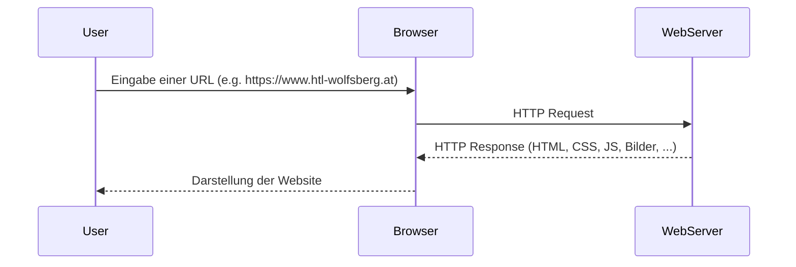

# Einführung Web und HTML

---
hideInToc: true
---

# Inhalt

<Toc minDepth="1" maxDepth="1" />

---

# Was ist das Web?

Das World Wide Web (WWW) ist ein weltweites Informationssystem, das auf dem Internet basiert. Webseiten werden mit Hilfe von **HTML** strukturiert, im **Browser** dargestellt und durch **Hyperlinks** verbunden.

## Warum HTML?

**HTML (Hypertext Markup Language)** ist die Sprache, mit der Webseiten erstellt werden. Sie beschreibt den **Inhalt und die Struktur** einer Seite:

- Text (Absätze, Überschriften)
- Links
- Bilder
- Listen und Tabellen
- Formulare und Eingabefelder

<br/>

> HTML ist keine Programmiersprache, sondern eine **Auszeichnungssprache**.

---

# Was macht ein Browser?

Ein **Webbrowser** (z. B. Chrome, Firefox, Edge) ist ein Programm, das **HTML-Dateien interpretiert** und daraus eine grafische Benutzeroberfläche rendert.

| **Browser**         | **Geschätzter globaler Marktanteil** |
| --------------------| -------------------------------------|
| Google Chrome       | \~ 69 %                              |
| Microsoft Edge      | \~ 12 %                              |
| Apple Safari        | \~ 7 %                               |
| Mozilla Firefox     | \~ 5 %                               |

---

# Ablauf beim Laden einer Website:

1. Der Browser fordert eine `.html`-Datei vom Server an
2. Er **analysiert** den HTML-Code (Parsing)
3. Er stellt die Inhalte auf dem Bildschirm dar


>Hinweis: Die Auflösung des Domainnamens (zu einer IP-Adresse) wurde für die vereinfachte Darstellung weggelassen

---

# Beispiel einer `html` Datei

```html [index.html]
<!DOCTYPE html>
<html>
  <head>
    <meta charset="UTF-8">
    <title>Meine erste Webseite</title>
  </head>
  <body>
    <h1>Hallo Welt!</h1>
    <p>Dies ist meine erste HTML-Seite.</p>
  </body>
</html>
```

**Aufgabe:**

Speichern Sie diese Datei z. B. als `index.html` und öffnen Sie sie im Browser.

> Merke: HTML-Dateien sind reine Textdateien mit der Endung `.html` und können mit jedem Texteditor erstellt werden:
>    - Editor 
>    - Notepad++
>    - <span v-mark.green="0">Visual Studio Code (VS Code)</span>

---

# Was sind HTML-Tags?

HTML verwendet sogenannte **Tags** (deutsch: „Auszeichnungen“), um Inhalte zu kennzeichnen und zu strukturieren.

Ein Tag besteht meist aus:

- einem **Start-Tag** (`<tagname>`),
- einem **Inhalt**,
- und einem **End-Tag** (`</tagname>`).

Beispiel:
```html
<p>Dies ist ein Absatz.</p>
```
<br>

> Einige Tags sind **selbstschließend**, z. B. `<br>` oder ``. D.h. sie benötigen keinen **End-Tag**

---

# Tag-Aufbau einer `html` Seite

```html [index.html]{all|1|2,11|3,6|4|5|7,10|8-9}{lines:true}
<!DOCTYPE html>
<html>
  <head>
    <meta charset="UTF-8">
    <title>Meine erste Webseite</title>
  </head>
  <body>
    <h1>Hallo Welt!</h1>
    <p>Dies ist meine erste HTML-Seite.</p>
  </body>
</html>
```
<br/>

<v-switch at="1">
  <template #1>
    Sagt dem Browser: <b>Das ist ein HTML5-Dokument</b>. Aktiviert den „Standards Mode“, damit moderne Regeln gelten.
  </template>
  <template #2> <b>Wurzel-Element</b> des Dokuments. Alles HTML steht innerhalb dieses Tags.</template>
  <template #3> <b>"Kopfbereich"</b>: Enthält Metadaten, die nicht direkt auf der Seite angezeigt werden (z. B. Titel, Zeichensatz, SEO-Infos). </template>
  <template #4>Legt die <b>Zeichenkodierung</b> fest (UTF-8). Wichtig, damit Umlaute/Emoji korrekt dargestellt werden. </template>
    <template #5><b>Seitentitel</b> – erscheint im Browser-Tab, in Lesezeichen und Suchergebnissen. </template>
  <template #6><b>Start und Ende des Seiteninhalts</b>, der im Browserfenster angezeigt wird. </template>
  <template #7>Der <b>Seiteninhalt</b> selbst. </template>

</v-switch>

---

# Tag Attribute

Tags können auch **Attribute** enthalten:

```html

```
      
<br>

| **Attribut** | **Beschreibung**                                     |
|--------------|------------------------------------------------------|
| src          | Bildquelle (URL, Dateiname, Pfad)                    |
| alt          | Alternativtext, falls Bild nicht geladen werden kann |

<br>

> **Info:** `` ist der *Tag* um Bilder darzustellen 

---

# Kommentar in HTML

HTML unterstützt auch **Kommentare**. Diese werden im Browser **nicht angezeigt** und dienen lediglich den Entwicklern:

```html
<!-- Überschrift der Seite -->
<h1>Willkommen auf meiner Seite</h1>
```

Ein Kommentar kann auch über mehrere Zeilen gehen.

```html
<!-- Ein 
sehr 
langer 
mehrzeiliger
Kommentar -->
<h1>Willkommen auf meiner Seite</h1>
```

---

# Wichtige Tags

<Toc minDepth="2" maxDepth="2" />

---

## Überschriften

<div class="grid grid-cols-2 gap-16">
  <div class="mt-8">

  ```html
  <h1>Größte Überschrift</h1>
  <h2>Etwas kleiner</h2>
  <h3>...</h3>
  <h6>Kleinste Überschrift</h6>
  ```
  </div>
  <div class="not-prose ua-reset">
    <h1>Größte Überschrift</h1>
    <h2>Etwas kleiner</h2>
    <h3>Noch kleiner</h3>
    <h6>Kleinste Überschrift</h6>
  </div>
</div>

<br>

<div class="grid grid-cols-2 gap-16">
  <div>
  
  ## Absätze und Zeilenumbrüche
  <br>

  ```html
  <p>Dies ist ein langer Absatz der nicht so schnell endet.</p> <!-- <p> steht für `parapraph`> -->
  <br> <!-- <br> steht für `break`> -->
  <p>Neuer Absatz mit <br> Zeilenumbruch.</p>
  ```
  </div>
  <div class="not-prose ua-reset">
    <p>Dies ist ein langer Absatz der nicht so schnell endet.</p> <!-- <p> steht für `parapraph`> -->
    <br> <!-- <br> steht für `break`> -->
    <p>Neuer Absatz mit <br> Zeilenumbruch.</p>
  </div>
</div>


<style>
.ua-reset, .ua-reset * {
  all: revert;   /* restore browser defaults (UA styles) */
}
</style>


---
layout: two-cols-header
layoutClass: gap-16
---

## Listen

::left::

### Geordnete Liste:
<br>
```html
<ol> <!-- <ol> steht für `ordered list` -->
  <li>Erster Punkt</li> <!-- <li> steht für `list item` -->
  <li>Zweiter Punkt</li>
</ol>
```

**Ausgabe:**
<ol> <!-- <ol> steht für `ordered list` -->
  <li>Erster Punkt</li> <!-- <li> steht für `list item` -->
  <li>Zweiter Punkt</li>
</ol>

::right::

### Ungeordnete Liste:
<br>
```html
<ul> <!-- <ul> steht für `unordered list` -->
  <li>Eintrag A</li>
  <li>Eintrag B</li>
</ul>
```

**Ausgabe:**
<ul> <!-- <ul> steht für `unordered list` -->
  <li>Eintrag A</li>
  <li>Eintrag B</li>
</ul>

---
layout: two-cols-header
layoutClass: gap-16
---

## Links

Der `<a>` tag wird benutzt um zu internen oder externen Seiten zu navigieren.

::left::

**Absolute URLs**

- Enthalten das vollständige Protokoll (e.g. `https`) und die Domain (e.g. `www.example.com`).

```html
<a href="https://www.example.com/about">Über uns</a>
```

::right::

**Relative URLs**

- Beziehen sich relativ zum Speicherort der aktuellen HTML-Datei.
- Vorteil: keine festen Domains – gut für lokale Entwicklung oder innerhalb derselben Website.

```html
<a href="kontakt.html">Kontakt</a> <!-- gleicher Ordner -->
<a href="produkte/liste.html">Produkte</a> <!-- Unterordner -->
<a href="../index.html">Startseite</a> <!-- Elternordner-->

```

---
layout: two-cols
layoutClass: gap-16
---

## Bilder
<br>

**Beispiel: Pfad**

```html

```


**Beispiel: URL**

```html

```

<br>

- `img` Tag benötigt eine zumindest das Quell-Attribut (Source => `src` abgekürzt) der Bilddatei.
- Die Quelle ist entweder ein Pfad oder eine URL

::right::


---
layout: two-cols-header
layoutClass: gap-16
---

## Tabellen

::left::

```html
<table>
    <tr> <!-- <tr> steht für table row -->
        <th>Name</th> <!-- <th> steht für table header -->
        <th>Alter</th>
    </tr>
    <tr>
        <td>Anna</td> <!-- <td> steht für table data -->
        <td>17</td>
    </tr>
    <tr>
        <td>Joe</td>
        <td>18</td>
    </tr>
</table>
```

::right::

**Ausgabe:**

<div class="not-prose ua-reset">
  <table>
      <tr> <!-- <tr> steht für table row -->
          <th>Name</th> <!-- <th> steht für table header -->
          <th>Alter</th>
      </tr>
      <tr>
          <td>Anna</td> <!-- <td> steht für table data -->
          <td>17</td>
      </tr>
      <tr>
          <td>Joe</td>
          <td>18</td>
      </tr>
  </table>
</div>

<style>
.ua-reset, .ua-reset * {
  all: revert;   /* restore browser defaults (UA styles) */
}
</style>

---

## Audio
<br>

```html
<audio src="./assets/audio/audio-example.mp3" controls></audio>
```

**Ausgabe:**

<audio src="./assets/audio/audio-example.mp3" controls></audio>

| Attribut           | Bedeutung                                                                     |
| ------------------ | ----------------------------------------------------------------------------- |
| `controls`         | zeigt Play/Pause/Lautstärke                                                   |
| `autoplay`         | startet automatisch (kann störend sein)                                       |
| `loop`             | wiederholt sich automatisch                                                   |

---
layout: two-cols
layoutClass: gap-16
---

## Video

<br>
<br>

```html
<video src="./assets/videos/video-example.mp4" controls width="400"></video>
```

<br>

<video src="./assets/videos/video-example.mp4" controls width="400"></video>

::right::

<div class="mt-22">

| **Attribut**   | **Bedeutung**                                      |
| ---------- | ---------------------------------------------- |
| `controls` | Steuerelemente einblenden                      |
| `poster`   | Vorschaubild anzeigen, bevor das Video startet |
| `autoplay` | Automatisch abspielen                          |
| `loop`     | Endlosschleife                                 |
| `muted`    | Start ohne Ton                                 |
</div>

---
layout: two-cols
layoutClass: gap-8
---

## Externe Inhalte

Mit dem `iframe` Tag können externe Inhalte, wie Videos, Karten, Dokumente (PDFs) aber auch Webseiten oder gar Web Anwendungen eingebunden werden. 

<br>

```html
<iframe width="560" height="315" 
    src="https://www.youtube.com/embed/eBSLUbpJvwA?si=nvFTCVmW9MtNiVQH" 
    title="Bill Gates and David Letterman" 
    frameborder="0" 
    allow="accelerometer; autoplay; clipboard-write; encrypted-media; gyroscope; picture-in-picture"
    referrerpolicy="strict-origin-when-cross-origin" 
    allowfullscreen>
</iframe>
```
::right::

<div class="mt-32">
  <iframe width="400" height="260" 
      src="https://www.youtube.com/embed/eBSLUbpJvwA?si=nvFTCVmW9MtNiVQH" 
      title="Bill Gates and David Letterman" 
      frameborder="0" 
      allow="accelerometer; autoplay; clipboard-write; encrypted-media; gyroscope; picture-in-picture"
      referrerpolicy="strict-origin-when-cross-origin" 
      allowfullscreen>
  </iframe>
</div>

---

# Links

- HTML Element (Tag) Referenz: https://www.w3schools.com/tags/default.asp
- Spielerisch Lernen: https://www.w3schools.com/html/default.asp