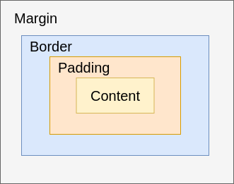

# Gruppieren von Tags 

## und CSS Box Modell

---
hideInToc: true
---

# Inhalt

<Toc minDepth="1" maxDepth="1" />

---

# `<div>` Tag
<hr>

<br>

- Das `<div>`- Tag ist ein **Block-Element ohne eigene Bedeutung**. 
- Es wird verwendet, um **Bereiche zu gruppieren** und diese dann gemeinsam zu gestalten oder mit CSS zu layouten.

**Eigenschaften:**

- Stellt einen **unsichtbaren Container** dar
- Nützlich für CSS-Gestaltung, Layouts, JavaScript
- Wird oft mit `class` oder `id` verwendet:

```html
<div class="info-box">
  <h3>Achtung</h3>
  <p>Wichtige Information</p>
</div>
```

---
layout: two-cols
layoutClass: gap-8
---
# Übung: `div` Card


Ziel: Einen logisch zusammengehörenden Abschnitt aus Überschrift und Text gruppieren.

- Erstelle eine vollständige HTML5 konforme `index.html` und `styles.css` Datei
- Verlinke die `styles.css` in der `index.html`
- Ändere die `.card` CSS Klasse
  - Ändere die Hintergrundfarbe zu `#006fca`
  - Ändere die Textfarbe zu `white`
  - Ändere die Schriftart: `font-family: Verdana;`
  - Setze `border-radius: 8px;`
- Tausche in der CSS Klasse `.btn` die Farben von `color` und `background-color`
- Füge noch ein `div` mit der Klasse `card` hinzu und ändere die Inhalte des `h3` und `p` tags

::right::

```html [index.html]
<div class="card">
  <h3>HTML lernen</h3>
  <p>HTML ist die Sprache, mit der Webseiten aufgebaut werden.</p>
  <a href="#" class="btn">Mehr erfahren</a>
</div>
```

```css [styles.css]
.card {
  padding: 15px;
  width: 220px;
  margin-bottom: 16px;
}
.card h3 {
  margin-top: 0;
}
.btn {
  display: inline-block;
  background-color: steelblue;
  color: white;
  padding: 5px 10px;
  border-radius: 5px;
  text-decoration: none;
}
```

---

# Das CSS Box-Modell

- Jedes HTML-Element auf einer Webseite wird im Browser als **Rechteck** dargestellt.
- Dieses Rechteck besteht nicht nur aus dem Inhalt, sondern auch aus Abständen und Rahmen.
- Das Konzept, wie diese Teile zusammenspielen, nennt man **CSS Box-Modell**.

---
layout: two-cols-header
layoutClass: gap-8
---
# Aufbau des Box-Modells

Von innen nach außen:

::left::

1. **Content** – Der eigentliche Inhalt (Text, Bild, etc.)
2. **Padding** – Abstand zwischen Inhalt und Rahmen
3. **Border** – Rahmen um das Element
4. **Margin** – Abstand zu anderen Elementen

::right::



---

# Übung: Box-Modell

- Erstelle ein HTML Dokument mit folgenden Tags und beliebigen Inhalt:
  - `h1`
  - `div`
  - `p`
- Füge zu jedem Tag eine eigene CSS-Klassen hinzu (e.g. `my-heading`, `my-div`, ...)
- Erstelle eine `.CSS` Datei und füge zu jeder Klasse folgende Eigenschaften bzw Werte hinzu
  - `padding: 16px;`
  - `margin: 16px;`
  - `border: 1px solid red;`
  - `background-color: green;`

---

# Box-Modell: Content

- Enthält den eigentlichen Inhalt, z. B. Text oder Bilder.
- Größe wird oft mit `width` und `height` festgelegt.

```css
div {
  width: 200px;
  height: 100px;
}
```

---

# Box-Modell: Padding

- **Innenabstand** zwischen Inhalt und Rahmen.
- Hintergrundfarbe wird **bis zum Rand des Paddings** gefüllt.
- Es können ein, zwei oder vier Parameter angegeben werden

```css
div {
  padding: 20px; /* alle Seiten */
  padding: 10px 20px; /* oben/unten, links/rechts */
  padding: 10px 20px 30px 10px; /* oben rechts unten links */
}
```

---

# Box-Modell: Border

- Rahmen um den Inhalt **und** Padding.
- Kann in Farbe, Dicke und Stil angepasst werden.

```css
div {
  border: 2px solid black;
}
```

---

# Box-Modell: Margin

- Außenabstand zwischen diesem Element und anderen.
- Hintergrundfarbe wirkt sich nicht auf den Margin aus.
- Wie bei `padding` können eins, zwei oder 4 Werte angegeben werden

```css
div {
  margin: 10px; /* alle Seiten */
  margin: 10px 20px; /* oben/unten, links/rechts */
  margin: 10px 20px 30px 10px; /* oben rechts unten links */
  margin: 0 auto; /* horizontal zentrieren */
}
```

--- 

# `box-sizing` Eigenschaft

Standardmäßig berechnet CSS die Gesamtgröße eines Elements so:
```
div {
  Gesamtbreite = width + padding + border
  Gesamthöhe   = height + padding + border
}
```

- Das kann unpraktisch sein.
- Mit `box-sizing: border-box;` wird die Breite **inklusive Padding und Border** berechnet.
- Verwenden Sie `box-sizing: border-box;` in allen Projekten, um die Größenberechnung einfacher zu machen.

```css
html {
  box-sizing: border-box;
}
*, *::before, *::after {
  box-sizing: inherit;
} 
```

---

# Übung: `box-sizing: border-box`

- Folgender `HTML` Code ist gegeben:

```html
<div class="box with-border-box">
  <h1>Mit Border Box</h1>
  <p>Ein Absatz mit Border Box</p>
</div>
<div class="box">
  <h1>Ohne Border Box</h1>
  <p>Ein Absatz ohne Border Box</p>
</div>
```

- Erstellen Sie jeweils ein CSS Klasse in einer CSS-Datei
- Für die Klasse `box` fügen Sie
  - eine Hintegrundfarbe ein
  - `padding`, `margin`, `border`, `width` und `height`
- Für die Klasse `with-border-box` fügen Sie `box-sizing: border-box` ein
- Öffne nun die DevTools mit der Taste `F12` und suche nach den Größen der Elemente