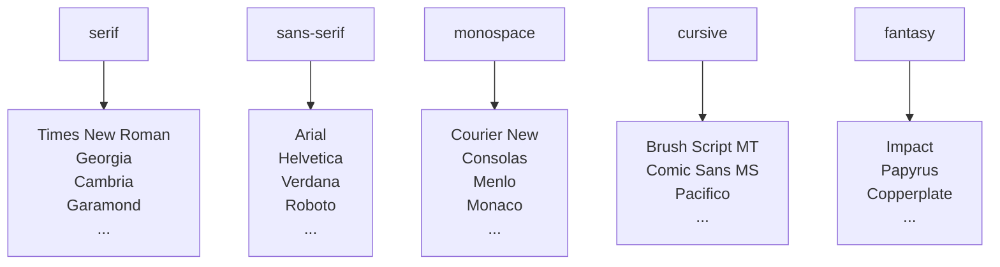

# Fonts

## Schriftgestaltung in CSS

---
hideInToc: true
---

# Inhalt

<Toc minDepth="1" maxDepth="1" columns="2" />

---

# Grundidee

- CSS erlaubt es, **Schriftarten, Größen, Farben** und weitere **typografische Eigenschaften** einer Webseite festzulegen.
- So lässt sich das Aussehen von Text an das **gewünschte Design und die Lesbarkeit** anpassen.

---
layout: two-cols-header
layoutClass: gap-16
---

# Die 5 generischen *Font Families*

In CSS werden Schriftarten in **fünf grundlegende generische Font Families** eingeteilt, die den **Stil und Charakter eines Textes** bestimmen.

::left::
- `serif`: Mit Serifen (kleinen "Füßchen")
- `sans-serif`: Ohne Serifen
- `monospace`: Alle Zeichen gleich breit
- `cursive`: Handschriftlich oder fließend
- `fantasy`: Dekorativ oder unkonventionell

::right::
<div style="border: 2px solid black;" class="px-2">
<p style="font-family: serif;">Dies ist ein Beispiel für Serif-Schrift.</p>
<p style="font-family: sans-serif;">Dies ist ein Beispiel für Sans-Serif-Schrift.</p>
<p style="font-family: monospace;">Dies ist ein Beispiel für Monospace-Schrift.</p>
<p style="font-family: cursive;">Dies ist ein Beispiel für Cursive-Schrift.</p>
<p style="font-family: fantasy;">Dies ist ein Beispiel für Fantasy-Schrift.</p>
</div>

---

# Übung: Playing with Font Families

Erstelle eine kleine HTML-Datei mit folgendem Inhalt:

```html
<!DOCTYPE html>
<html>
    <head>
        <meta charset="UTF-8">
        <title>Font Family Übung</title>
    </head>
    <body>
        <p style="font-family: serif;">Serif-Schrift</p>
        <p style="font-family: sans-serif;">Sans-Serif-Schrift</p>
        <p style="font-family: monospace;">Monospace-Schrift</p>
        <p style="font-family: cursive;">Cursive-Schrift</p>
        <p style="font-family: fantasy;">Fantasy-Schrift</p>
    </body>
</html>

```

- Wie unterscheiden sich die Schriften optisch?
- Welche liest sich am angenehmsten als Fließtext?
- Welche wirkt eher verspielt oder technisch?

---
layout: two-cols-header
layoutClass: gap-8
---

# `sans-serif` vs `serif` Schriften

- Am **Bildschirm** wirken **Sans-Serif-Schriften** oft klarer
- Im **Druck** sind **Serif-Schriften** angenehmer zu lesen.

<br>

**Beispiel:**

::left::
<h2 style="font-family: sans-serif;" >Stadtparkeröffnung</h2>
<p style="font-family: sans-serif; width: 40ch;">
Die Stadtverwaltung hat am Donnerstag den neuen Stadtpark eröffnet. Zahlreiche Besucher nutzten das sonnige Wetter, um die modernen Spielplätze und den neu angelegten Rosengarten zu erkunden. Bürgermeisterin Anna Keller sprach von einem wichtigen Schritt, um die Lebensqualität in der Innenstadt zu erhöhen.
</p>

::right::
<h2 style="font-family: serif;" >Stadtparkeröffnung</h2>
<p style="font-family: serif; width: 40ch;">
Die Stadtverwaltung hat am Donnerstag den neuen Stadtpark eröffnet. Zahlreiche Besucher nutzten das sonnige Wetter, um die modernen Spielplätze und den neu angelegten Rosengarten zu erkunden. Bürgermeisterin Anna Keller sprach von einem wichtigen Schritt, um die Lebensqualität in der Innenstadt zu erhöhen.
</p>

---

# Von *Families* zu echten Fonts

Die fünf generischen Font Families (`serif`, `sans-serif`, `monospace`, `cursive`, `fantasy`)  
sind **nicht konkrete Schriften**, sondern nur **Kategorien** bzw. **Fallback-Gruppen**.

- Sie definieren *Stilrichtungen*.
- Der Browser wählt **automatisch eine passende Systemschrift**.
- Jede Kategorie kann **dutzende oder hunderte konkrete Fonts** enthalten.

<br>



---

# Welche Fonts sind lokal verfügbar?

- **Für Windows:** Drücke `Windows-Taste + I` um *Einstellungen* zu öffnen


---

# Fonts und Fallback Schriften

- Nicht jede Schrift ist auf jedem Computer vorhanden.  
- Wenn das System die Schrift **nicht findet**, zeigt der Browser stattdessen **gar nichts oder eine Ersatzschrift**.
- Aus diesem Grund können bzw. **sollten** Webentwickler zusätzlich **Fallback Schriften definieren**

<br>

**Beispiel:**

```css
p {
  font-family: "Roboto", "Helvetica", "Arial", sans-serif;
}
```

- Der Browser prüft die Liste von **links nach rechts**.
- Er verwendet die **erste verfügbare** Schrift.
- Falls keine gefunden wird → nutzt er die **generische Family** (hier: `sans-serif`).

---

# Verwenden von nicht installierten Fonts

- Wir können Fonts direkt über das Internet laden – z. B. mit <a href="https://fonts.google.com/" target="_blank">**Google Fonts**</a>.

```html
<head>
    <!-- Einbinden einer externen Font -->
    <link href="https://fonts.googleapis.com/css2?family=Caveat+Brush&display=swap" rel="stylesheet">
    <style>
        p {
            font-family: 'Caveat Brush', 'Roboto', sans-serif;
        }
    </style>
</head>
<body>
    <p>Whereas disregard and contempt for human rights have resulted</p>
</body>
```

**Output:**

<link href="https://fonts.googleapis.com/css2?family=Caveat+Brush&display=swap" rel="stylesheet">
<p style="font-family: 'Caveat Brush', 'Roboto', sans-serif">Whereas disregard and contempt for human rights have resulted</p>

---

# Übung: Ausgefallene Fonts

- Finde zwei Fonts in <a href="https://fonts.google.com/" target="_blank">**Google Fonts**</a>, welche nicht auf deinem System installiert sind.
- Erstelle eine Beispiel `HTML` Seite, welche diese Fonts anwendet.
    - Wende eine Font für alle Überschriften an
    - Wende eine Font für den restlichen Fließtext an

---

# Wichtige CSS Eigenschaften für Fonts (1.Teil)

| Eigenschaft       | Beschreibung                                      | Beispiel |
|------------------|---------------------------------------------------|----------|
| `font-family`    | Schriftart                                         | `font-family: Arial, sans-serif;` |
| `font-size`      | Schriftgröße                                       | `font-size: 16px;` |
| `font-weight`    | Schriftstärke (`normal`, `bold`, Zahlen 100–900)   | `font-weight: bold;` |
| `font-style`     | Schriftstil (`normal`, `italic`, `oblique`)        | `font-style: italic;` |
| `color`          | Textfarbe                                          | `color: #333;` |

---

# Wichtige CSS Eigenschaften für Fonts (2.Teil)

| Eigenschaft       | Beschreibung                                      | Beispiel |
|------------------|---------------------------------------------------|----------|
| `line-height`    | Zeilenhöhe (Abstand zwischen Zeilen)               | `line-height: 1.5;` |
| `text-align`     | Ausrichtung (`left`, `center`, `right`, `justify`) | `text-align: center;` |
| `text-decoration`| Verzierung (`none`, `underline`, `line-through`)   | `text-decoration: underline;` |
| `letter-spacing` | Abstand zwischen Buchstaben                        | `letter-spacing: 2px;` |
| `word-spacing`   | Abstand zwischen Wörtern                           | `word-spacing: 4px;` |

---

# Übung: Font Eigenschaften

- Gegeben ist folgender HTML Code:

```html
<!DOCTYPE html>
<html>
    <head>
        <meta charset="UTF-8">
        <title>Fonts Sandbox</title>
        <link href="https://fonts.googleapis.com/css2?family=Roboto:ital,wght@0,100..900;1,100..900&display=swap" rel="stylesheet">rel="stylesheet">
        <style>
            html {
                font-family: 'Roboto', 'Verdana', sans-serif;
            }
        </style>
    </head>
    <body>
        <h1>Hello World</h1>
        <p>Whereas disregard and contempt for human rights have resulted</p>
    </body>
</html>
```

- Wende verschiedene **CSS Eigenschaften für Fonts** an
- Benutze für `h1` und `p` **verschiedene** Eigenschaften

---
layout: two-cols-header
layoutClass: gap-8
---

# Schriftgrößen & Best Practices mit `rem`

In CSS sollten **relative Einheiten** statt fester Pixelgrößen verwendet werden.  
Das sorgt für **Barrierefreiheit**, **Responsivität** und **bessere Skalierbarkeit**.

::left::

**Warum `rem` statt `px`?**
- `px` = fester Pixelwert → skaliert **nicht mit**  
- `em` = relativ zur Schriftgröße des **Elternelements**  
- `rem` = relativ zur Schriftgröße des **Root-Elements (`<html>`)**

<br>

> 💡 `rem` steht für **root em**  
und ist meist stabiler & besser vorhersagbar als `em`.

::right::

**Beispiel:**

```css
html {
  /* Optional, Standardgröße in Browsern für 1rem = 16px */
  font-size: 1rem; 
}

h1 { font-size: 2rem; }   /* 32px */
h2 { font-size: 1.5rem; } /* 24px */
p  { font-size: 1rem; }   /* 16px */
```

---

# Übung: Playing with `em`

```html
<!DOCTYPE html>
<html lang="de">
    <head>
        <meta charset="UTF-8">
        <title>em Übung</title>
    </head>
    <body style="font-size:16px; font-family:sans-serif;">
        Dieser Text ist Standardgröße
        <div style="font-size:1.25em;">
            Dieser Text ist das 1.25fache von Standard
            <div style="font-size:1.25em;">
                Dieser Text ist wieder 1.25 mal größer als vorher
                <div style="font-size:1.25em;">
                    Dieser Text ist wieder 1.25 mal größer als vorher
                    <span style="font-size:0.8em; padding:0.5em 1em; background:#222; color:#fff; display:inline-block;">
                    Dieser Text ist 0.8mal kleiner als der der vorherige
                    </span>
                    <p>Wie groß (in pixel) ist der Text in schwarz?</p>
                </div>
            </div>
        </div>
    </body>
</html>
```

---

# Übung: Playing with `rem`

```html
<!DOCTYPE html>
<html lang="de">
    <head>
        <meta charset="UTF-8">
        <title>rem Übung</title>
    </head>
    <body style="font-size:16px; font-family:sans-serif;">
        Dieser Text ist Standardgröße
        <div style="font-size:1.25rem;">
            Dieser Text ist das 1.25fache von Standard
            <div style="font-size:1.5rem;">
                Dieser Text ist 1.5 mal größer als der Standard
                <div style="font-size:2rem;">
                    Dieser Text ist wieder 2 mal größer als der Standard
                    <span style="font-size:1.5rem; padding:0.5rem 1rem; background:#222; color:#fff; display:inline-block;">
                    Dieser Text ist 1.5mal größer als der Standard
                    </span>
                    <p>Wie groß (in pixel) ist der Text in schwarz?</p>
                </div>
            </div>
        </div>
    </body>
</html>
```


