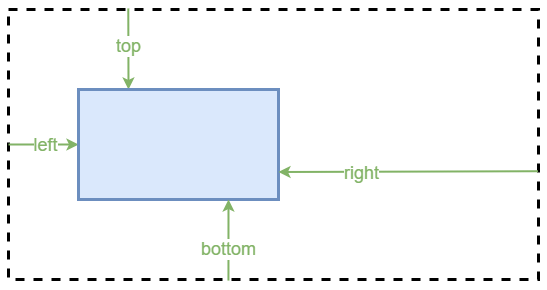

# Positionierung in CSS

---
hideInToc: true
---

# Inhalt

<Toc minDepth="1" maxDepth="1" columns="1" />

---

# Grundidee

Mit **CSS-Positionierung** wird festgelegt, **wo** ein Element auf der Webseite angezeigt wird.
Das Verhalten hängt vom Wert der `position`-Eigenschaft ab.

|              |              |
|--------------|--------------|
| `static`     | **Standard**. Elemente erscheinen in der normalen Reihenfolge des HTML-Dokuments. Keine spezielle Positionierung. |
| `relative`   | Positionierung **relativ zur ursprünglichen Position**. Ermöglicht kleine Verschiebungen. |
| `absolute`   | Positionierung **relativ zum nächsten positionierten Vorfahren** (nicht zum gesamten Dokument, außer wenn kein Vorfahre positioniert ist). |
| `fixed`      | Positionierung **relativ zum Browserfenster**. Bleibt beim Scrollen an derselben Stelle. |
| `sticky`     | Mischung aus `relative` und `fixed`. Bewegt sich normal, bleibt aber an einer Position „kleben“, sobald sie erreicht ist. |

---

# Wichtige Positionsattribute

Diese Werte funktionieren nur, wenn `position` ≠ `static` ist:

<div class="grid grid-cols-2">
<div>

- `top` – Abstand von der oberen Kante
- `left` – Abstand von der linken Kante
</div>
<div>

- `right` – Abstand von der rechten Kante
- `bottom` – Abstand von der unteren Kante
</div>
</div>



---

# `position: static` (Default)

- **Definition:** Standardfluss, Element folgt dem normalen Dokumentfluss.  
- **Offsets:** `top/right/bottom/left` **wirken nicht**.  

**Use-cases:** Default – gut für Fließlayout.

```css
.static-box { position: static; /* optional, da default */ } 
```

**Demo**

<div style="border:1px solid #ccc;"> 
  <div class="box" style="position: static; background:#cfe; ">Static Box</div> 
  <div style="background:#eef;">Nachher</div> 
</div>

---

# `position: relative`

- **Definition:** Bleibt im Flow, **versetzbar** relativ zu seiner normalen Position.  
- **Offsets:** `top/right/bottom/left` verschieben **optisch**, Platz bleibt erhalten.  

**Use-cases:** Feine Korrektur

```css

.relative-box { position: relative; top: 6px; right: 6px; }
```

**Demo**

<div style="border:1px solid #ccc;"> 
  <div style="background:#cfe;position: relative; top:6px; left:6px;"> Relative Box (versetzt) </div>
  <div style="background:#eef;">Normaler Inhalt</div> 
</div>

---

# `position: absolute`

- **Definition:** **Entfernt** aus dem normalen Flow.  
- **Offsets:** relativ zum **positionierten Elternelement** (`relative/absolute/fixed/sticky`), sonst zum **Viewport**.  

**Use-cases:** Badges, Tooltips, exakt platzierte Overlays.

```css
.absolute-box { position: absolute; top: 8px; right: 8px; }
```

**Demo**

<div style="border:1px solid #ccc;position: relative;width: 100%; height: 150px; background:#eef; display: flex; align-items: center; justify-content: center;">
  Normaler Inhalt
  <span style="position:absolute; top:8px; right:8px; background:#cfe;"> Absolute Box </span> 
</div>

---

# `position: sticky`

- **Definition:** Hybrid: **im Flow**, bis ein Offset erreicht ist → dann **klebt** relativ zum Scroll-Container.  
- **Offsets:** z. B. `top: 0` – klebt an der Oberkante des **Scroll-Containers**.  

**Use-cases:** Abschnittstitel, Tabellen-Header, In-Page Navigation.

```css
.sticky-box { position: sticky; top: 0; }
```


**Demo**

<div style="height:200px; overflow:auto; border:1px solid #ccc;"> 
  <div style="background:#eef;">Vorher</div>
  <div style="position: sticky; top: 0; background:#cfe;"> Sticky Header (scroll!) </div> 
  <div style="height:300px; background:#eef;"> 
    Nachher…<br/>…<br/>…<br/>…<br/>…<br/>…<br/>…<br/>…<br/>…<br/>…<br/>…<br/>
  </div> 
</div> 

---

# `position: fixed`

- **Definition:** Aus dem Flow, **fixiert am Viewport** (bleibt beim Scrollen sichtbar).  
- **Offsets:** relativ zum **Viewport**. 

**Use-cases:** Navigation, „Back to top“, Chat-Bubbles.

```css
.fixed-box { position: fixed; right: 16px; bottom: 16px; }
```

**Demo**

- Da `fixed` immer relativ zum **Viewport** ist, kann es nicht leicht in isolierten Demo Beispielen gezeigt werden.
- Gehe zur nächsten Folie um die Demo aus einem `iFrame` (=Viewport) zu zeigen

---

# Live Demo

<iframe src="https://htl-wolfsberg-betriebsinformatik.github.io/skript/assets/html/positioning-css.html" width="100%" height="400" style="border:1px solid #ccc;"></iframe>

---

# Übung: Positioning

- Erstelle eine HTML Datei und füge 4 `div` Elemente ein
- Erstelle eine CSS Datei und verlinke sie zur HTML Seite
- Erstelle je eine Klasse für die 4 `div` Elemente und weise ihnen eine `position` Eigenschaft zu
  - `.relative-box { position: relative; }`
  - `.absolute-box { position: aboslute; }`
  - `.fixed-box { position: fixed; }`
  - `.sticky-box { position: sticky; }`
- Ergänze das Beispiel mit den Positionierungswerten (e.g. `top`, `left`, `bottom`, `right`) und je nach Bedarf zusätzliche Elternelemente 