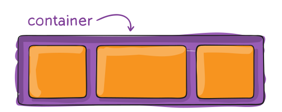
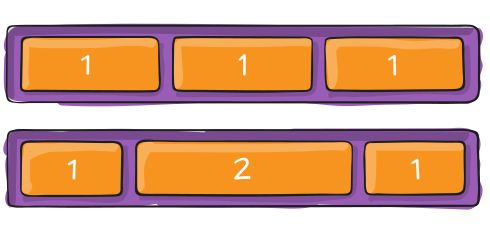

# Moderne Layouts in CSS

## Flexbox

---
hideInToc: true
---

# Inhalt

<Toc minDepth="1" maxDepth="1" columns="1" />

---
layout: center
class: text-center
---

# Warum brauchen wir moderne CSS-Layoutsysteme?

---

# 🕰 Klassische Layoutmethoden

- Inhalte wurden mit **`inline-block`**, **`float`** oder sogar **Tabellen** angeordnet  
- Jede kleine Änderung führte zu **viel CSS-Code**  
- Probleme mit:
  - Vertikaler Zentrierung  
  - Abständen zwischen Elementen  
  - Responsiven Layouts (Handy, Tablet, Desktop)

<br>

---

# 🎯 Ziel moderner Layoutsysteme

- **Einfachere Syntax**
- **Weniger Code**
- **Bessere Kontrolle** über Ausrichtung, Abstände und Reihenfolge
- **Responsive Design** direkt eingebaut 

<br>

**Die 2 großen Systeme:**

<div style="display:flex; gap: 44px; font-size: 44px">

  <div style="width: 100%; background-color: lightblue; border: 2px solid lightblue; color: white; border-radius: 8px; text-align: center; font-family: Verdana, sans-serif; padding: 44px 0;">
  FLEXBOX
  </div>
  <div style="width: 100%; background-color: white; border: 2px solid lightblue; color: teal; border-radius: 8px; text-align: center; font-family: Verdana, sans-serif; padding: 44px 0;">
  GRID
  </div>
</div>

<br>

> 💡Wir beschäftigen uns nur mit dem **Flexbox** Layoutsystem.

---

# Flexbox

Für **eindimensionale Layouts** – Elemente in **einer Reihe oder Spalte** anordnen.

- Ideal für Navigationen, Buttons, Header-Footer-Strukturen  
- Steuert **Ausrichtung**, **Abstände** und **Größenverteilung**  
- Einfach horizontales und vertikales **zentrieren**

```css
element {
  display: flex;
}
```


🧩 Merke: *"1D – Linie"*


<div style="background-color: lightblue; padding: 8px 16px; border-radius: 8px;">
  💡 Bilder und Beispiele zu Flexbox stammen aus dem Artikel:

**Chris Coyier**, [CSS-Tricks](https://css-tricks.com)  
🔗 [A Complete Guide to Flexbox](https://css-tricks.com/snippets/css/a-guide-to-flexbox/)  

© Urheberrecht: Chris Coyier / CSS-Tricks  
Verwendung zu **Lehr- und Demonstrationszwecken** (nicht kommerziell)
</div>


---
layout: two-cols
layoutClass: gap-8
hideInToc: true
---

# `display: flex`

- Aktiviert das Flexbox-Layoutsystem.
- Ordnet **Kind-Elemente flexibel** in **einer Reihe oder Spalte** an.
- Ideal für Navigationen, Kartenreihen, Kopfbereiche usw.
- Elterncontainer bekommt `display: flex;`,
- Kinder werden automatisch zu **Flex-Items**.

::right::




---

# Übung: Meine erste Flexbox

- Erstelle ein Eltern `div` Element mit der Klasse `container`
- Im Eltern `div` füge 5 Kinder `div`s ein mit der Klasse `item`
- Benenne jedes Kind `div` fortlaufend: Item 1, Item 2, ..., Item 5
- Gib Eltern und Kinder `div`s 
  - `8px` padding
  - unterschiedliche Hintegrundfarben (1 Farbe für Eltern `div`, 1 Farbe für alle Kinder `div`s)
- Gib nun dem Eltern `div` die Eigenschaft `display: flex;`

<br>

<style>
.container {
  background-color: purple;
  padding: 8px;
  display: flex;
}

.item {
  background-color: orange;
  color: white;
  padding: 8px;
}
</style>

<div class="container">
  <div class="item">Item 1</div>
  <div class="item">Item 2</div>
  <div class="item">Item 3</div>
  <div class="item">Item 4</div>
  <div class="item">Item 5</div>
</div>

---
layout: two-cols
hideInToc: true
---

# `flex-direction`

Bestimmt, in **welcher Richtung** die Flex-Items **angeordnet werden**.

```css
.container {
  flex-direction: row | row-reverse | column | column-reverse;
}
```
<br>

- `row` (default): Links nach rechts
- `row-reverse`: Rechts nach links
- `column`: Oben nach unten
- `column-reverse`: Unten nach oben

::right::

<div style="display:flex; height: 100%; align-content: center; margin: 0 16px; justify-content: center;">
  
</div>


---
layout: two-cols
hideInToc: true
---

# `flex-wrap`

Sagt, ob Elemente in die **nächste Zeile umbrechen** dürfen, wenn kein Platz mehr ist.

```css
.container {
  flex-wrap: nowrap | wrap | wrap-reverse;
}
```

<br>

- `nowrap` (default): all flex items will be on one line
- `wrap`: flex items will wrap onto multiple lines, from top to bottom.
- `wrap-reverse`: flex items will wrap onto multiple lines from bottom to top.

::right::

<div style="display:flex; height: 100%; align-content: center; margin: 0 16px; justify-content: center;">
  
</div>


---
layout: two-cols
hideInToc: true
---

# `justify-content`

Steuert, wie der freie Platz auf der Hauptachse verteilt wird. z.B. linksbündig, mittig, gleichmäßig verteilt.

```css
.container {
  justify-content: flex-start | flex-end | center | space-between | ...;
}
```

::right::

<div style="display:flex; height: 500px; align-content: center; margin: 0 16px; justify-content: center;">
  
</div>

---
layout: two-cols
hideInToc: true
---

# `align-items`

Steuert, wie die Items auf der Querachse (senkrecht zur Hauptachse) ausgerichtet sind. → z. B. oben, mittig oder unten im Container.

```css
.container {
  align-items: stretch | flex-start | flex-end | center | baseline;
}
```

::right::

<div style="display:flex; height: 500px; align-content: center; margin: 0 16px; justify-content: center;">
  
</div>

---
layout: two-cols
hideInToc: true
---

# `align-content`

Wie mehrere Zeilen (bei flex-wrap) auf der Querachse verteilt werden. → Wirkt nur, wenn es mehr als eine Zeile gibt.

```css
.container {
  align-content: normal | flex-start | flex-end | center | space-between | space-around | stretch;
}
```

::right::

<div style="display:flex; height: 500px; align-content: center; margin: 0 16px; justify-content: center;">
  
</div>

---
layout: two-cols
hideInToc: true
---

# `gap`

Legt den Abstand zwischen Flex-Items fest — ohne zusätzliche Margins.

```css
.container {
  display: flex;
  ...
  gap: 10px;
  gap: 10px 20px; /* row-gap column gap */
  row-gap: 10px;
  column-gap: 20px;
}
```

::right::

<div style="display:flex; height: 500px; align-content: center; margin: 0 16px; justify-content: center;">
  
</div>


---
layout: two-cols
hideInToc: true
---

# `flex`

Bestimmt, **wie groß oder klein** ein Element im **Flex-Container** werden darf.  

**Beispiele:**


<small>Alle Flex-Items teilen sich den Platz gleichmäßig:</small> 
```css
.item {
  flex: 1;
}
```

<small>Item 2 bekommt doppelt so viel Platz wie Item 1:</small>
```css
.item1 { flex: 1; }
.item2 { flex: 2; }
```

::right::

<div style="display:flex; height: 500px; align-content: center; margin: 0 16px; justify-content: center;">
  
</div>


---
layout: two-cols
hideInToc: true
---

# `align-self`

Überschreibt align-items für ein einzelnes Element.

```css
.item {
  align-self: auto | flex-start | flex-end | center | baseline | stretch;
}
```

::right::

<div style="display:flex; height: 500px; align-content: center; margin: 0 16px; justify-content: center;">
  
</div>


---

# Grid

Für **zweidimensionale Layouts** – Inhalte in **Zeilen und Spalten** positionieren.

- Ideal für ganze Seitenraster, Galerien oder Dashboards  
- Definiert **Raster mit Spalten und Reihen**  
- Ermöglicht **präzise Platzierung** und **komplexe Strukturen**

🧩 Merke: *"2D – Raster"*

---
layout: two-cols
layoutClass: gap-16
---

# Grid Demos

Teilt den Container in 3 gleich große Spalten auf.

```css
.container {
  display: grid;
  grid-template-columns: 1fr 1fr 1fr;
  gap: 10px;
}
```
<br>

- `fr` steht für „fraction“ → also Anteil oder Bruchteil des verfügbaren Platzes.
- `1fr` bedeutet: *„Nimm einen gleich großen Teil vom restlichen Platz.“*
- Das Grid teilt den Platz in 3 gleich große Spalten (jede bekommt 1/3 der Gesamtbreite).
::right::

<style>
.container {
  background-color: purple;
  padding: 8px;
  display: grid;
  grid-template-columns: 1fr 1fr 1fr;
  gap: 10px;
  border-radius: 8px;
}

.item {
  background-color: orange;
  border-radius: 8px;
  color: white;
  padding: 8px;
}
</style>

<div class="container">
  <div class="item">Item 1</div>
  <div class="item">Item 2</div>
  <div class="item">Item 3</div>
  <div class="item">Item 4</div>
  <div class="item">Item 5</div>
  <div class="item">Item 6</div>
  <div class="item">Item 7</div>
  <div class="item">Item 8</div>
  <div class="item">Item 9</div>
  <div class="item">Item 10</div>
</div>

---
layout: two-cols
layoutClass: gap-16
hideInToc: true
---

# Grid Demos

Unterschiedlich breite Spalten


```css
.container {
  display: grid;
  grid-template-columns: 160px 1fr 2fr;
  gap: 10px;
}
```
<br>

- Erste Spalte fix (`160 px`),
- Zweite und dritte Spalte teilen sich den restlichen Platz im Verhältnis `1 : 2`.

::right::

<style>
.container {
  background-color: purple;
  padding: 8px;
  display: grid;
  grid-template-columns: 160px 1fr 2fr;
  gap: 10px;
  border-radius: 8px;
}

.item {
  background-color: orange;
  border-radius: 8px;
  color: white;
  padding: 8px;
}
</style>

<div class="container">
  <div class="item">Item 1</div>
  <div class="item">Item 2</div>
  <div class="item">Item 3</div>
  <div class="item">Item 4</div>
  <div class="item">Item 5</div>
  <div class="item">Item 6</div>
  <div class="item">Item 7</div>
  <div class="item">Item 8</div>
  <div class="item">Item 9</div>
  <div class="item">Item 10</div>
</div>

---
layout: two-cols
layoutClass: gap-16
hideInToc: true
---

# Grid Demos

Zeilen und Spalten definieren

```css
.container {
  display: grid;
  grid-template-columns: 1fr 1fr;
  grid-template-rows: 100px 200px;
  gap: 10px;
}
```
<br>

- Zwei Spalten, zwei Zeilen – ergibt ein `2×2`-Raster.

::right::

<style>
.container {
  background-color: purple;
  padding: 8px;
  display: grid;
  grid-template-columns: 1fr 1fr;
  grid-template-rows: 100px 200px;
  gap: 10px;
  border-radius: 8px;
}

.item {
  background-color: orange;
  border-radius: 8px;
  color: white;
  padding: 8px;
}
</style>

<div class="container">
  <div class="item">Item 1</div>
  <div class="item">Item 2</div>
  <div class="item">Item 3</div>
  <div class="item">Item 4</div>
</div>

---
layout: two-cols
layoutClass: gap-16
hideInToc: true
---

# Grid Demos

Ein Element über mehrere Spalten oder/und Zeilen

```css
.container {
  display: grid;
  grid-template-columns: 1fr 1fr 1fr;
  grid-template-rows: repeat(5, 50px);
  gap: 10px;
}

.item1 {
  grid-column: 1 / span 2; /* 1.Spalte, auf 2 Spalten */
}

.item3 {
  grid-row: 2 / span 2; /* 2.Zeile, auf 2 Zeilen */
}

.item6 {
  grid-column: 2 / span 2;
  grid-row: 3 / span 2;
}
```
<br>

::right::

<style>
.container {
  background-color: purple;
  padding: 8px;
  display: grid;
  grid-template-columns: 1fr 1fr 1fr;
  grid-template-rows: repeat(5, 50px);
  gap: 10px;
  border-radius: 8px;
}

.item {
  background-color: orange;
  border-radius: 8px;
  color: white;
  padding: 8px;
}

.item1 {
  grid-column: 1 / span 2; /* 1.Spalte, auf 2 Spalten */
}

.item3 {
  grid-row: 2 / span 2; /* 2.Zeile, auf 2 Zeilen */
}

.item6 {
  grid-column: 2 / span 2;
  grid-row: 3 / span 2;
}

</style>

<div class="container">
  <div class="item item1">Item 1</div>
  <div class="item">Item 2</div>
  <div class="item item3">Item 3</div>
  <div class="item">Item 4</div>
  <div class="item">Item 5</div>
  <div class="item item6">Item 6</div>
  <div class="item">Item 7</div>
  <div class="item">Item 8</div>
  <div class="item">Item 9</div>
  <div class="item">Item 10</div>
</div>


