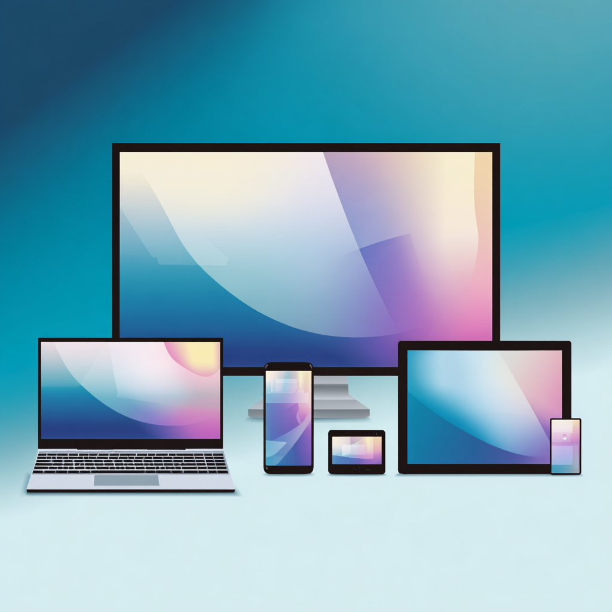

# Responsive Design

---
hideInToc: true
---

# Inhalt

<Toc minDepth="1" maxDepth="1" columns="2" />

---
layout: two-cols
---
# Das Problem unserer Zeit

Eine Website wird heute angezeigt auf …

- Monitore (2K, 4K, ...)
- Ultrawide Monitore
- Laptops
- Smartphones / Foldables
- Tablets
- Smart TVs

::right::



---

# Unterschiedliche Bildschirmgrößen

Eine Website hat **nicht mehr nur eine feste Größe**.

| Gerät | Breite |
|-------|--------|
| Smartphone | ~360px |
| Tablet | ~768px |
| Laptop | ~1366px |
| Desktop | 1920px+ |

---

# Was passiert ohne Anpassung?

- Inhalte sind zu klein
- Man muss hineinzoomen
- Navigation ist nicht klickbar
- Layout bricht auseinander
- Bilder ragen hinaus

<br>

> ❗ **Schlechte Benutzererfahrung (UX = User Experience)**

---

# Die Lösung - Responsive Design

Responsive Design bedeutet, dass sich eine Webseite automatisch an die Bildschirmgröße des Geräts anpasst:

- Layout verändert sich
- Spalten ordnen sich neu
- Navigation wird angepasst
- Bilder skalieren mit

<br>

> 🎯 **Ziel ist es, eine einzige Webseite für alle Geräte zu entwickeln**

---

# Das Viewport Meta-Tag

Mit dem Viewport Meta Tag wird die Breite (`width`) auf die echte Gerätebreite und der initiale Zoom Level gesetzt.

```html
<meta name="viewport" content="width=device-width, initial-scale=1.0">
```

---

# Übung: Viewport Meta-Tag

```html
<!DOCTYPE html>
<html>
  <head>
    <!-- TODO: Insert Viewport Meta Tag -->
    <style>
      img {
        max-width: 100%;
        height: auto;
      }
    </style>
  </head>
  <body>
    <p> To understand this example, you should open this page on a phone or a tablet. </p>
    
    <p>
      Lorem ipsum dolor sit amet, consectetuer adipiscing elit, sed diam nonummy nibh euismod tincidunt ut laoreet dolore magna aliquam erat volutpat. Ut wisi enim ad minim veniam, quis nostrud exerci tation ullamcorper suscipit lobortis nisl ut aliquip ex ea commodo consequat. Duis autem vel eum iriure dolor in hendrerit in vulputate velit esse molestie consequat, vel illum dolore eu feugiat nulla facilisis at vero eros et accumsan et iusto odio dignissim qui blandit praesent luptatum zzril delenit augue duis dolore te feugait nulla facilisi.
    </p>
  </body>
</html>
```

<a href="https://www.w3schools.com/css/img_chania.jpg" download="img_chania.jpg">Bild herunterladen</a>

---

# Flexible Breiten statt fixe Pixel

Bei Nutzung von fixen Breiten (e.g. in Pixel) ensteht seitliches Scrollen nach rechts

**Das Problem:**

```css
.container {
  width: 1200px;
}
```

<br>

**Die Lösung:**

```css
.container {
  width: 100%;
  max-width: 1200px;
}
```

* `100%` → flexibel
* `max-width` → Begrenzung auf großen Bildschirmen

---

# Weitere flexible Einheiten

- `%` → relativ zum Elternelement
- `vw` → Prozent der Viewport-Breite
- `vh` → Prozent der Viewport-Höhe
- `rem` → relativ zur Schriftgröße

---
layout: two-cols
---

# Übung: Flexible Breiten

Erstelle zwei `div` Boxen mit:

- `width: 800px`
- `width: 80%`

Verkleinere das Browserfenster im Anschluss.

::right::

```html
<!DOCTYPE html>
<html lang="en">
<head>
  <meta charset="UTF-8">
  <meta name="viewport" content="width=device-width, initial-scale=1.0">
  <title>Document</title>
  <style>
    .fixed-box {
      /* TODO: set width */
      background-color: lightcoral;
    }
    .flexible-box {
      /* TODO: set width */
      background-color: greenyellow;
    }
  </style>
</head>
<body>
  <div class="fixed-box">
    Fixed Box
  </div>
  <div class="flexible-box">
    Flexible Box
  </div>
</body>
</html>
```

---

# Responsive Bilder

Bilder ragen aus dem Bildschirm, wenn mit fixen Breiten gearbeitet wird (ähnlich "Flexible Breiten").

**Das Problem:**

```css
img {
  width: 500px;
}
```

<br>

**Die Lösung:**

```css
img {
  max-width: 100%;
  height: auto;
}
```

- Bild wird nie größer als Container
- Seitenverhältnis bleibt erhalten

---

# Übung: Responsive Bilder

Suche ein großes (breites) Bild (z.B. 2000px Breite) und füge es in ein HTML Dokument ein. 

1. Teste ohne CSS (Gehe dazu in die mobile Ansicht in den Dev-Tools)
2. Teste mit max-width: 100%

---

# Media Queries

Media Queries sind CSS-Regeln, die nur bei bestimmten Bildschrimgrößen gelten.

```css
@media (max-width: 768px) {
  body {
    background-color: lightblue;
  }
}
```

<br>

- Regel wird nur aktiv wenn der Bildschirm ≤ `768px` ist

<br>

**Typische Breakpoints**

- `1200px` → Desktop
- `992px` → Laptop
- `768px` → Tablet
- `576px` → Smartphone

---

# Übung: Media Queries

```css
.cards {
  display: grid;
  grid-template-columns: repeat(3, 1fr); /* exakt 3 Spalten */
  gap: 16px;
}

@media (max-width: 768px) {
  .cards {
    grid-template-columns: repeat(2, 1fr); /* exakt 2 Spalten */
  }
}

/* TODO: Erstelle eine weitere Media Query, welche bis zu einer Breite von 576px nur eine Spalte anzeigt */ 
```

---

# Mobile First vs Desktop First

Es gibt *zwei Strategien*:

- **Desktop First**: Man startet mit Desktop und verkleinert
- **Mobile First**: Man startet mit Smartphone und erweitert

**Beispiel: Mobile First:**

```css
.container {
  flex-direction: column;
}

/* Achtung: statt max-width verwenden wir min-width, also ab einer Größe passen wir an */
@media (min-width: 768px) { 
  .container {
    flex-direction: row;
  }
}
```

---

# Übung: Mobile First

Diskutiere in 2er Gruppen:

- Warum könnte **Mobile First** für neue Projekte sinnvoller sein?

