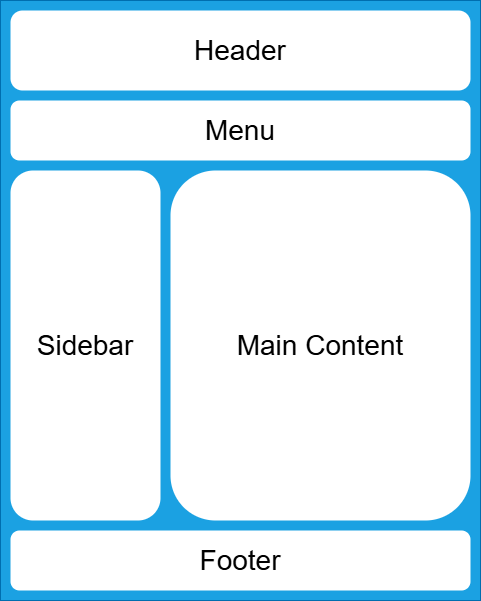

# Semantisches HTML

## Strukturierte, verständliche und barrierefreie Webseiten

---
hideInToc: true
---

# Inhalt

<Toc minDepth="1" maxDepth="1" columns="1" />

---
layout: two-cols
layoutClass: gap-16
---
# Grundidee

**Semantisches HTML** bedeutet, dass HTML-Elemente so verwendet werden, dass ihre **Bedeutung (Semantik) für Menschen und Maschinen klar ist**.

::right::

{width=90%}

---

# Warum semantisches HTML?

<br>

| Vorteil | Erklärung |
|--------|-----------|
| **Klare, einheitliche Struktur** | Der Quellcode ist leichter zu lesen und zu pflegen. |
| **Suchmaschinenoptimierung (SEO)** | Suchmaschinen erkennen wichtige Inhalte und deren Bedeutung besser. |
| **Barrierefreiheit (Accessibility)** | Screenreader können den Inhalt sinnvoll gliedern und Nutzern vorlesen. |

---

# Umsetzung

Anstatt alles in `<div>` zu packen, werden **spezielle Tags** genutzt, die den Inhaltstyp beschreiben.

| **Element**     | **Bedeutung**                                   |
| ----------- | ------------------------------------------- |
| `<header>`  | Kopfbereich eines Dokuments oder Abschnitts |
| `<nav>`     | Navigation                                  |
| `<main>`    | Hauptinhalt der Seite (nur 1mal!)           |
| `<section>` | Thematischer Abschnitt                      |
| `<article>` | Selbstständig stehender Inhalt              |
| `<aside>`   | Ergänzende Inhalte (Sidebar, Info-Boxen)    |
| `<footer>`  | Fußzeile eines Dokuments oder Abschnitts    |

---

# Gängige Varianten

<Toc minDepth="2" maxDepth="2" columns="1" />

---
layout: two-cols
layoutClass: gap-16
---

## Default Variante

<br>

```html
<body>
  <header> … </header>
  <nav> … </nav>
  <main> … </main>
  <footer> … </footer>
</body>
```

::right::

<SemanticBox
  width="full"
  label="<header>"
/>
<SemanticBox
  width="full"
  label="<nav>"
/>
<SemanticBox
  width="full"
  height="250px"
  label="<main>"
/>
<SemanticBox
  width="full"
  label="<footer>"
/>

---
layout: two-cols
layoutClass: gap-16
---

## Sektionen im Hauptinhalt

<br>

```html
<body>
  <header> … </header>
  <nav> … </nav>
  <main>
    <section> … </section>
    <section> … </section>
  </main>
  <footer> … </footer>
</body>
```

<br>

- Thematisch zusammenhängender Bereich (z. B. "News", "Produkte")

::right::

<SemanticBox
  width="full"
  label="<header>"
/>
<SemanticBox label="<nav>" width="full" />

<SemanticBox
  width="full"
  height="250px"
  label="<main>"
>
<SemanticBox label="<section>" width="full" />
<SemanticBox label="<section>" width="full" />
</SemanticBox>
<SemanticBox
  width="full"
  label="<footer>"
/>

---
layout: two-cols
layoutClass: gap-16
---

## Artikel im Hauptinhalt

<br>

```html
<body>
  <header> … </header>
  <nav> … </nav>
  <main>
    <article> … </article>
  </main>
  <footer> … </footer>
</body>
```

<br>

- Selbstständig stehender Inhalt (e.g. Blogbeitrag auf Detailseite)
- Können auch mehrere beihnhalten (e.g. Liste an Blogbeiträgen)

::right::

<SemanticBox
  width="full"
  label="<header>"
/>
<SemanticBox label="<nav>" width="full" />

<SemanticBox
  width="full"
  height="250px"
  label="<main>"
>
  <SemanticBox label="<article>" width="full" height="150px" />
</SemanticBox>
<SemanticBox
  width="full"
  label="<footer>"
/>

---
layout: two-cols
layoutClass: gap-16
---

## Navigation in Header Variante

<br>

```html
<body>
  <header>
    <nav> … </nav>
  </header>

  <main> … </main>

  <footer> … </footer>
</body>
```

<br>

- Wenn das Menü Teil des Kopfbereichs ist
- Häufigste Variante
- Screenreader erkennt Navigation früh

::right::

<SemanticBox
  width="full"
  label="<header>"
>
    <SemanticBox label="<nav>" width="full" />
</SemanticBox>
<SemanticBox
  width="full"
  height="250px"
  label="<main>"
/>
<SemanticBox
  width="full"
  label="<footer>"
/>

---
layout: two-cols
layoutClass: gap-16
---

## Sidebar Variante

<br>

```html
<body>
  <header> … </header>

  <main>
    <article> … </article>
    <aside> … </aside>
  </main>

  <footer> … </footer>
</body>
```

<br>

- Wenn der Inhalt inhaltlich zum Haupttext gehört
- Ergänzende, aber thematisch zugehörige Infos

<br>

> `<aside>` kann auch außerhalb vom `<main>` sein, wenn es nicht zum Hauptinhalt passt (e.g. globales Element)

::right::

<SemanticBox
  width="full"
  label="<header>"
>
</SemanticBox>
<SemanticBox label="<main>" width="full">

  <div class="flex gap-4 w-full">
    <SemanticBox label="<article>" height="150px" />
    <SemanticBox label="<aside>" width="third" height="150px" />
  </div>

</SemanticBox>
<SemanticBox
  width="full"
  label="<footer>"
/>
