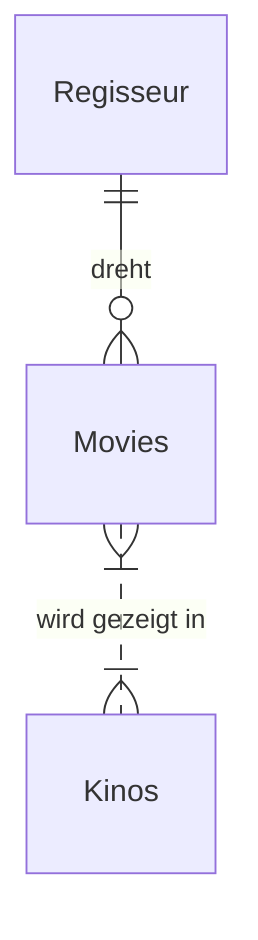

Nachdem grundlegende SQL-Befehle wie `CREATE`, `INSERT`, `SELECT`, `ALTER` oder `DROP` bekannt sind, ist es sinnvoll, die **strukturelle Grundlage relationaler Datenbanken** zu verstehen: das **Relationenmodell**.


## Was ist eine Relation?

In der Datenbanktheorie ist eine **Relation** eine **Tabelle**, bestehend aus:

- **Zeilen (Tupel)** → einzelne Datensätze
- **Spalten (Attribute)** → Felder mit bestimmten Datentypen

> Eine **Relation** beschreibt also eine **Menge gleich strukturierter Daten** – zum Beispiel alle Filme, alle Kunden oder alle Rechnungen.

Beispiel einer Relation `filme`:

| movie_id | title        | genre    | jahr |
|----------|--------------|----------|------|
| 1        | Inception    | Sci-Fi   | 2010 |
| 2        | Parasite     | Drama    | 2019 |
| 3        | Matrix       | Action   | 1999 |

---

## RDBMS – Relationale Datenbankmanagementsysteme

Ein **RDBMS** (Relationales Datenbankmanagementsystem) ist eine Software zur **Verwaltung relationaler Datenbanken**.

Beispiele:

- **SQLite** (einfach, lokal, dateibasiert)
- **Microsoft SQL Server**
- **MySQL**
- **PostgreSQL**

Alle basieren auf dem **Relationalen Modell** nach Edgar F. Codd.

---

## Wie stehen Relationen zueinander?

Einzelne Relationen können miteinander in Beziehung stehen – z. B.:

- Ein Kunde hat mehrere Bestellungen
- Ein Film kann in mehreren Kinos gezeigt werden
- Ein Lehrer unterrichtet mehrere Klassen

Solche **Beziehungen zwischen Tabellen** werden über **Fremdschlüssel (Foreign Keys)** hergestellt.

---

## Daten aus mehreren Relationen verknüpfen – `JOIN`

Mit dem SQL-Befehl `JOIN` können **mehrere Tabellen kombiniert** werden:

```sql
SELECT m.title, r.name
FROM Movies as m
JOIN Regisseur as r ON m.regisseur_id = r.regisseur_id;
```

!!! note
    Diese Abfrage verbindet zwei Relationen: Movies und Regisseur

---

## Was ist ein Relationsschema?

Ein Relationsschema beschreibt die Struktur aller Tabellen einer Datenbank – inklusive:

- Tabellenname
- Spaltennamen und -typen
- Primär- und Fremdschlüssel
- Beziehungen (1:n, m:n)

```bash
FILM(film_id, titel, genre, jahr)
SCHAUSPIELER(schauspieler_id, name, geb_jahr)
ROLLE(film_id → FILM, schauspieler_id → SCHAUSPIELER, rolle)
```

---

## Vom Konzept zur Struktur – ER-Diagramme

Bevor Tabellen erstellt werden, ist es sinnvoll, die Datenbank grafisch zu entwerfen.

Dazu werden **Entity-Relationship-Diagramme (ER-Diagramm)** verwendet.
Sie zeigen:

- Entitäten (z. B. Film, Schauspieler, Kunde)
- Attribute (z. B. Titel, Name, Geburtsdatum)
- Beziehungen (z. B. „dreht“, „besucht“, „gehört zu“)

!!! tip
    Aus einem ER-Diagramm kann später ein Relationsschema abgeleitet werden – als Grundlage für den praktischen SQL-Entwurf.
    Das Verständnis von Relationen, Schemata und deren grafischer Darstellung (ERD) hilft, strukturierte, wartbare und fehlerfreie Datenbanken zu entwerfen – ein zentrales Ziel in der Informatik und Betriebsinformatik.

---

## 🎬 Beispiel: ER-Diagramm – Movies, Regisseur, Kinos

