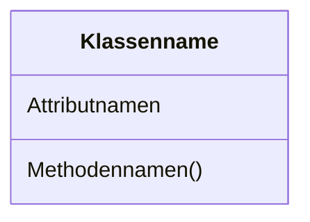
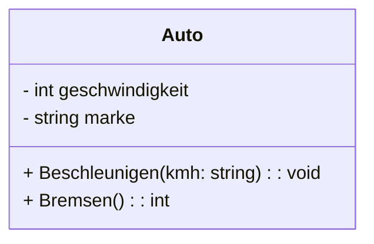
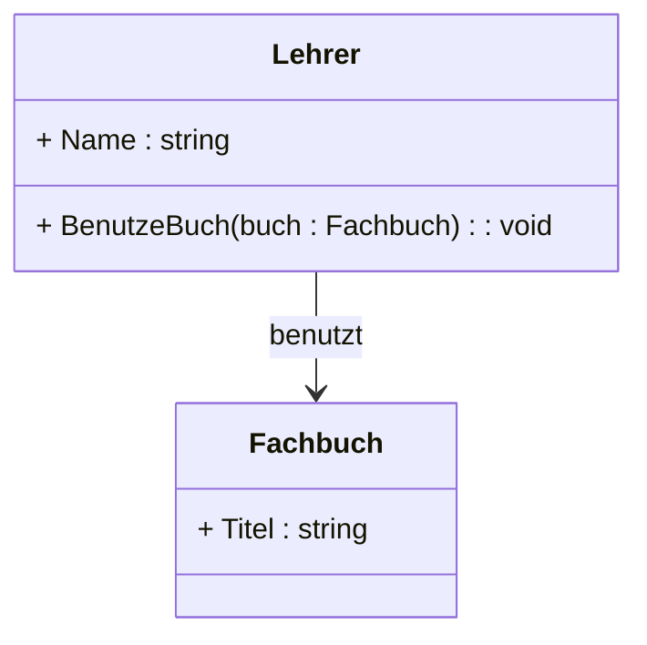
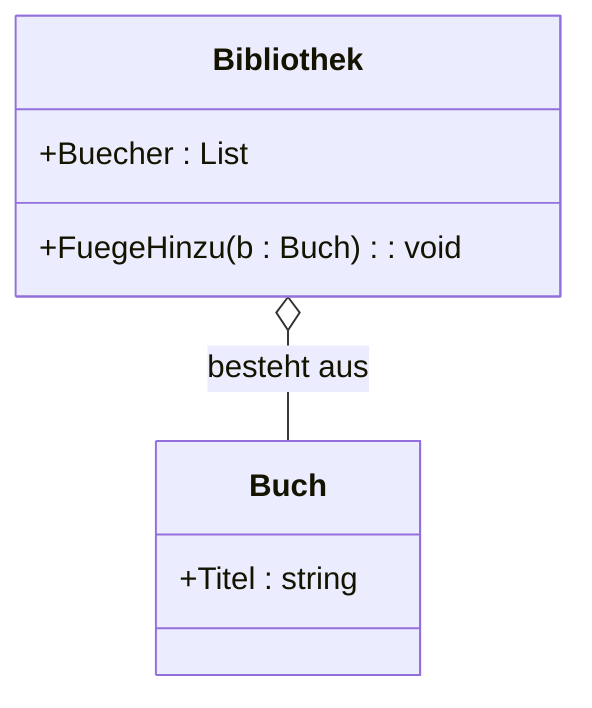
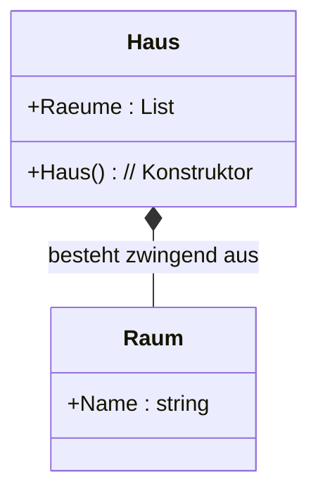
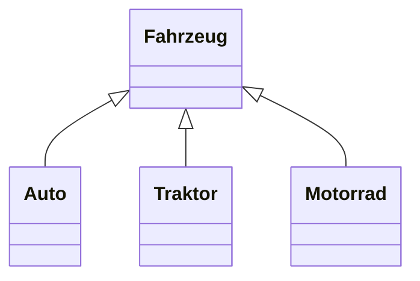
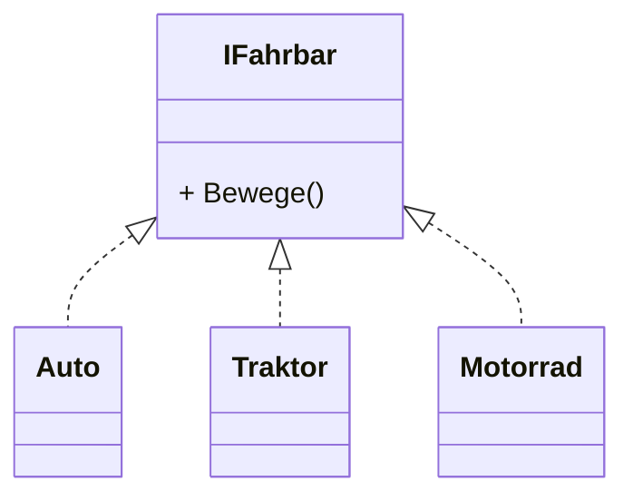

# UML Klassendiagramme

- Teil der UML (Unified Modeling Language).
- Zeigt die Struktur von Klassen: Attribute, Methoden und Beziehungen.
- Dient als Bauplan: hilft beim Verstehen, Entwerfen und Dokumentieren von Programmen.

## Aufbau



## Sichtbarkeit (Access Modifier)

- `+` = public
- `-` = private
- `#` = protected

**Beispiel: Klasse Auto**



C# Code:

```csharp
class Auto
{
    private int geschwindigkeit;
    private string marke;
    public void Beschleunigen(string kmh) { /* ... */ }
    public int Bremsen() { /* ... */ }
}
```


## Beziehungen zwischen Klassen

### Assoziation ("hat ein")

- Ein Lehrer **hat ein** (benutzt) Fachbuch.
- Beide Klassen können unabhängig voneinander existieren.



C# Code:

```csharp
class Fachbuch
{
    public string Titel { get; set; }
}

class Lehrer
{
    public string Name { get; set; }

    // Assoziation: Lehrer kennt ein Fachbuch
    public void BenutzeBuch(Fachbuch buch)
    {
        Console.WriteLine($"{Name} benutzt das Buch {buch.Titel}.");
    }
}
```


### Aggregation ("besteht aus")

- Eine Bibliothek **besteht aus** Büchern. 
- Ganzes (Bibliothek) kann Teile (Bücher) verlieren, Teile existieren weiter



C# Code:

```csharp
class Buch
{
    public string Titel { get; set; }
}

class Bibliothek
{
    // Aggregation: Liste von Büchern
    public List<Buch> Buecher { get; } = new List<Buch>();

    public void FuegeHinzu(Buch b)
    {
        Buecher.Add(b);
    }
}
```


### Komposition

- Ein Haus **besteht zwingend** aus Räumen.
- Stärke Aggregation: "besteht zwingend aus"
- Teile (Räume) existieren nur mit dem Ganzen




C# Code:

```csharp
class Raum
{
    public string Name { get; set; }
}

class Haus
{
    public List<Raum> Raeume { get; } = new List<Raum>();

    // Räume entstehen IM Haus → Komposition
    public Haus()
    {
        Raeume.Add(new Raum { Name = "Wohnzimmer" });
        Raeume.Add(new Raum { Name = "Küche" });
    }
}
```


### Vererbung

- Auto **ist ein** Fahrzeug



### Interfaces

- Auto **implementiert** `IFahrbar`


