- Sequenzdiagramme zeigen Abläufe im Zeitverlauf: Wer schickt welche Nachricht an wen – und in welcher Reihenfolge.
- Ideal, um Interaktionen zwischen Objekten/Teilsystemen zu klären (z. B. Login, Bezahlung, Bestellung, API-Aufruf).

!!! tip "Merke"
    Sequenzdiagramme beantworten: *„Welche Beteiligten interagieren, in welcher Reihenfolge, mit welchen Nachrichten?“*

## Elemente

- Teilnehmer/Lifelines: Akteure/Objekte/Services entlang der X-Achse (Zeit läuft nach unten).
- Nachrichten: Pfeile zwischen Lifelines (synchron/async, mit Rückgaben).
- Aktivierungen: Ausführungsbalken, wenn ein Teilnehmer gerade arbeitet.
- Fragmente: Steuerlogik wie `alt`, `opt`, `loop`, `par`, `break`.

## Syntax

**Teilnehmer:**

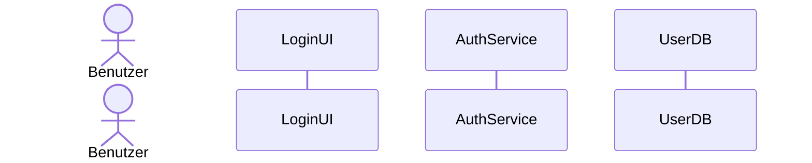

**Synchrone Nachricht & Rückgabe:**

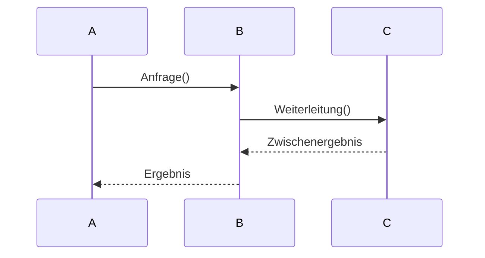

**Asynchrone Nachricht:**

- Asynchrone Nachrichten unterscheiden sich an der Pfeilspitze

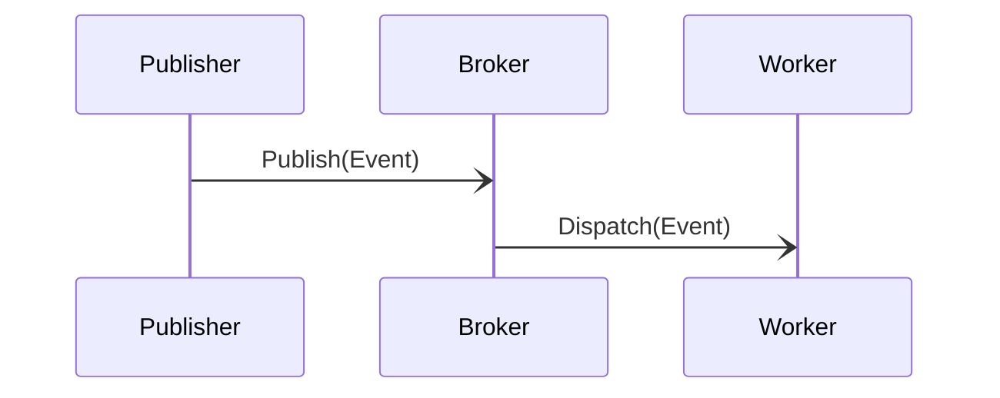

- Da die Pfeilspitzen oft übersehen werden für asynchrone Nachrichten, sollte man gleich `[async]` an die Nachrichtenbeschreibung hinzufügen.

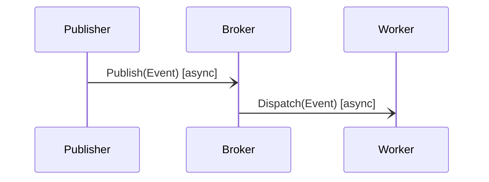

**Aktivierungsbalken:**

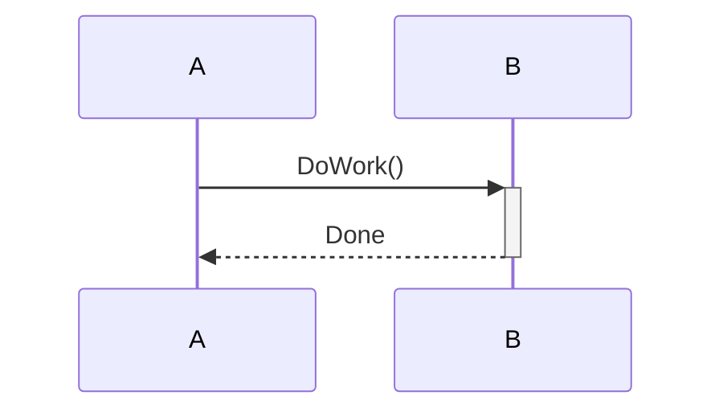

**`opt` - Optional (if ohne else)**

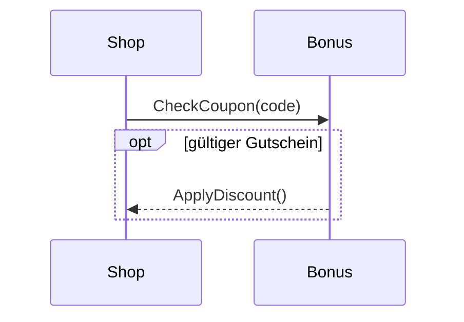

**`alt` - Alternative Pfade (if/else):**

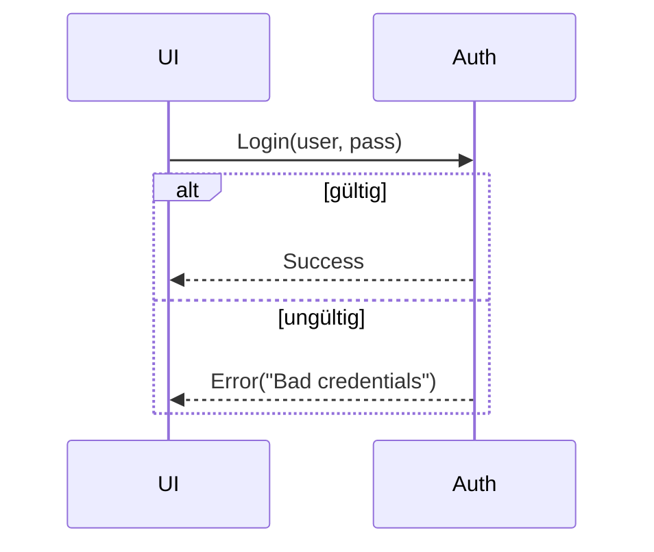

**`loop` - Schleifen:**

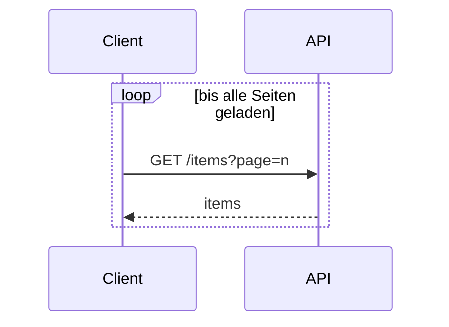

**`par` - Parallele Aktionen:**

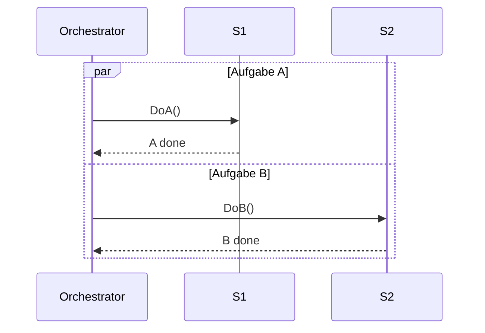

**`break` - Abbruch eines Flows:**

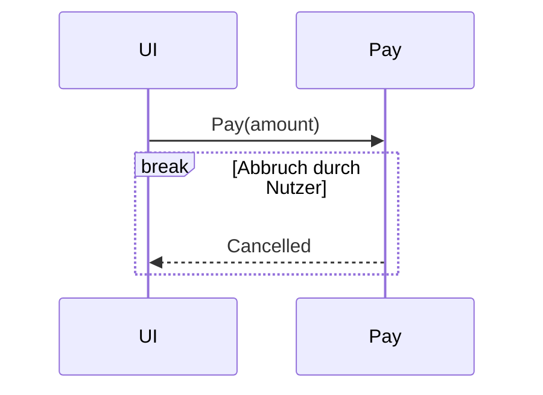

## Praxisbeispiele

### Beispiel: Bestellung im Shop

- Payment & Lager

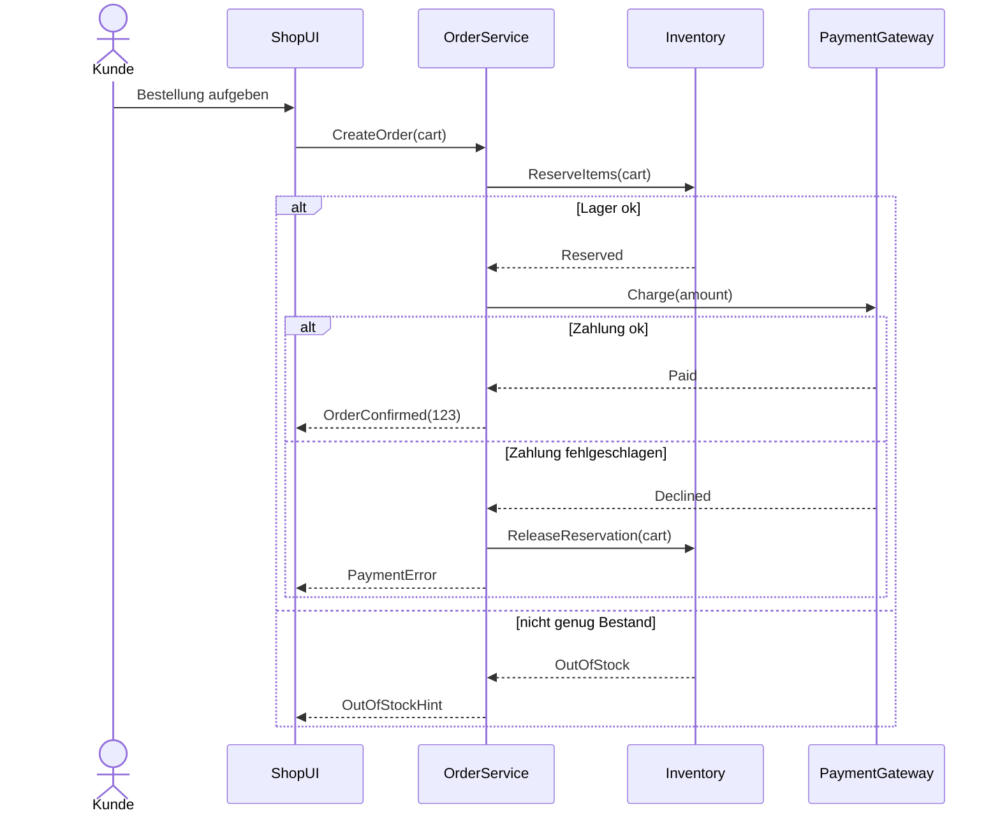

### Beispiel: Login mit 2-FA (2-Factor Authentication)

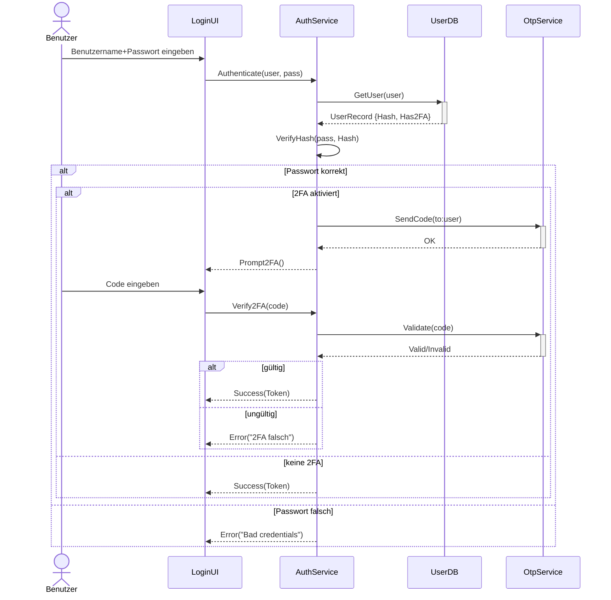

### Beispiel: Chat-Nachrichten (asynchron)

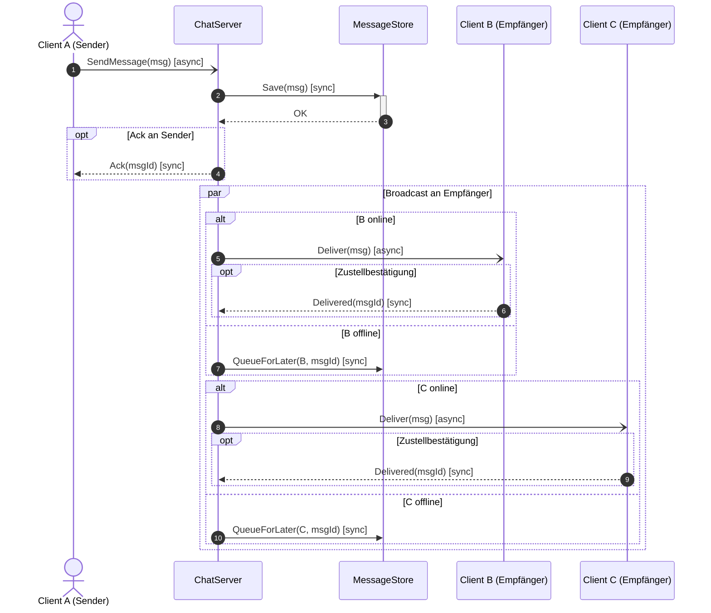

!!! note "Hinweis"
    Da wir einen System-zu-System Ablauf darstellen (Nachricht wird vom Server an andere Client-Programme verteilt), macht es mehr Sinn, B und C als `participants` (Rechteck) zu zeigen.
    Wenn wir die Interaktion Mensch ↔ Client-App betonen wollten, wären B und C `actors` (also Strichmännchen).

# Test

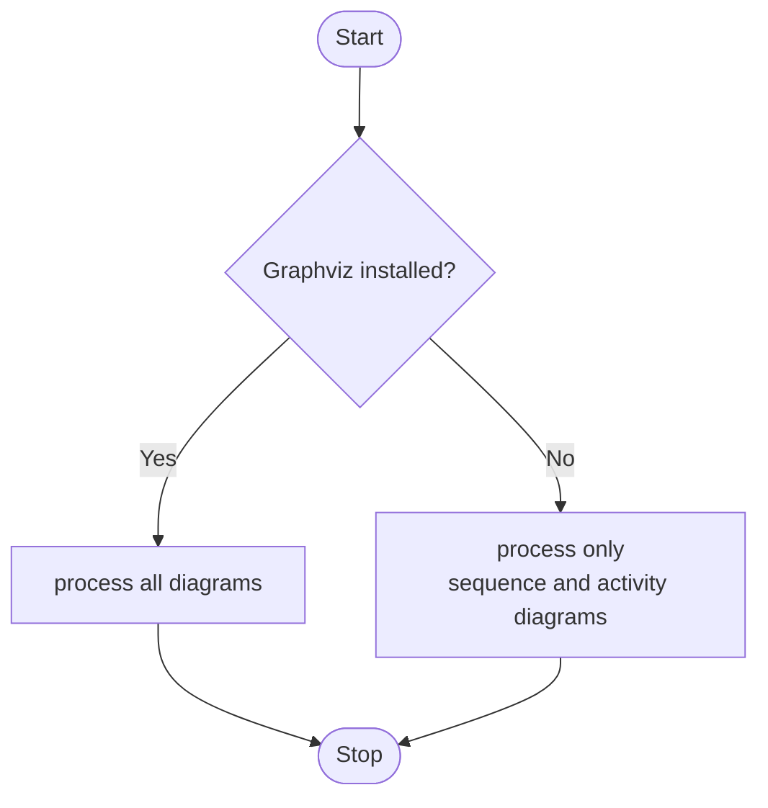